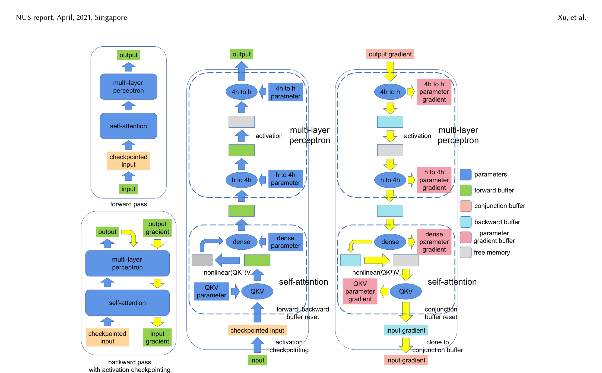
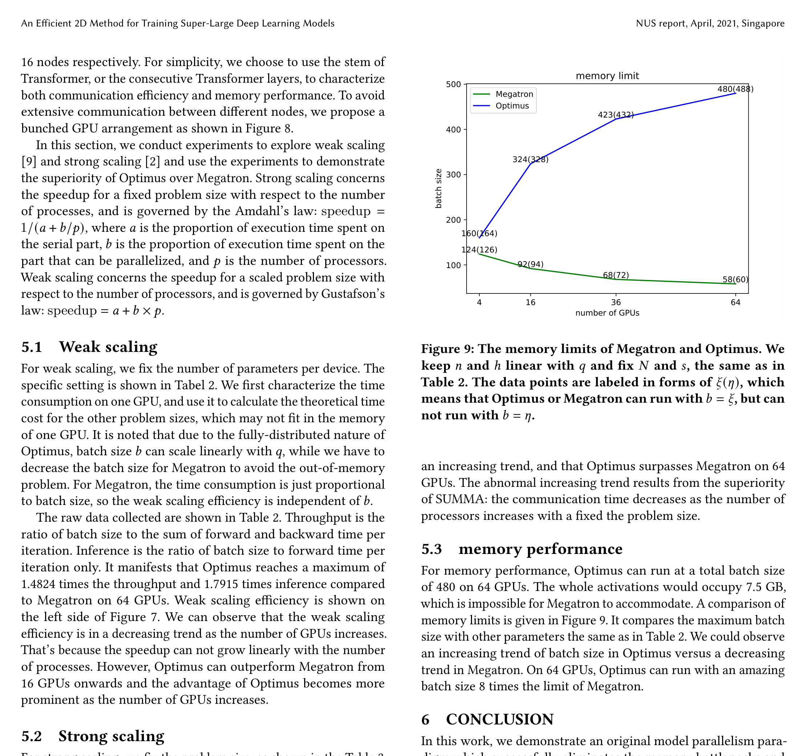

# An Efficient 2D Method for Training Super-Large Deep Learning Models (Optimus)

### 1. Background & Motivation

Megatron-LM 的 tensor parallelism 是一维方案：参数被拆分但**每个设备仍持有完整的激活值**。随着模型和 batch size 增大，激活显存成为瓶颈。

关键观察：当 $p > N/3$（$N$ 为 Transformer 层数）时，**中间激活**成为瓶颈而非参数。对于 $N=24$ 的典型模型，$p > 8$ 即出现 OOM。

Optimus 的目标：将 **参数和激活值都** 分布到所有设备上，消除激活冗余。

### 2. High-Level Method

核心思路：借鉴 **SUMMA（Scalable Universal Matrix Multiplication Algorithm）**，将矩阵乘法在 $q \times q$ 的 2D mesh 上分块执行。

**SUMMA 原理（Algorithm 1: $C = AB$）：**

将 $A$ 和 $B$ 各自分成 $q \times q$ 子块，$A_{ij}$, $B_{ij}$ 分配给设备 $(i,j)$。计算循环 $q$ 轮：

- 第 $l$ 轮：将 $A_{il}$ 沿行 broadcast，$B_{lj}$ 沿列 broadcast
- 每设备执行本地矩阵乘法 $C_{ij} \mathrel{+}= A_{il} B_{lj}$

**Optimus 的 Transformer 适配：**

- **MLP 块**：两个 GEMM 都按 SUMMA 方式执行（激活和参数同时拆分）
- **Self-Attention**：沿 batch ($b$) 和 hidden ($h$) 维度拆分（不拆 sequence 维度 $s$），避免 attention scores 的通信开销
- **Embedding 层**：沿 vocab 维度拆 embedding table，兼容 SUMMA 模式
- **非 SUMMA 操作**（bias-add, layer norm）：参数由 row-0 设备持有，前向时沿列 broadcast，反向时 reduce 回 row-0

**通信 vs Megatron：**

| 方案 | 前向通信量 | 反向通信量 | Isoefficiency |
|------|-----------|-----------|--------------|
| Megatron (1D) | $\frac{4(p-1)}{p} bsh$ | $\frac{8(p-1)}{p} bsh$ | $W \sim p^3$ |
| **Optimus (2D)** | $\frac{\log(p)}{2\sqrt{p}}(7bsh + 12h^2)$ | $\frac{\log(p)}{2\sqrt{p}}(21bsh + 36h^2)$ | $W \sim (\sqrt{p}\log p)^3$ |

Optimus 的 isoefficiency 显著优于 Megatron，即**在相同并行度下达到相同效率所需的问题规模更小**。

### 3. Key Implementation Details

- **2D 设备网格**：$p = q^2$ 个设备排成 $q \times q$ mesh，通信仅在行/列内进行（broadcast/reduce，非 all-reduce）
- **Activation checkpointing**：每层仅存 checkpointed input（分布在 2D grid 上），反向重算时用预分配的 workspace buffer
- **内存预分配**：手动管理 forward/backward/parameter gradient 等 buffer，避免 fragmentation——最多容纳 480 batch size（Megatron 仅 60）

- **Bunched GPU arrangement**：跨节点时将同一列的 GPU 尽量放在同一节点或少数节点上，减少跨节点通信
- **LayerNorm**：分布式计算均值和方差（本地 sum 后 all-reduce 沿行）

### 4. Experiments & Results

**实验环境：** TACC Frontera，NVIDIA Quadro RTX 5000（4 GPU/节点），InfiniBand 互联。

**Weak Scaling（每个 GPU 参数量固定）：**

| GPU 数 | Megatron throughput | Optimus throughput | 提升 |
|--------|-------------------|-------------------|------|
| 4 | 2.94 seq/s | 2.52 seq/s | 0.86× |
| 16 | 1.38 | 1.41 | 1.02× |
| 36 | 0.88 | 1.31 | **1.48×** |
| 64 | 0.64 | 0.95 | **1.48×** |

**Strong Scaling（固定问题规模）：**

Optimus 的 strong scaling efficiency 随 GPU 数**递增**（从 0.45→0.64），而 Megatron 递减（0.74→0.60）。这是因为 SUMMA 的通信量随 $q$ 增大会被更多设备分摊。

**显存性能：**
- 64 GPU 时 Optimus 最大 batch size **480**（Megatron 仅 **60**），**8× 提升**
- Megatron 的 max batch size 随 GPU 数增加而下降（激活冗余），Optimus 则上升（激活分布化）

### 5. Limitations & Reflection

**局限性：**

- 要求 GPU 数量为完全平方数（$p = q^2$），部署灵活性受限
- 需要显式管理 $q \times q$ 设备网格和行列通信，工程复杂度高于 Megatron
- Attention scores 的显存占用（$b \times n \times s \times s$）在 $s$ 大时可能超过激活本身——论文建议 operation fusion 缓解
- 仅在 Transformer 结构上验证（未覆盖 CNN 等其他架构）
- 未在更大规模（256+ GPU）和真实训练场景（GPT-3 级）上验证

**我的判断：**

- 2D 并行在理论上优雅，isoefficiency 分析清晰展示了 SUMMA 在大规模下的优势
- 实际落地受限于 $p=q^2$ 约束和工程复杂度——这也是为什么 Megatron 的 1D 方案在实践中更流行
- 但该工作启发了后续的序列并行（sequence parallelism）等更细粒度的激活分布方案
- 与 [[megatron-lm-training-multi-billion-parameter-language-models-using-model-parallelism|Megatron-LM]] 的对比实验设计合理，但考虑到 Optimus 用 RTX 5000 而 Megatron 原实验用 V100，绝对性能数字仅供参考

### 6. Personal Takeaways

- Megatron 的 1D 并行是 "parameters split, activations replicated"，Optimus 的 2D 是 "everything distributed"——前者简单高效适用于中小规模，后者在大规模和大 batch 时优势明显
- SUMMA 在 HPC 领域历史悠久（1997），将其引入 LLM 训练是一个 neat 的跨领域迁移
- 手动内存管理 + activation checkpointing 的精细设计使得 Optimus 的 batch size 远超 Megatron——这对于在大规模集群上提升吞吐非常关键
- 后续 DeepSpeed、Colossal-AI 等框架都吸收了 2D/序列并行的思想

---

**Key Concepts:**
- [[tensor-parallelism|Tensor parallelism (1D)]] — Megatron 式按行/列拆分参数
- 2D parallelism (SUMMA) — 将矩阵乘法在 $q \times q$ 网格上分块执行，参数和激活都分布化
- Isoefficiency — 衡量并行系统可扩展性的指标：保持效率不变时问题规模随处理器数增长的速率
- SUMMA (Scalable Universal Matrix Multiplication Algorithm) — HPC 领域的 2D 矩阵乘法算法

**Extracted Figures:**
- `optimus_fig4_optimus_architecture.png` — Optimus MLP + Self-Attention 的 2D SUMMA 架构
- `optimus_fig7_scaling.png` — Weak/Strong scaling 效率对比（Optimus vs Megatron）
- `optimus_fig9_memory_limits.png` — Memory limits 对比（Optimus 8× batch size）
