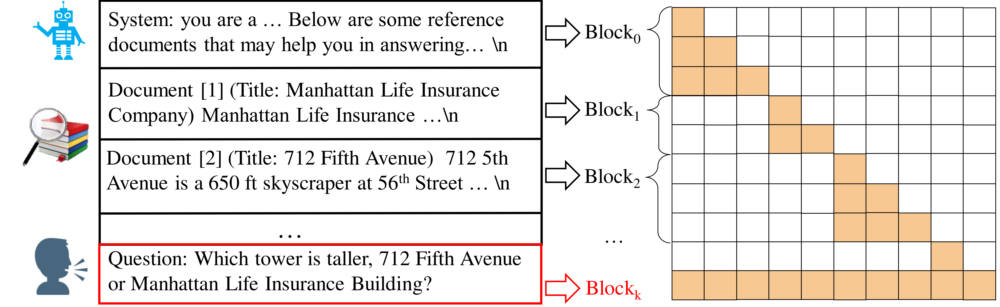
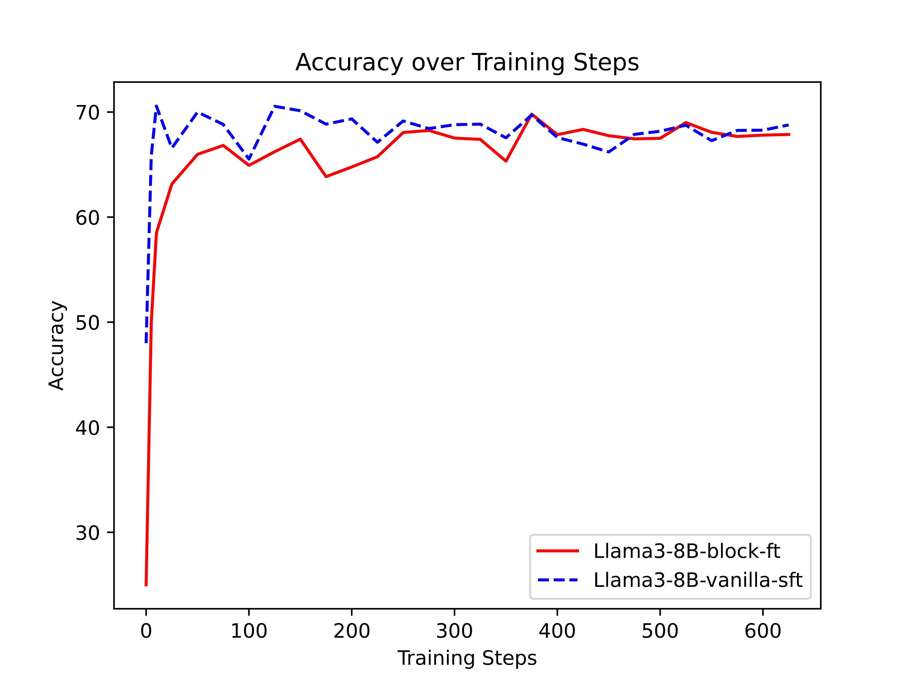
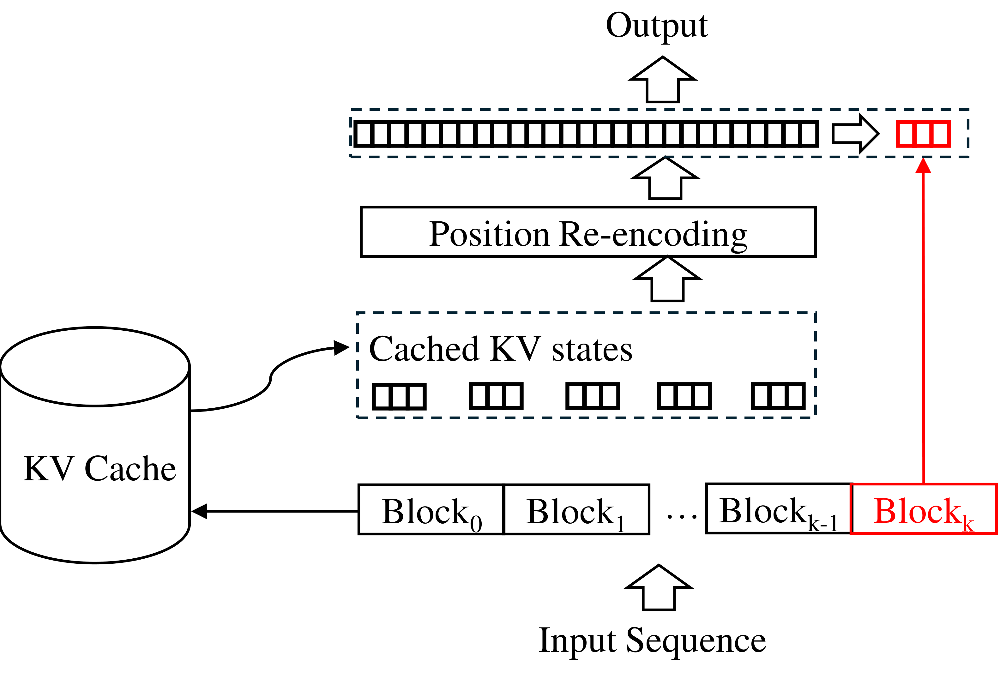
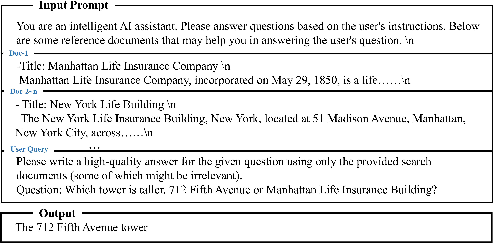

# Block-Attention for Efficient Prefilling

| 项目 | 内容 |
|------|------|
| **Authors** | Dongyang Ma, Yan Wang, Tian Lan (Tencent) |
| **Published** | 2025-01 (ICLR 2025) |
| **Link** | [arXiv 2409.15355](https://arxiv.org/abs/2409.15355) |

**一句话总结:**
- 将 RAG 中检索到的文档划分为独立 block，各 block 独立计算 KV cache，仅末尾 block（用户 query）关注其他 block，实现 prefilling 阶段 TTFT 降低 98.7%、FLOPs 降低 99.8%。

**核心贡献:**
- **Block-attention 机制**：输入序列划分为多个 block，各 block 独立 self-attention 计算 KV 状态，仅最后一个 block 关注前面所有 block
- **位置重编码（Position Re-encoding）**：利用 RoPE 旋转特性，将缓存 block 的位置编码从原始位置旋转到新上下文中的位置，实现 KV cache 复用
- **Block Fine-tuning**：通过少量训练让 LLM 适应 Block-attention 模式（~23% Tulu3-SFT 数据可分块，+ 20K RAG 样本）
- **Seamless Switching**：同一模型可在 block 和 full attention 间无缝切换，无精度损失
- **效率提升**：32K 输入时 TTFT 仅 45ms（full attention 的 1.3%），FLOPs 仅 0.2%
- **Game AI 应用**：将游戏状态分为 300+ block，TTFT 从 2800ms 降至 100ms

---

### 1. Background & Motivation

RAG 场景下，LLM 需要 prefill 大量检索文档（通常 10-20 个 passage，总长可达 32K tokens），导致 **TTFT（Time to First Token）** 过高。现有 KV cache 方法无法跨不同 query 复用，因为 KV 状态是上下文相关的——同一 passage 在不同 query 下需要重新编码。

核心洞察：RAG 的检索文档彼此**语义独立**，且文档间不需要相互 attention——只有 query 需要关注文档。因此可将各文档视为独立 block，各自独立编码后再由 query 聚合。

### 2. High-Level Method

**Block-attention 的核心设计：**
- 将输入序列 S 分为 k 个 block：{b₁, b₂, ..., bₖ}
- Block bᵢ 独立计算其 KV 状态（仅内部 self-attention）
- 仅最后一个 block bₖ（用户 query）能关注前面所有 block
- 当某个 block 更新时，只需重新编码该 block 和最后一个 block 的 KV 状态

**位置重编码的关键技巧：**
利用 RoPE 旋转位置编码的可逆性：
1. 对缓存 block 的 token sᵢ，先将其 RoPE **逆时针旋转** iθ 度（复位到 0 位置）
2. 再**顺时针旋转** (i∆)θ 度（旋转到新上下文中的位置）
3. 这样缓存 KV 的 position encoding 就能适配新的上下文位置（详见 [[rope|RoPE]] 的旋转可逆性）

### 3. Key Implementation Details

**Block Fine-tuning：** 直接在 Tulu3-SFT（Llama-3.1-8B）基础上继续训练：
- 训练数据：23% 的 Tulu3-SFT（可按 `\n\n`、`---` 等分隔符分块）+ 20K RAG 样本（TriviaQA + 2WikiMultiHopQA）
- 每个 RAG 样本：question + 10 passage（retrieved），各 passage 作为独立 block
- 超参数：lr=2e-5, batch=64, epoch=1, 8×H20 GPU
- 无需从头训练，仅需少量 fine-tuning steps（~200 steps 即收敛）

**推理流程：**

仅需约 200 training steps 即可收敛至 full-attention 水平。

### 4. Experiments & Results

**RAG 基准——精度对比：**

Tulu3-block-ft 与 Tulu3-RAG（full attention）精度差距 ≤ 1%。Position re-encoding 贡献约 2% 精度提升（移除后降为 68.9-74.4），而无 fine-tuning 直接切换损失巨大。

**通用/ICL 基准——无缝切换能力：**

在 zero-shot 任务（IFEval, HumanEval, MMLU）上自动 fallback 到 full-attention；ICL 场景（GSM8K, MATH, BBH, DROP）上每样本独立分块，性能持平甚至略高于 full-attention 基线。

**效率——核心优势：**

| Total Length | TTFT (vanilla) | TTFT (block) | FLOPs 降低 |
|-------------|---------------|-------------|-----------|
| 512 | 50ms | 26ms (48%) | 90.1% |
| 4K | 330ms | 27ms (91%) | 98.7% |
| 8K | 691ms | 29ms (95%) | 99.3% |
| 32K | 3638ms | **45ms (98.7%)** | **99.8%** |

FLOPs-TFT 在任意长度下恒定（7.5e+11），因为只计算最后一个 block（query，固定 50 tokens）。

**Game AI 应用：**
- 游戏状态数据以 JSON 结构化存储，相邻状态间 >99.5% 内容相同
- 通过规则将 state 分为 300+ block，仅编码变化的 block
- 未公开游戏中：TTFT 从 2800ms → 100ms（降 96%），端到端延迟从 3000ms → <300ms

### 5. Limitations & Reflection

**局限：**
- 需要 block fine-tuning，约 23% 的通用 SFT 数据可自然分块，其余需特殊处理
- Block 划分策略依赖规则（`\n\n`、`---` 等分隔符），对无明显结构化分隔符的文本不友好
- 与 TurboRAG（同时期独立工作）高度相似，方法独创性存疑
- 仅在 8B 模型上验证，更大模型（70B+）上的效果和效率未探索
- Random attention 的 gather 操作仍是 GPU 不擅长的稀疏操作

**思考：**
- 本文最实用的洞察是**将 RAG 中文档的语义独立性转化为 attention mask 的结构性稀疏**——简单但有效
- 位置重编码技术很巧妙：利用 RoPE 线性旋转特性实现零开销的位置变换，避免了重新计算位置编码
- 与 Big Bird 的稀疏 attention 思路不同：Block-attention 不是 sparsify attention 本身，而是通过 block-level 的独立性约束来消除跨文档 attention
- Game AI 应用场景很有说服力：游戏状态天然适合 block 划分（JSON 结构）+ 时序高重复率（>99.5%）

---

**Extracted Figures:**
- `blockattn_fig1_masks.png` — Block-attention mask 示意：各 block 独立 attention，仅末尾 block 关注全局
- `blockattn_table1_rag.png` — RAG 4 基准精度对比（2wiki, HQA, NQ, TQA）
- `blockattn_table2_general.png` — 通用/ICL 7 基准精度（IFEval, HumanEval, MMLU, GSM8K, MATH, BBH, DROP）
- `blockattn_table3_efficiency.png` — TTFT/FLOPs 效率数据（32K 时 98.7%/99.8% 降低）
- `blockattn_fig4_accuracy.png` — Block fine-tuning 收敛速度（~200 steps）
