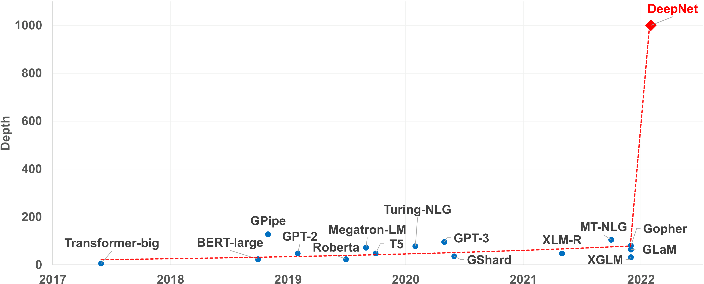
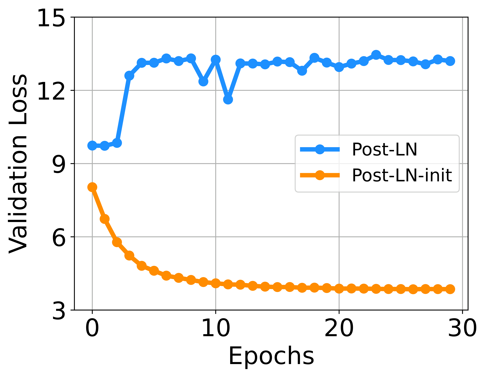
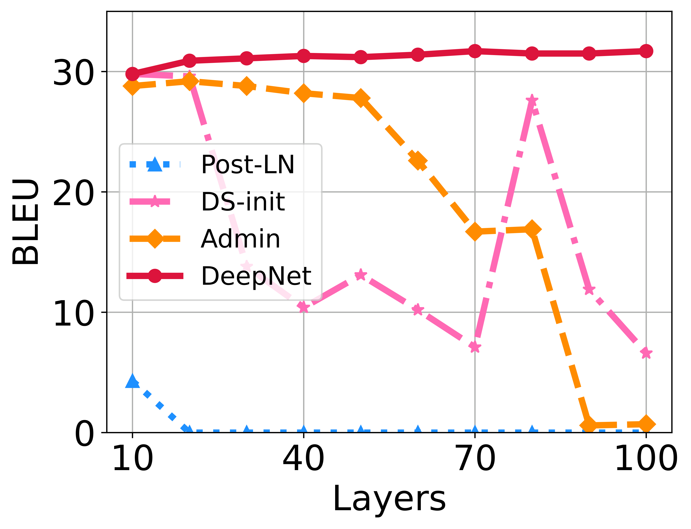
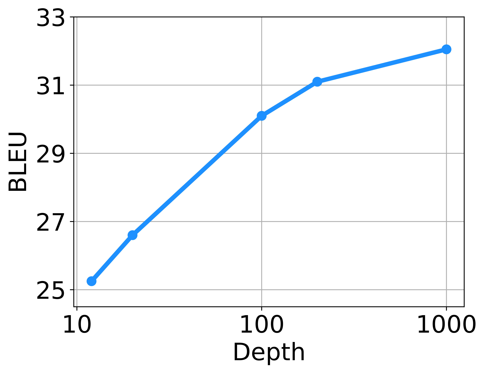
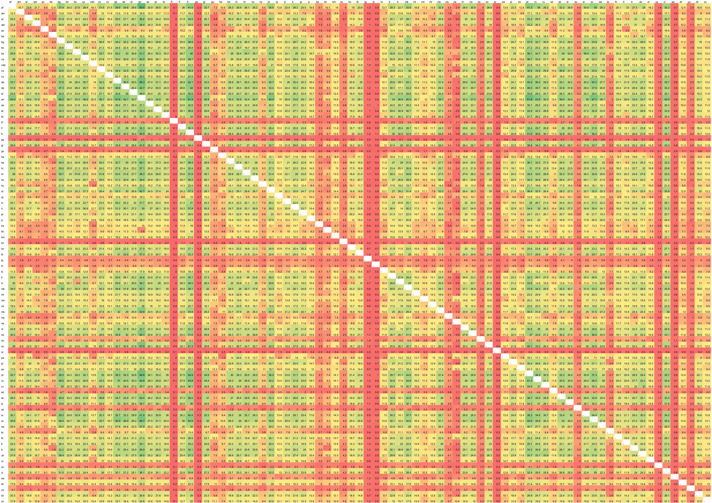

# DeepNet: Scaling Transformers to 1,000 Layers

| 项目 | 内容 |
|------|------|
| **Authors** | Hongyu Wang, Shuming Ma, Li Dong, Shaohan Huang, Dongdong Zhang, Furu Wei (Microsoft Research) |
| **Published** | 2022-03 (ICLR 2023) |
| **Link** | [arXiv 2203.00555](https://arxiv.org/abs/2203.00555) |

**一句话总结:**
- 提出 DeepNorm + 理论推导的初始化策略，将 Transformer 稳定扩展到 1,000 层（10× 前人极限），200 层 3.2B 模型在 7,482 个翻译方向上以 1/4 参数量超越 48 层 12B SOTA（+5 BLEU）。

**核心贡献:**
- **DeepNorm**：一种新的 normalization 函数，修改 residual 连接：xl+1 = LN(α·xl + Gl(xl, θl))，其中 α > 1 控制残差权重
- **理论推导的初始化**：基于模型更新 bound 分析，推导出各层权重缩放因子，确保任意深度下模型更新量 O(η)
- **Post-LN 的性能 + Pre-LN 的稳定性**：DeepNorm 兼顾 Post-LN 的高精度和 Pre-LN 的稳定训练
- **1,000 层成功训练**：500 层编码器 + 500 层解码器（2,500 sublayers），在 OPUS-100 上平均 BLEU 32.1
- **200 层 3.2B 超越 48 层 12B**：M2M-100（12B） vs DeepNet-200（3.2B）：WMT 33.9 vs 31.9，OPUS 23.0 vs 18.4

---

### 1. Background & Motivation



虽然 Transformer 参数量从百万增长到万亿，但模型**深度**增长缓慢（2022 年最深的也不过 GPT-3 的 96 层）。核心瓶颈是训练不稳定性：

- **Post-LN**：深层性能好但训练不稳定，深层梯度爆炸/消失
- **Pre-LN**：训练稳定但性能不如 Post-LN，底层梯度 > 顶层梯度
- 此前方法（DS-Init、Admin、ReZero、T-Fixup）最多稳定到~100 层，无法突破

本文的核心洞察：**Post-LN 的不稳定性根源不是梯度爆炸，而是模型更新（model update）幅度失控**——训练初期 update 急剧增大后骤停，陷入假局部最优。

### 2. High-Level Method

**DeepNorm 的核心公式：**

对第 l 个 sublayer Gl（可以是 attention 或 FFN）：
```
xl+1 = LN(α · xl + Gl(xl, θl))
```

其中 α > 1 是残差权重超参数。相比 Post-LN（α=1），DeepNorm 通过 α 放大残差连接分支，缩小每个 sublayer 的更新贡献。

**初始化策略（以 encoder-decoder 为例）：**
- Encoder 层：缩放 FFN/value/output 投影权重为 0.87·(N⁴M)^(-1/16)，残差权重为 0.81·(N⁴M)^(1/16)
- Decoder 层：缩放 FFN/value/output 投影权重为 (12M)^(-1/4)，残差权重为 (3M)^(1/4)
- 其中 N = encoder 层数，M = decoder 层数

**理论保证（Theorem 4.2）：** 模型更新量 ||ΔF|| 被 bound 在 O(η)，与深度无关。



WMT-17 En-De 翻译上，DeepNet 在 6L-6L 到 100L-100L 全程保持增长（28.1→28.8→29.0→28.9），而 Post-LN、DS-Init、Admin、ReZero 等在 50L+ 后发散或退化。Pre-LN 虽不发散但性能饱和于 27.4（100L-100L）。



DeepNet 在所有深度（10L-10L 到 100L-100L）上表现最佳，且深度越深优势越明显。

### 3. Key Results

**大规模多语言翻译（OPUS-100, 100 语言）：**


| 模型 | 层数 | 参数量 | X→En | En→X | 平均 |
|------|:---:|:---:|:---:|:---:|:---:|
| Baseline | 12 | 133M | 27.5 | 21.4 | 24.5 |
| Baseline | 48 | 254M | 31.4 | 24.0 | 27.7 |
| **DeepNet** | **200** | **863M** | **33.2** | **29.0** | **31.1** |
| **DeepNet** | **1000** | **3.8B** | **33.9** | **30.2** | **32.1** |



深度从 10L 增加到 1000L，BLEU 从约 27 持续升到约 33——**没有出现收益递减**，暗示更深模型仍有提升空间。

**与 SOTA（M2M-100 12B）对比：**



| 模型 | 层数 | 参数量 | WMT | OPUS | TED | Flores |
|:---|:---:|:---:|:---:|:---:|:---:|:---:|
| M2M-100 | 48 | 12B | 31.9 | 18.4 | 18.7 | 13.6 |
| **DeepNet** | **200** | **3.2B** | **33.9** | **23.0** | **20.1** | **18.6** |

200 层 DeepNet 以 3.2B 参数在 7,482 个翻译方向上全面超越 48 层 12B 的 M2M-100。

### 4. Analysis

**为什么 Post-LN 不稳定？**
论文通过实验追踪了 Post-LN 训练初期的过程：
1. 模型更新（||ΔF||）在最初几步急剧爆炸
2. 随后骤停——模型陷入假局部最优
3. Warmup 和更好的初始化能缓解，但不能根除
4. **根源**：LN 输入 x 的幅度 ||x|| >> √d，导致 LN 梯度极小 → 梯度消失 → 整个模型无法继续更新

**DeepNorm 的优势：**
- α > 1 放大残差连接，使每个 sublayer 的更新幅度受控
- 深度增大时 α 也随之增大（从理论推导得出）
- 模型更新 bound O(η) 与层数无关，可任意扩展深度

### 5. Limitations & Reflection

**局限：**
- 仅在 NMT 任务上大规模验证，NLU 任务（GLUE/SQuAD）上未充分探索
- 1,000 层模型实际性能增益（32.1 vs 200 层的 31.1）不显著，边际收益递减
- 理论分析假设 SGD，实际使用 Adam，存在 gap
- 深度增加但 hidden dim 保持 512（窄而深），可能不如宽而深效果好

**思考：**
- 本文最关键的理论贡献是**证明 Post-LN 的不稳定来自 model update 而非 gradient**——这个洞察修正了社区的共同认知
- DeepNorm 的本质是通过 α > 1 将每个 sublayer 的学习率隐式降低 1/α，同时保持 Post-LN 的梯度结构
- "窄而深"与"宽而浅"的 tradeoff 值得深入——DeepNet 的结果说明可能社区过于关注宽度（大 hidden dim）而低估了深度的潜力
- 与 [[deepnorm|DeepNorm]] 的关系：不是替代 LN，而是在 LN 前增加残差缩放

---

**Extracted Figures:**
- `deepnet_fig1_depth_trend.png` — NLP 模型深度随时间增长趋势，DeepNet 达 1,000 层
- `deepnet_table1_bleu_comparison.png` — WMT-17 En-De 不同深度和方法的 BLEU 对比
- `deepnet_table2_opus100.png` — OPUS-100 多语言翻译结果（200 层 / 1,000 层）
- `deepnet_table3_m2m_comparison.png` — M2M-100 12B 对比 DeepNet 3.2B（4 评估集）
- `deepnet_fig6_iwslt_results.png` — IWSLT-14 不同深度 BLEU 对比（含 8 种方法）
- `deepnet_fig8_bleu_vs_depth.png` — 深度 vs BLEU 散点图（10L 到 1000L）
