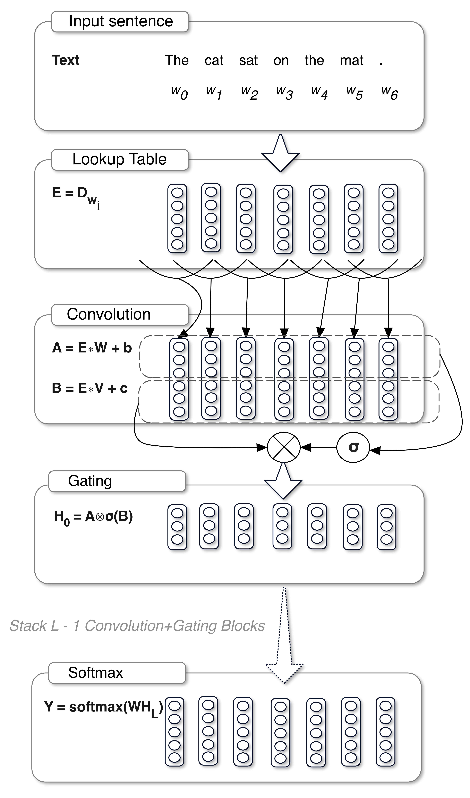
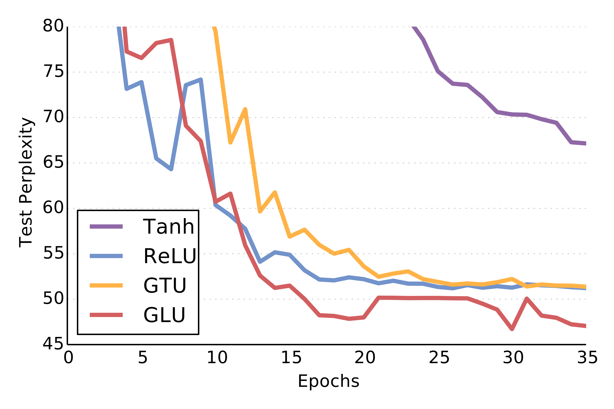
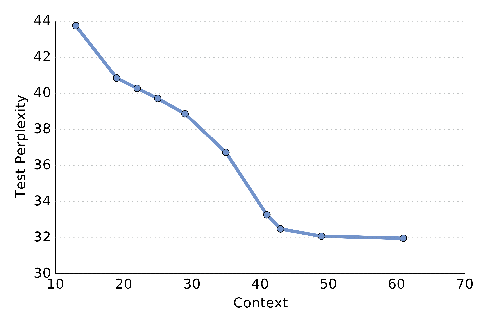
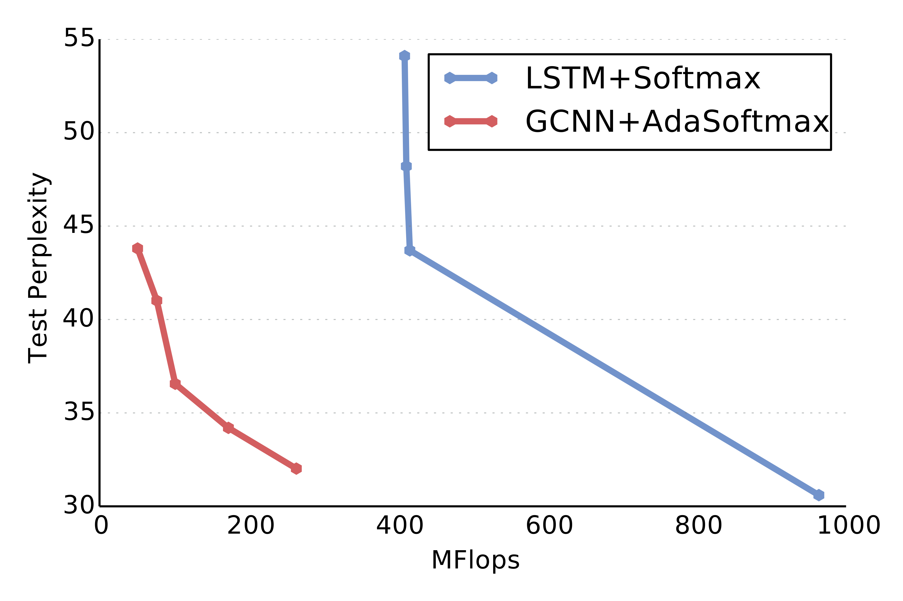
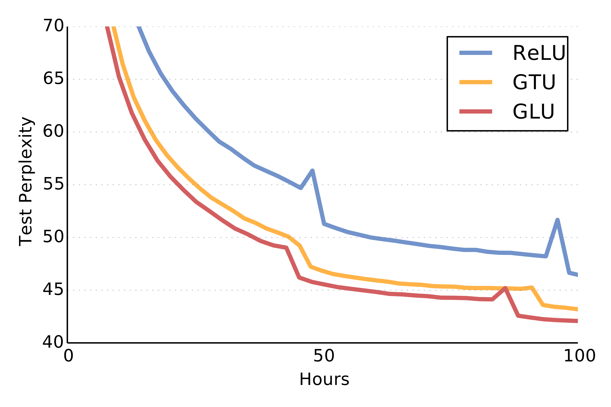
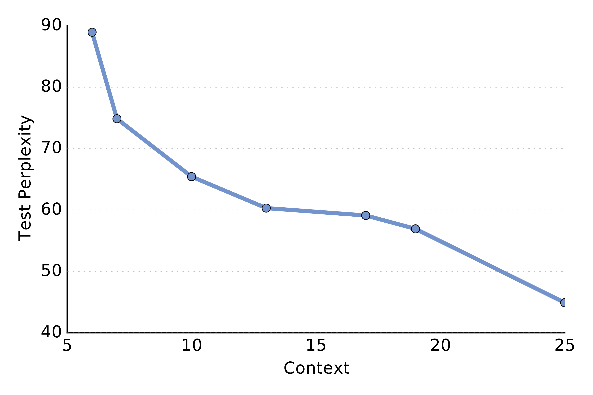
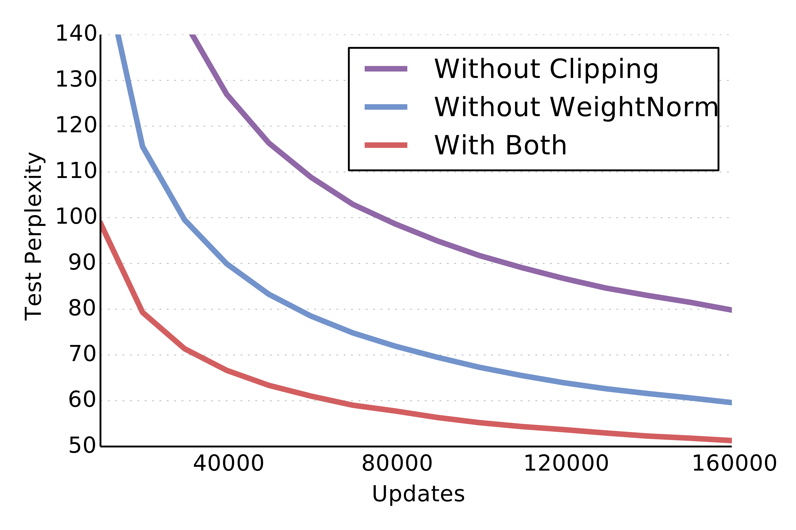

# Language Modeling with Gated Convolutional Networks (GCNN)

| 项目 | 内容 |
|------|------|
| **Authors** | Yann N. Dauphin, Angela Fan, Michael Auli, David Grangier (Facebook AI Research) |
| **Published** | 2017 (ICML 2017) |
| **Link** | [arXiv 1612.08083](https://arxiv.org/abs/1612.08083) |

**一句话总结:**
- 首次用堆叠门控卷积替代 RNN 实现语言建模，证明有限上下文（~40 tokens）足以逼近甚至超越循环模型的表现，并提出简化门控机制 **Gated Linear Unit (GLU)**，收敛更快、精度更高。

**核心贡献:**
- 提出 **Gated Convolutional Network (GCNN)**——堆叠带门控的因果卷积层，实现序列维度的完全并行（vs RNN 的串行递推）
- 提出 **Gated Linear Unit (GLU)** 简化门控机制：`output = A ⊗ σ(B)`，相比 LSTM 风格的 GTU (`tanh(A) ⊗ σ(B)`) 提供更通畅的梯度路径，收敛更快
- 在 WikiText-103 上达到 SOTA（37.2 ppl），在 Google Billion Word 上与大规模 LSTM 可比（38.1 ppl），训练成本仅为 LSTM 的几分之一
- 系统消融了上下文大小、门控机制、激活函数、训练技巧（weight normalization + gradient clipping）的影响

---

### 1. Background & Motivation

2017 年之前的神经语言模型几乎完全基于 **循环神经网络**（RNN/LSTM）。RNN 的自回归特性 `h_i = f(h_{i-1}, w_{i-1})` 使其无法在序列维度并行化——每个时间步必须等待前一步完成后才能计算。

卷积神经网络（CNN）在图像识别等任务上已经展示了强大的并行能力和残差连接带来的训练稳定性。**能否用卷积替代 RNN 做语言建模？** 核心挑战在于：卷积的上下文是有限的（kernel size），而语言需要长距离依赖（理论上无限）。

本文的 key insight：**无限上下文并非必要**。实践中，强 RNN 语言模型也仅截断 40 步的 BPTT，说明 ~40 tokens 的上下文窗口已经足够。因此可以用堆叠卷积（增大感受野）覆盖实际需要的上下文长度，同时获得序列维度的完全并行。

### 2. High-Level Method

#### 2.1 Gated Convolutional Architecture

模型架构如下：

1. **Word Embedding**：将 token 序列映射为稠密向量 E = [D_{w0}, ..., D_{wN}]
2. **堆叠门控卷积层**：多个残差瓶颈块（bottleneck residual blocks），每块含若干卷积层（kernel size k=4-6）
3. **Gated Linear Unit (GLU)**：每个卷积层使用 GLU 作为门控激活
4. **Adaptive Softmax**：对大规模词表使用自适应 softmax，高频词高维、低频词低维

**Gated Linear Unit (GLU):**
$$h_l(X) = (X * W_l + b_l) \otimes \sigma(X * V_l + c_l)$$

其中 `*` 表示因果卷积（确保位置 i 只能看到 i 及以前的信息），σ 为 sigmoid 函数，⊗ 为逐元素乘法。

**与 LSTM-Style Gating (GTU) 的对比：**
$$h_l(X) = \tanh(X * W_l + b_l) \otimes \sigma(X * V_l + c_l)$$

GLU 去掉了 tanh 非线性，只保留线性映射 A 与门控 B 逐元素相乘。这使得梯度可以直接通过线性路径传播，缓解梯度消失，加速收敛。

**残差瓶颈块（Bottleneck Block）：** 每个块使用 1×1 降维 → 5×1 卷积 → 1×1 升维的结构，在保证感受野的同时大幅降低计算量。

#### 2.2 因果卷积与并行化

不同于 RNN 的串行递推，卷积在训练时所有位置可以同时计算：

$$H = f * w$$

其中 `*` 表示因果卷积运算。推理时，卷积的前向传播也不依赖序列顺序（只需填充足够的 context），因此响应时间（从输入到输出的延迟）远低于 RNN。

| 模型 | Throughput (tokens/s, CPU) | Responsiveness (tokens/s, GPU) |
|------|---------------------------|-------------------------------|
| LSTM-2048 | 169 | 2,282 |
| GCNN-9 | 121 | 29,116 |
| GCNN-8 Bottleneck | 179 | 45,878 |

GCNN 的响应速度（逐一 token 处理时）比 LSTM 快 10-20 倍。这是因为 RNN 每步必须等前一步输出，而卷积可以在获得足够 context 后将剩余计算完全并行。

### 3. Key Implementation Details

**模型架构参数（以 GCNN-13 为例）：**

| 层 | 配置 |
|------|------|
| Lookup | 128 dim |
| Conv1 | [4, 1268] × 1 |
| Conv2.x | [4, 1268] × 12 |
| Conv3.x | [1,512; 5,512; 1,1024] × 3 |
| Conv4.x | [1,1024; 5,1024; 1,2048] × 6 |
| Conv5.x | [1,1024; 5,1024; 1,4096] × 1 |
| AdaSoftmax | 10k, 40k, 200k |

格式 `[k, n]` 表示 kernel size = k, output channels = n。

**训练细节：**
- 优化器：SGD with Nesterov momentum（比 Adam 更适合卷积架构）
- 学习率：~1.0（通过 weight normalization 实现的大学习率）
- Weight normalization + gradient clipping 使收敛速度翻倍
- 上下文窗口：实验中 ~20-40 tokens 已达到最优

### 4. Experiments & Results

**Google Billion Word 测试集（困惑度）：**

| 模型 | Test PPL | 硬件 |
|------|----------|------|
| 2-layer LSTM-8192-1024 | 30.6 | 32 GPUs |
| LSTM-2048 (Grave et al., 2016) | 43.9 | 1 GPU |
| **GCNN-13** | **38.1** | **1 GPU** |
| **GCNN-14 Bottleneck** | **31.9** | **8 GPUs** |

GCNN-14B 接近 LSTM-8192 的水平，但训练只需 2 周 × 8 GPU（vs LSTM 的 3 周 × 32 GPU），计算效率显著更高。

**WikiText-103 结果（长上下文场景）：**

| 模型 | Test PPL |
|------|----------|
| LSTM-1024 | 48.7 |
| **GCNN-8** | **44.9** |
| **GCNN-14** | **37.2 (SOTA)** |

WikiText-103 平均文档长度 ~4000 tokens，GCNN 用有限上下文（~20-40 tokens）取得了 SOTA，证明无限上下文对语言建模并非必需。

**门控机制对比（关键消融）：**

GLU 在所有实验设置中一致性最优，且收敛更快：

| 门控/激活 | 说明 | Test PPL (Wiki-103) |
|-----------|------|---------------------|
| Tanh | 非线性, 无门控 | ~75 (最高) |
| GTU | tanh(A) ⊗ σ(B), LSTM 风格 | ~68 |
| ReLU | max(0, x), 无门控 | ~60 |
| **GLU** | **A ⊗ σ(B)** | **~47 (最低)** |

GLU 的线性路径提供了更好的梯度流，使优化更高效。

**上下文长度的影响：**

- Google Billion Word：context > 20 后 perplexity 改善迅速衰减
- WikiText-103：context > 40 后改善明显衰减
- 关键发现：虽然 WikiText-103 文档平均 ~4000 tokens，但 30 tokens 的 context 已能达到强表现

**Weight Normalization + Gradient Clipping 的收敛加速效果：**

### 5. Limitations & Reflection

**作者承认的局限/未来工作：**
- 固定上下文窗口在处理需要极长记忆的特定场景下可能不足
- 论文未探索卷积层数更深时的优化稳定性
- 强调这些方法可被扩展到其他序列任务（机器翻译、摘要等）
- 可以通过混合专家（MoE）或模型集成进一步改进结果

**历史影响（个人视角）：**
- GCNN 在 2017 年是极少数在语言建模上匹敌 RNN 的非循环架构之一，为后续 Transformer 全面取代 RNN 提供了"非循环也能 work"的先例证据
- GLU 已成为现代深度学习的事实标准激活之一——被 Transformer FFN 的变体（SwiGLU、GeGLU）继承，成为 LLM 的标配组件
- GLU 的设计哲学（linear path + sigmoid gate）与后续的 gating 机制（如 Gated Linear Attention 中的 output gate）一脉相承
- 本文提出的"有限上下文足够"的观点在今天依然被广泛接受（如 sliding window attention、局部注意力等）
- 局限：卷积的感受野增长仍受限于层数和 kernel size，对需要超长上下文的场景不如图 2017 年同期提出的 Transformer 灵活

**Key Concepts:**
- **[[gated-linear-unit|Gated Linear Unit (GLU)]]** — 简化门控机制 A ⊗ σ(B)，比 LSTM 风格的门控收敛更快

---

**Extracted Figures:**
- `gated-conv_fig1_architecture_gated_convolutional.png` — GCNN 架构图（embedding → 堆叠卷积 → adaptive softmax）
- `gated-conv_fig2_comparison_state_art.png` — 计算量 vs 困惑度：GCNN + Adaptive Softmax 效率远高于 LSTM + Full Softmax
- `gated-conv_fig3a_learning_curves_wikitext.png` — WikiText-103 上 GLU/GTU/Tanh/ReLU 的学习曲线
- `gated-conv_fig3b_learning_curves_wikitext.png` — Google Billion Word 上 GLU/GTU/ReLU 的 100 小时学习曲线
- `gated-conv_fig4a_test_perplexity_function.png` — Google Billion Word 困惑度 vs 上下文窗口大小
- `gated-conv_fig4b_test_perplexity_function.png` — WikiText-103 困惑度 vs 上下文窗口大小
- `gated-conv_fig5_learning_curves_google.png` — 不同非线性程度模型的 Google Billion Word 学习曲线
- `gated-conv_fig6_effect_weight_normalization.png` — Weight Normalization + Gradient Clipping 对收敛速度的影响
