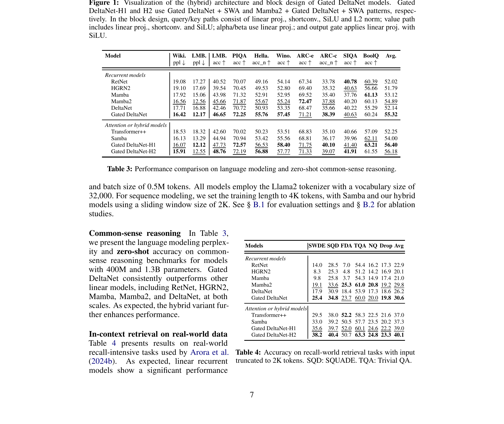
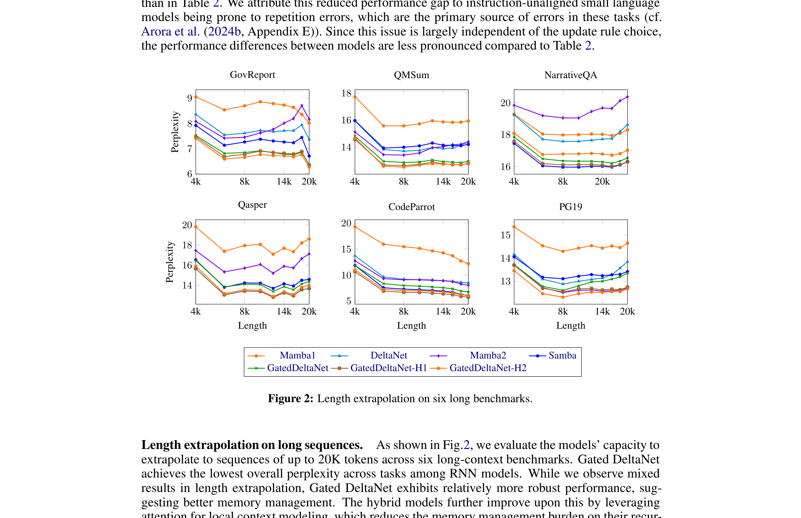
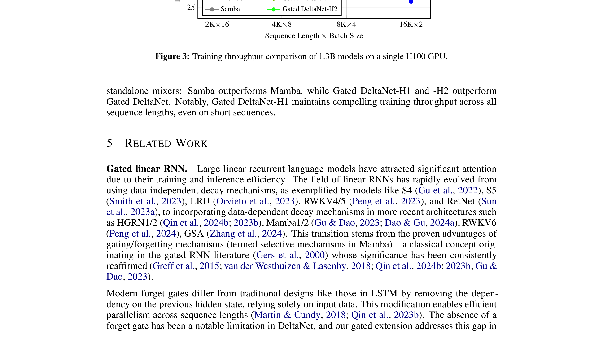

# Gated Delta Networks: Improving Mamba2 with Delta Rule

| 项目 | 内容 |
|------|------|
| **Authors** | Songlin Yang (MIT CSAIL), Jan Kautz (NVIDIA), Ali Hatamizadeh (NVIDIA) |
| **Published** | 2024-12 (ICLR 2025) |
| **Link** | [arXiv 2412.06464](https://arxiv.org/abs/2412.06464) |
| **Code** | [NVlabs/GatedDeltaNet](https://github.com/NVlabs/GatedDeltaNet) |

**一句话总结:**
- 提出 gated delta rule，将 Mamba2 的 gating（指数衰减）与 DeltaNet 的 delta rule（Householder 变换）结合，实现快速清除 + 精准更新的互补优势，在语言建模、长上下文理解等任务上持续超越 Mamba2 和 DeltaNet。

**核心贡献:**
- 提出 **gated delta rule**，将标量门控 α_t∈(0,1)（控制整体衰减）与 delta rule 的 Householder 过渡矩阵 I-β_t k_t k_t^T（选择性更新）统一为一条递推公式
- 推导了 gated delta rule 的硬件高效 chunkwise 并行训练算法，通过扩展 WY 表示实现 tensor-core 优化
- Gated DeltaNet 在 1.3B/100B tokens 规模下持续超越 RetNet、HGRN2、Mamba、Mamba2、DeltaNet 等基线，hybrid 变体（+SWA/+Mamba2）进一步提升性能
- Hybrid 架构 Gated DeltaNet-H2 在 LongBench 平均 18.4 分，超越纯 Transformer++ 的 11.0 分

---

### 1. Background & Motivation

**线性注意力**（Linear Transformer / Linear Attention）将标准 softmax attention 替换为核化线性注意力，推理时可重写为矩阵值状态的线性 RNN，消除 O(n²) 的 KV cache 增长。但线性注意力的记忆容量受状态维度 d_k × d_v 的限制——当序列长度超过此容量时，"memory collision" 导致无法精确检索。

现有工作从两个不同角度改进线性注意力：

**Gating（门控衰减）** — 如 Mamba2 使用标量门控 α_t∈(0,1) 控制历史信息的指数衰减：
$$S_t = \alpha_t S_{t-1} + v_t k_t^T$$
- 优势：可以快速清除陈旧信息（α_t→0 时几乎完全重置记忆）
- 劣势：所有 key-value 关联被同等衰减，无法选择性遗忘特定信息

**Delta Rule（增量规则）** — 如 DeltaNet 使用 Householder 过渡矩阵选择性更新：
$$S_t = S_{t-1} (I - \beta_t k_t k_t^T) + \beta_t v_t k_t^T$$
- 优势：可以精准修改单个 key-value pair 而不影响其他关联
- 劣势：一次只能修改一个 pair，缺乏快速批量擦除机制，在上下文切换时更新效率低

本文的核心洞察：**gating 和 delta rule 是互补的**——快速清除能力 vs 精准更新能力。将两者结合有望获得更好的记忆管理。

### 2. High-Level Method

#### 2.1 Gated Delta Rule

提出 gated delta rule，将两者统一为一条递推公式：

$$S_t = S_{t-1} \left( \alpha_t (I - \beta_t k_t k_t^T) \right) + \beta_t v_t k_t^T$$

其中：
- α_t∈(0,1) — 数据相关的标量门控，控制整体状态衰减（来自 Mamba2）
- β_t∈(0,1) — 数据相关的标量，控制写入强度（来自 DeltaNet）
- 当 α_t→0 时：近似完全重置记忆（gating 的快速清除）
- 当 α_t→1 时：退化为纯 delta rule（精准选择性更新）

通过在线学习框架（Liu et al., 2024）的统一视角，各模型的递推公式对应不同的在线学习目标：

| 方法 | 在线学习目标 | 递推更新 |
|------|-------------|---------|
| Linear Attention | \|S_t - S_{t-1}\|²_F - 2⟨S_t k_t, v_t⟩ | S_t = S_{t-1} + v_t k_t^T |
| Mamba2 | \|S_t - α_t S_{t-1}\|²_F - 2⟨S_t k_t, v_t⟩ | S_t = α_t S_{t-1} + v_t k_t^T |
| DeltaNet | \|S_t - S_{t-1}\|²_F - 2⟨S_t k_t, β_t(v_t - S_{t-1} k_t)⟩ | S_t = S_{t-1}(I - β_t k_t k_t^T) + β_t v_t k_t^T |
| **Gated DeltaNet** | \|S_t - α_t S_{t-1}\|²_F - 2⟨S_t k_t, β_t(v_t - α_t S_{t-1} k_t)⟩ | S_t = S_{t-1}(α_t(I - β_t k_t k_t^T)) + β_t v_t k_t^T |

从 fast weight programming 视角，delta rule 可视为以 β_t 为学习率的 SGD 优化在线回归目标 L(S_t) = ½\|S_t k_t - v_t\|²。Gated delta rule 则相当于在 SGD 中引入自适应的 weight decay 项 α_t。

#### 2.2 Hardware-Efficient Chunkwise Training

计算式 (10) 的朴素实现需要逐时间步串行递推，无法在现代 GPU 上高效利用 tensor core。本文扩展 Yang et al. (2024b) 基于 **WY 表示**（Bischof & Loan, 1985）的并行化方法，为 gated delta rule 设计硬件高效的 chunkwise 算法：

将序列分割为大小为 C 的 chunks，每个 chunk 内的计算通过矩阵乘法加速：

$$S_{[t+1]} = \overrightarrow{S}_{[t]} + \left( \tilde{U}_{[t]} - \overleftarrow{W}_{[t]} S_{[t]}^{T} \right)^T \overrightarrow{K}_{[t]}$$

$$O_{[t]} = \overleftarrow{Q}_{[t]} S_{[t]}^{T} + (Q_{[t]} K_{[t]}^T \odot M) \left( \tilde{U}_{[t]} - \overleftarrow{W}_{[t]} S_{[t]}^{T} \right)$$

其中 \(\overleftarrow{q}_{[t]}^{r} = \gamma_{[t]}^{r} q_{[t]}^{r}\)、\(\overrightarrow{k}_{[t]}^{r} = \frac{\gamma_{[t]}^{C}}{\gamma_{[t]}^{r}} k_{[t]}^{r}\) 分别表示向 chunk 首尾方向的衰减，\(\gamma_{[t]}^{j} = \prod_{s=1}^{j} \alpha_{[t]}^{s}\) 为 gating 累积乘积。这一算法将 gating 项融合到 WY 表示的前处理中，额外开销极小。

#### 2.3 Architecture

Gated DeltaNet 遵循 Llama 的 macro 架构，用 gated delta rule token mixer 替换 self-attention：

**Block 设计：**
- **Query/Key 路径：** Linear → ShortConv → SiLU → L2 Normalization
- **Value 路径：** Linear → ShortConv → SiLU
- **α/β 路径：** Linear projection only
- **Output gate：** Linear projection with SiLU（类似 GLA/RetNet）
- **Head dim=128** 为最优性价比

**Hybrid 架构：**
- **Gated DeltaNet-H1：** Gated DeltaNet + Sliding Window Attention（SWA）层间交替
- **Gated DeltaNet-H2：** Mamba2 + Gated DeltaNet + SWA 层间交替

### 3. Key Implementation Details

**参数化：** α_t 使用 Mamba2 的参数化方式（short convolution + sigmoid），β_t 使用线性投影 + sigmoid。

**稳定性：** Q/K 使用 L2 normalization 保证训练稳定，与 DeltaNet 一致。

**初始化：** S_0 = 0（零初始化状态矩阵），所有线性投影使用标准初始化。

**训练配置（1.3B 模型）：**
- 数据：FineWeb-Edu，100B tokens
- 优化器：AdamW（lr=4e-4, weight decay=0.1, grad clip=1.0）
- 学习率调度：Cosine annealing，1B tokens warm-up
- Batch size：0.5M tokens
- 训练长度：4K tokens
- SWA 窗口：2K tokens

### 4. Experiments & Results

**语言建模和常识推理（1.3B）：**

| 模型 | Wiki. ppl ↓ | LMB. ppl ↓ | PIQA ↑ | Hella. ↑ | Wino. ↑ | ARC-e ↑ | Avg. ↑ |
|------|-----------|-----------|--------|---------|---------|---------|--------|
| Mamba2 | 16.56 | 12.56 | 71.87 | 55.67 | 55.24 | 72.47 | 54.89 |
| DeltaNet | 17.71 | 16.88 | 70.72 | 50.93 | 53.35 | 68.47 | 52.14 |
| **Gated DeltaNet** | **16.42** | **12.17** | **72.25** | **55.76** | **57.45** | **71.21** | **55.32** |
| Gated DeltaNet-H1 | 16.07 | 12.12 | 72.57 | 56.53 | 58.40 | 71.75 | 56.40 |
| Gated DeltaNet-H2 | 15.91 | 12.55 | 72.19 | 56.88 | 57.77 | 71.33 | 56.18 |

Gated DeltaNet 在所有纯循环模型中最佳，在 6/8 项指标上超越 Mamba2。

**真实世界召回任务：**

| 模型 | SWDE | SQD | FDA | TQA | NQ | Drop | Avg |
|------|------|-----|-----|-----|-----|------|-----|
| Mamba2 | 19.1 | 33.6 | 25.3 | 61.0 | 20.8 | 19.2 | 29.8 |
| DeltaNet | 17.9 | 30.9 | 18.4 | 53.9 | 17.3 | 18.6 | 26.2 |
| **Gated DeltaNet** | **25.4** | **34.8** | **23.7** | **60.0** | **20.0** | **19.8** | **30.6** |
| Transformer++ | 29.5 | 38.0 | 52.2 | 58.3 | 22.5 | 21.6 | 37.0 |

纯循环模型中 Gated DeltaNet 最佳，但纯循环模型与 Transformer 仍有显著差距。Hybrid 架构（+SWA）基本追平甚至超越纯 Transformer。

**S-NIAH 案例研究（理解三个组件的作用）：**

| 任务 | 设置 | 发现 |
|------|------|------|
| S-NIAH-1 (passkey) | 重复上下文，测试长期记忆 | DeltaNet ≈ 100%，Mamba2 随长度骤降（gating 衰减过快），Gated DeltaNet 通过 delta rule 缓解 |
| S-NIAH-2 (number) | 真实文本上下文，测试信息筛选 | DeltaNet 骤降（memory collision，无 gating），Mamba2 和 Gated DeltaNet 更好（gating 过滤无关信息）|
| S-NIAH-3 (UUID) | 复杂值记忆 | Mamba2 快速退化，Gated DeltaNet 更好（delta rule 的精准绑定能力）|

**长上下文理解（LongBench 14 任务平均）：** Gated DeltaNet 16.6 > Mamba2 13.5 > DeltaNet 13.6，在 Single-doc QA（NQA 14.1）、Few-shot（TRC 30.0）和 Code（RBP 22.1）上优势明显。

**训练吞吐量：** Gated DeltaNet 与 DeltaNet 吞吐量几乎相同（tensor-core 利用率高），略低于 Mamba2。Gated DeltaNet-H1 在全部序列长度上保持有竞争力的吞吐量。

### 5. Limitations & Reflection

**作者承认的局限/未来工作：**
- 纯循环模型与 Transformer 在 retrieval 任务上仍有差距
- 未来工作将探索更长的序列（>20K）上的表现
- 更 expressive 的变体（如负特征值、多 Householder 乘积）可以直接应用于 Gated DeltaNet
- 非线性回归目标（如 TTT、Titans）可进一步提升表达力，但需要维护非线性递推

**技术意义（个人视角）：**
- 本文的核心贡献在于统一了 gating 和 delta rule 两种看似正交的记忆管理机制
- 从在线学习视角提供了统一理论框架，为后续 linear RNN 设计提供了 principled 的指导
- Chunkwise 算法扩展为融合 gating 的一般化方法，可以应用于更广泛的更新规则（如 RWKV-7 的 diagonal-plus-low-rank）
- Hybrid 架构（循环 + 局部注意力）正成为 state-of-the-art linear RNN 的标配设计
- 消融实验确认了 short convolution、output gate、L2 normalization 等设计选择的重要性

**Key Concepts:**
- **[[gated-delta-rule|Gated Delta Rule]]** — 统一 gating 和 delta rule 的记忆管理机制

---

**Extracted Figures:**
- `gated-delta_fig1_architecture.png` — Gated DeltaNet 架构和 block 设计可视化（Hybrid 布局 + Gated Delta Rule 内部流程）
- `gated-delta_fig2_length_extrapolation.png` — 6 个长文本基准上的长度外推 perplexity 曲线（vs Mamba2/DeltaNet/Samba）
- `gated-delta_fig3_throughput.png` — 1.3B 模型在单 H100 上的训练吞吐量对比（K tokens/s）
