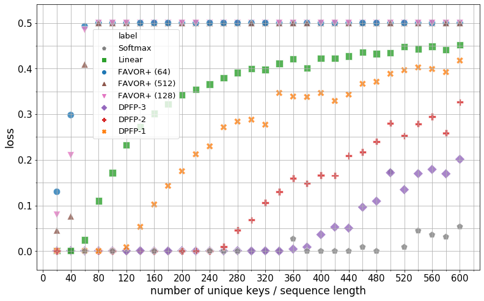
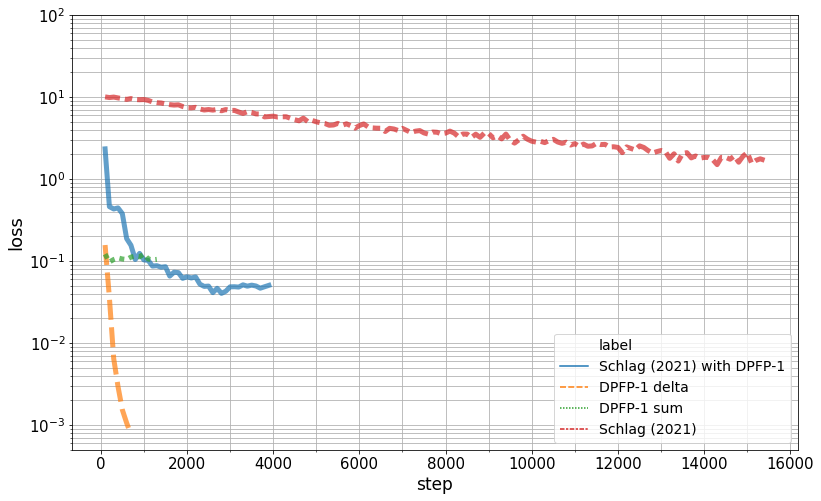
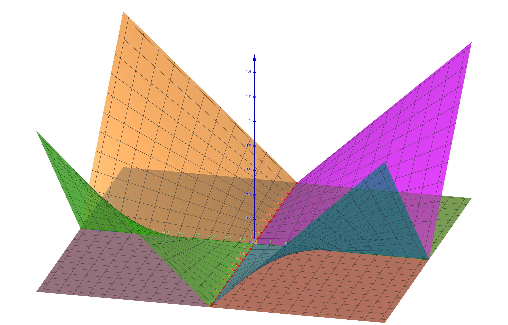

# Linear Transformers Are Secretly Fast Weight Programmers (DeltaNet)

| 项目 | 内容 |
|------|------|
| **Authors** | Imanol Schlag, Kazuki Irie, Jürgen Schmidhuber (IDSIA / USI & SUPSI) |
| **Published** | 2021-02 (ICML 2021) |
| **Link** | [arXiv 2102.11174](https://arxiv.org/abs/2102.11174) |
| **Code** | [ischlag/fast-weight-transformers](https://github.com/ischlag/fast-weight-transformers) |

**一句话总结:**
- 证明线性化 self-attention 与 1990 年代的 Fast Weight Programmers (FWP) 形式等价，揭示线性注意力的记忆容量瓶颈（受限于 key 投影维度 d_dot），并提出用 delta rule 替代纯加法外积来改善有限记忆的动态更新。

**核心贡献:**
- 建立线性化 self-attention 与 **Fast Weight Programmers (FWPs)**（Schmidhuber, 1991）的形式等价关系——两者都通过外积（outer product）在有限矩阵记忆中累计 key-value 关联
- 识别线性注意力的 **容量瓶颈**：当序列长度超过 d_dot（key 投影维度）时，key 无法保持正交，引发 retrieval error（crosstalk）
- 提出 delta rule 式的编程指令替代纯加法外积——FWP 先检索当前 key 对应的旧值，再用自适应的 β(i) 插值新旧值，实现精准更新
- 提出 **DPFP (Deterministic Parameter-Free Projection)** 核函数，用确定性两因子特征将 key 投影到更高维空间，增加记忆容量

---

### 1. Background & Motivation

线性 Transformer（Katharopoulos et al., 2020）用线性化 softmax 替代标准 attention，将复杂度从 O(n²) 降至 O(n)，同时将记忆压缩为常量大小的矩阵状态。然而，线性注意力在复杂任务上的表现仍显著弱于标准 Transformer。

本文从 **Fast Weight Programmers (FWPs)** 的视角重新审视线性注意力。FWPs 早在 1991 年（Schmidhuber, 1991; 1992; 1993）就提出用"慢网络"通过可微指令编程"快权重存储器"。慢网络是常规的梯度训练权重，快权重是由慢网络在线生成的输入依赖的权重矩阵，充当短期记忆。

核心观察：**去掉 softmax 的 self-attention 就是 FWPs**：

$$y(i) = \sum_{j=1}^{i} v(j) \otimes k(j) \; q(i) = W(i) q(i)$$

线性化 softmax 后的 attention 也只是 FWPs + normalization：
$$W(i) = \sum_{j=1}^{i} v(j) \otimes \phi(k(j)), \quad y(i) = \frac{W(i) \phi(q(i))}{z(i) \cdot \phi(q(i))}$$

其中 φ 是核函数，z(i) = Σ φ(k(j)) 是归一化项。

### 2. High-Level Method

#### 2.1 记忆容量分析（Tensor Product Representation 视角）

FWPs 的矩阵记忆 W ∈ R^{d_value × d_dot} 可以存储的最大无干扰 key-value 关联数等于 key 投影空间的维度 d_dot。原因是：W = Σ v(j) ⊗ φ(k(j))，检索时 y = W φ(q) = Σ v(j)(φ(k(j))·φ(q))。若 φ(k(j)) 不是正交的，点积会同时激活多个值，产生 crosstalk/retrieval error。

**容量边界**：在 d_dot 维空间中最多的正交向量数为 d_dot。因此当序列长度 L > d_dot 时，模型进入 **overcapacity regime**，必然发生检索错误。

软注意力（softmax）不受此限制，因为它将 key-value 对拼接存储（而非压缩为固定矩阵），存储容量随序列线性增长。

#### 2.2 Delta Rule 编程指令

纯加法更新（sum rule）在 overcapacity 时无法选择性更新/删除特定关联。本文提出类似 delta rule 的更新指令：

**算法流程**：
1. **检索旧值**：¯v(i) = W(i-1) φ(k(i))
2. **生成写入强度**：β(i) = σ(W_β x(i))，β(i) ∈ (0, 1)
3. **插值新值**：v_new(i) = β(i) v(i) + (1-β(i)) ¯v(i)
4. **更新记忆（delta rule形式）**：
$$W(i) = W(i-1) + \underbrace{v_{\text{new}}(i) \otimes \phi(k(i))}_{\text{write}} - \underbrace{\bar{v}(i) \otimes \phi(k(i))}_{\text{remove}}$$
$$= W(i-1) + \beta(i) (v(i) - \bar{v}(i)) \otimes \phi(k(i))$$

这是经典的 delta rule（Widrow & Hoff, 1960），其中 β(i) 是自适应的"学习率"。模型自动学习何时应该大幅修改记忆（β→1）、何时保持现有记忆（β→0）。该模型被称为 **Delta Network**（或 DeltaNet）。

**Sum Normalization**：作者提出将 φ(k) 和 φ(q) 的每个分量除以其分量之和（使得分量和为 1），替代 attention normalization。这使得矩阵-向量乘法可被视为对列的注意力加权，同时避免了 attention normalization 中累加器无限增长的问题。

#### 2.3 DPFP：Deterministic Parameter-Free Projection

现有的核函数 φ 各有缺陷：
- **ELU+1**（Katharopoulos）：保持维度不变（d_dot = d_key），不增加容量
- **FAVOR+**（Performer）：随机特征近似，引入方差，训练不稳定

DPFP 是一种确定性、无参数的核函数，通过两因子 ReLU 特征将输入投影到更高维空间：

$$\phi_{i\nu}(k) = ReLU([k; -k]_i) \cdot ReLU([k; -k]_{i+\nu})$$

其中 ν 是容量控制超参数，输出维度 d_dot = 2 d_key ν。当 ν > 1 时，DPFP 可以增加记忆容量。

### 3. Key Implementation Details

**模型架构**：
- 与标准 Transformer 相同的 macro 架构，但将 self-attention 替换为线性注意力（FWPs）
- 支持多头注意力（H = 8），每头有独立的 W、z

**Delta Network 训练细节（WikiText-103）**：
- Small：D=128, L=256, 16层, 40M 参数
- Medium：D=256, L=384, 16层, 90M 参数
- 不使用时序位置编码（消融实验验证其不必要）
- 使用 sum normalization 而非 attention normalization
- custom CUDA kernel 加速

### 4. Experiments & Results

**合成检索（Setting 1 - Capacity 测试）：**
Linear-Attention (ELU+1, d_dot=64) 在 S≥60 时开始误差，DPFP-1 (d_dot=128) 在 ~100、DPFP-3 (d_dot=384) 在 ~350 后开始误差。软注意力在所有 S 下几乎零误差。

**合成检索（Setting 2 - Update Rule 测试）：**
在有替换采样（需要更新已有关联）的场景中，delta rule 指令在 20 个 epoch 内收敛到接近零损失，而 sum rule 完全失败（无法选择性遗忘旧值）。

**WMT14 英德翻译：**

| 模型 | d_dot | Test BLEU |
|------|-------|-----------|
| Standard Transformer | - | 27.7 |
| Linear Transformer | 64 | 26.8 |
| Performer | 512 | 27.7 |
| DPFP (ours) | 256 | 26.9 |
| DPFP (ours) | 512 | 27.1 |

**WikiText-103 语言建模（有限上下文）：**

| 模型 | Update Rule | Valid PPL | Test PPL |
|------|------------|-----------|----------|
| Transformer | - | 27.9 | 29.6 |
| Linear Transformer | sum | 31.1 | 33.0 |
| **Delta Network** | **delta** | **29.7** | **31.5** |
| Performer | sum | 32.2 | 33.8 |
| Performer | delta | 30.0 | 31.8 |

Delta network 在中等配置下将测试困惑度从 33.0（sum rule）降至 31.5。

**无限上下文（无截断训练/评估）：**

| 模型 | State Size | Test PPL |
|------|-----------|----------|
| Linear Transformer | 0.13M | >260 |
| **Delta Network** | **0.13M** | **29.4** |
| Transformer-XL | 0.13M | 65.5 |
| Transformer-XL | 2.10M | 27.4 |
| Transformer-XL | 6.29M | 25.5 |

Delta Network 在极小 state size（0.13M）下实现了与 Transformer-XL（2.10M state）可比的 29.4 PPL，而 sum rule 的 Linear Transformer 完全失效（>260 PPL）。

### 5. Limitations & Reflection

**作者承认的局限/未来工作：**
- Delta Network 在 WikiText-103 上仍低于 Transformer-XL 的最佳配置（25.5 vs 29.4）
- 需进一步探索更好的编程指令和 FWP 设计
- 在极长序列上的表现尚需验证

**历史影响（个人视角）：**
- 本文建立了线性注意力和 90 年代 FWP 之间的桥梁——这一理论贡献使得后续 Gated DeltaNet、Mamba2 等模型可以用在线学习/FWP 框架统一理解
- Delta rule 更新指令直接启发了 Schlag et al. (2021) 的原始 DeltaNet，进而影响了 Gated DeltaNet（Paper 1）等后续工作
- DPFP 虽未被广泛采用，但其强调的正交性/稀疏性原则对后续线性注意力核函数设计有参考价值
- Sum normalization 的设计与后续 RetNet、GLA 等 model 采用的归一化方式有相似之处
- 容量分析（d_dot 限制）精确地解释了为什么早期的 Linear Transformer 在长序列上表现不佳——这一理论洞察为后来的容量增强方案（如 Mamba2 的 gating、Gated DeltaNet 的组合机制）提供了理论基础

**Key Concepts:**
- **[[fast-weight-programmer|Fast Weight Programmer (FWP)]]** — 用慢网络在线编程快权重存储器的通用框架，线性注意力的理论基础
- **[[gated-delta-rule|Gated Delta Rule]]** — 将 delta rule 与 gating 结合，进一步改进记忆管理的后续工作

---

**Extracted Figures:**
- `linear-fwp_fig1_visualisation_dpfp_space.png` — DPFP 可视化：2d → 4d 投影，四个象限激活不同的两因子组合
- `linear-fwp_fig2_final_evaluation_loss.png` — 容量测试：softmax > DPFP > Linear > Performer，超过 d_dot 后误差骤升
- `linear-fwp_fig3_learning_curves_different.png` — Delta rule vs sum rule 学习曲线：delta 仅 20 epoch 收敛而 sum 完全失败
- `linear-fwp_fig4_training_curves_setting.png` — Setting 1 中 600 个关联的训练曲线
- `linear-fwp_fig5_final_evaluation_loss.png` — Setting 2（有替换采样）不同更新规则对比
