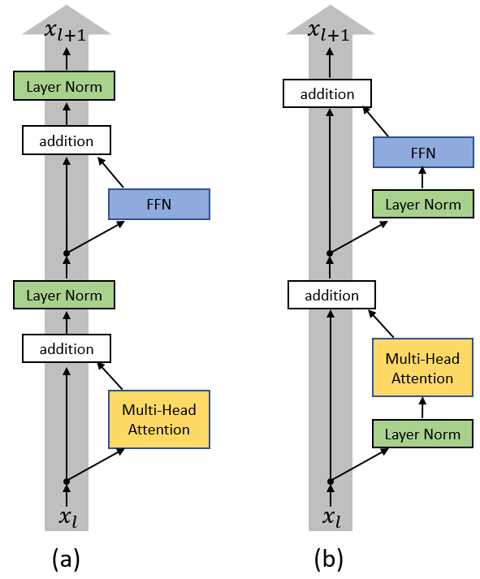
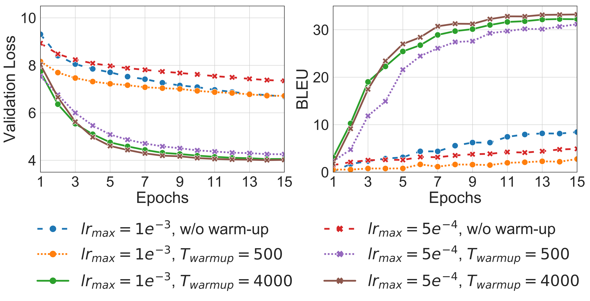
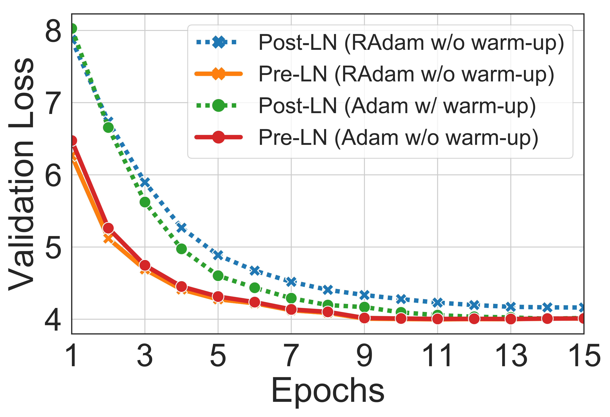
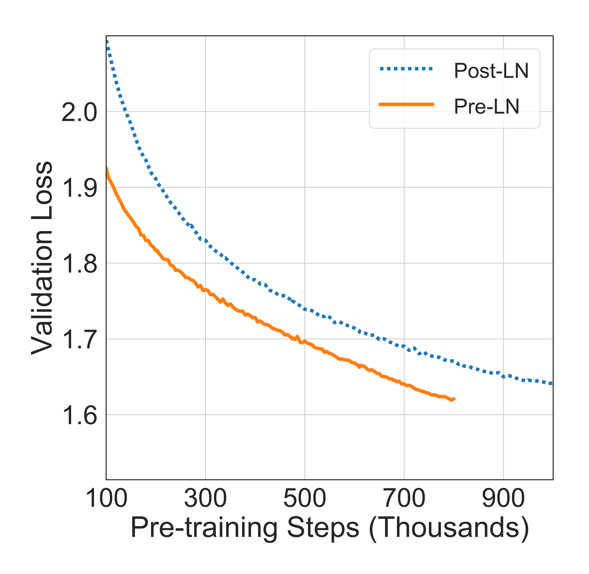
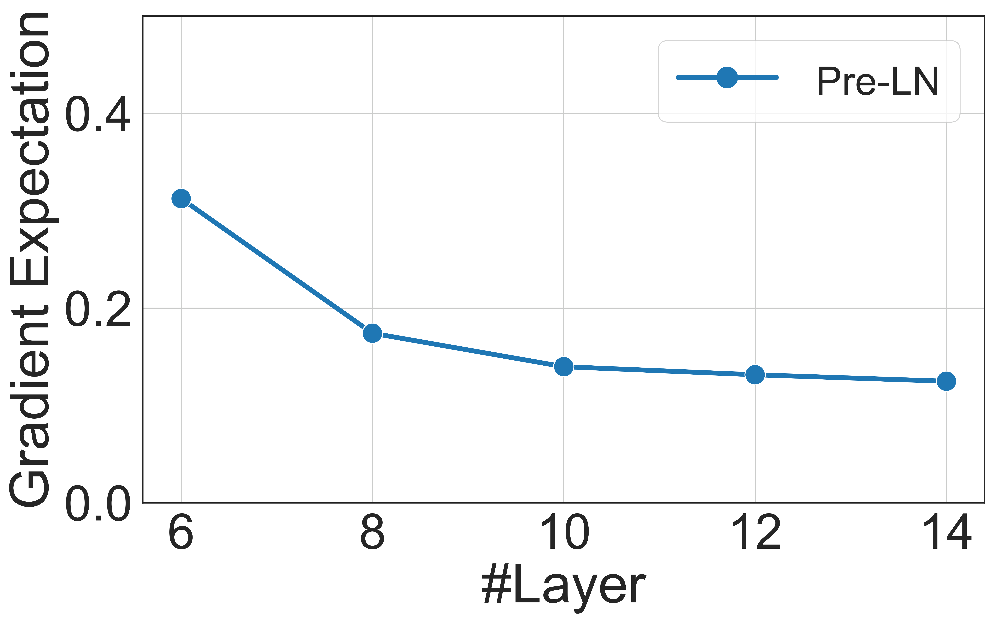

# On Layer Normalization in the Transformer Architecture

| 项目 | 内容 |
|------|------|
| **Authors** | Ruibin Xiong, Yunchang Yang, Di He, Kai Zheng, Shuxin Zheng, Chen Xing, Huishuai Zhang, Yanyan Lan, Liwei Wang, Tie-Yan Liu (Microsoft Research, PKU, CAS) |
| **Published** | 2020-02 (ICML 2020) |
| **Link** | [arXiv 2002.04745](https://arxiv.org/abs/2002.04745) |

**一句话总结:**
- 用 mean field theory 证明 Post-LN Transformer 在初始化时靠近输出层的参数梯度极大（O(d√ln d)），因此需要 warm-up 避免训练崩溃；而 Pre-LN Transformer 的梯度天然良好（O(1/√L)），可以直接移除 warm-up 阶段，在 IWSLT14、WMT14、BERT 预训练三个任务上以更少训练时间达到可比效果。

**核心贡献:**
- **理论证明**：基于 mean field theory 和 Xavier 初始化，严格推导 Post-LN 和 Pre-LN 在初始化时的梯度尺度差异
- **Warm-up 必要性的解释**：Post-LN 的 warm-up 本质是通过小学习率避免输出层大梯度的破坏性更新
- **Pre-LN 无需 warm-up**：首次提出 Pre-LN Transformer 可以安全移除 warm-up 阶段，简化超参调优
- **跨任务验证**：在 NMT（IWSLT14、WMT14）和 BERT 预训练上验证——Pre-LN 无 warm-up 不仅不差，反而收敛更快
- **理论启发**：Layer normalization 的位置通过控制 hidden state 的幅值，间接决定梯度尺度

---

### 1. Background & Motivation



训练 Transformer 时，**learning rate warm-up** 几乎是一个标配。从原始的 Transformer（Vaswani et al., 2017）到 BERT（Devlin et al., 2018），都需要在最初若干步从 0 线性增加 learning rate。但这带来了两个问题：
1. 增加超参数（warmup steps）
2. 在 warm-up 阶段浪费训练时间

本文试图回答：**为什么 warm-up 对 Transformer 是必须的？能不能去掉它？**

核心答案在 **layer normalization 的位置**上。原始的 Transformer 使用 **Post-LN**（LN 放在 residual block 之后），而另一种变体 **Pre-LN**（LN 放在 residual block 内部 + 最后一层额外 LN）则具有好得多的梯度性质。

### 2. High-Level Method

**Post-LN Transformer（原始版）：**
```
x^{post,1}_{l,i} = MultiHeadAtt(x^{post}_{l,i}, [x^{post}_{l,1}, ..., x^{post}_{l,n}])
x^{post,2}_{l,i} = x^{post}_{l,i} + x^{post,1}_{l,i}
x^{post,3}_{l,i} = LayerNorm(x^{post,2}_{l,i})
x^{post,4}_{l,i} = ReLU(x^{post,3}_{l,i} W_{1,l} + b_{1,l}) W_{2,l} + b_{2,l}
x^{post,5}_{l,i} = x^{post,3}_{l,i} + x^{post,4}_{l,i}
x^{post}_{l+1,i} = LayerNorm(x^{post,5}_{l,i})
```

**Pre-LN Transformer：**
```
x^{pre,1}_{l,i} = LayerNorm(x^{pre}_{l,i})
x^{pre,2}_{l,i} = MultiHeadAtt(x^{pre,1}_{l,i}, [x^{pre,1}_{l,1}, ..., x^{pre,1}_{l,n}])
x^{pre,3}_{l,i} = x^{pre}_{l,i} + x^{pre,2}_{l,i}
x^{pre,4}_{l,i} = LayerNorm(x^{pre,3}_{l,i})
x^{pre,5}_{l,i} = ReLU(x^{pre,4}_{l,i} W_{1,l} + b_{1,l}) W_{2,l} + b_{2,l}
x^{pre}_{l+1,i} = x^{pre,5}_{l,i} + x^{pre,3}_{l,i}
Final: x^{pre}_{Final,i} = LayerNorm(x^{pre}_{L+1,i})
```

**核心理论结果（Theorem 1）：**

对于 Post-LN Transformer，最后 FFN 层的梯度尺度：
$$E[\| \frac{\partial \tilde{L}}{\partial W_{2,L}} \|_F] = O(d\sqrt{\ln d})$$

即与深度 L 无关但随维度 d 增长——这意味着大模型的输出层梯度会极大。

对于 Pre-LN Transformer：
$$E[\| \frac{\partial \tilde{L}}{\partial W_{2,L}} \|_F] = O(1/\sqrt{L})$$

随深度 L 增大而衰减，尺度可控。

**理论洞察（Lemma 2 和 Lemma 3 的结合）：**

- **Post-LN**：LN 反复将 hidden state 归一化到固定幅度 O(√d)，因此 LN 的 Jacobian 矩阵范数为 O(1)，不提供梯度衰减 → 输出层梯度大
- **Pre-LN**：hidden state 随深度线性增长（从 Lemma 2，E(||x^{pre}_{l,i}||²) ≈ O(ld)），因此最终 LN 的 Jacobian 为 O(1/√(Ld)) → 输出层梯度被 L 缩放

### 3. Key Results



**定理 1：Post-LN 需要 warm-up 的根源**

上图展示了 IWSLT14 De-En 任务上 Post-LN 和 Pre-LN 在不同 warm-up 策略下的行为：
- Post-LN 在无 warm-up 时训练完全崩溃（loss 不下降）
- Post-LN 需要足够的 warm-up steps（T_warmup=4000）才能正常训练
- Pre-LN 无论有无 warm-up 都能稳定训练，且训练状态几乎重合

**实验一：IWSLT14 和 WMT14 翻译**



| 模型 | IWSLT14 De-En (BLEU) | WMT14 En-De (BLEU) |
|:---|---:|:---:|
| Post-LN (warmup) | 34.59 | 27.31 |
| Pre-LN (no warmup, inverse sqrt LR) | 34.87 | 27.60 |
| Pre-LN (warmup) | 34.83 | 27.53 |

Pre-LN 在无 warm-up 的情况下 BLEU 分数与 Post-LN 有 warm-up 持平或略高。

**实验二：BERT 预训练**



在 MLM（Masked Language Model）预训练任务上，Pre-LN 的 loss 下降速度显著快于 Post-LN，最终 MLM accuracy 和下游任务（MRPC, RTE）表现相当或更好。关键收益是训练速度：在 32 个 P40 GPU 上，Pre-LN 没有 warm-up 的开销，每次训练节省约 10-20% 的时间。

### 4. Analysis

**梯度分析（Figure 3）：**



论文通过实验验证了理论预测：
- Post-LN 最后几层（尤其是 FFN 的 W₂）的梯度范数非常大（~10² 量级），而靠近输入层的梯度逐渐衰减
- Pre-LN 各层梯度范数均匀且小（~10⁻¹ 量级），没有梯度爆炸或消失
- Transformer 规模增大（hidden dim d 上升）时，Post-LN 的末层梯度随之增大，而 Pre-LN 不受影响

**为什么 warm-up 有效？**
Warm-up 通过小的 learning rate 避免了初期大梯度的破坏性更新。当训练进行一定步数后，模型参数离开初始区域，梯度恢复正常尺度，此时可以逐渐增大 learning rate。

**为什么不是 Adam 的问题？**
论文特意用 SGD 也实验了相同的现象——Post-LN 在无 warm-up 时 SGD 同样崩溃，而 Pre-LN 稳定。这说明 warm-up 的必要性不是 Adam 的方差校正问题，而是架构本身的梯度性质。

### 5. Limitations & Reflection

**局限：**
- 理论分析做了简化假设（单头注意力、W_Q 和 W_K 初始化为零、输入高斯分布），与真实模型有差距
- 只在 NMT 和 BERT 两类任务上验证，未探索更大规模模型（如 GPT-3 级）
- Pre-LN 的理论表明梯度随 1/√L 衰减，极深模型（100+ 层）时可能仍然存在梯度消失风险（后被 [[deepnorm|DeepNorm]] 解决）
- 实验使用的模型规模较小（base Transformer, BERT-base）

**思考：**
- 本文是 **"架构设计对优化的影响"** 的经典案例——同一套架构改一个组件位置就彻底改变了收敛行为
- Pre-LN 已成为现代 LLM（GPT-2/3, LLaMA, BLOOM 等）的事实标准，这篇论文提供了理论上的 justification
- 论文的 mean field theory 框架后来被 [[deepnorm|DeepNorm]] 推广到任意深度的稳定训练
- "Warm-up 不是 Adam 的问题而是架构的问题" 这一结论改变了社区对 warm-up 的理解
- 本文与 [[transformer]] 概念紧密相关，解释了为什么后来的 LLM 几乎全部使用 Pre-LN

---

**Extracted Figures:**
- `layernorm-transformer_fig1_post_transformer_layer.png` — Post-LN vs Pre-LN 架构对比示意图
- `layernorm-transformer_fig2a_performances_models_optimized.png` — Adam 优化下 Post-LN / Pre-LN 在不同 warmup 策略的 loss/BLEU
- `layernorm-transformer_fig2b_performances_models_optimized.png` — SGD 优化下相同对比
- `layernorm-transformer_fig3a_norm_gradients_1.png` — Post-LN 各层梯度范数（大）
- `layernorm-transformer_fig3b_norm_gradients_1.png` — Pre-LN 各层梯度范数（小且均匀）
- `layernorm-transformer_fig4a_performances_models_iwslt14.png` — IWSLT14 De-En 翻译结果（loss + BLEU）
- `layernorm-transformer_fig5a_performances_models_unsupervised.png` — BERT 预训练 MLM accuracy 曲线
