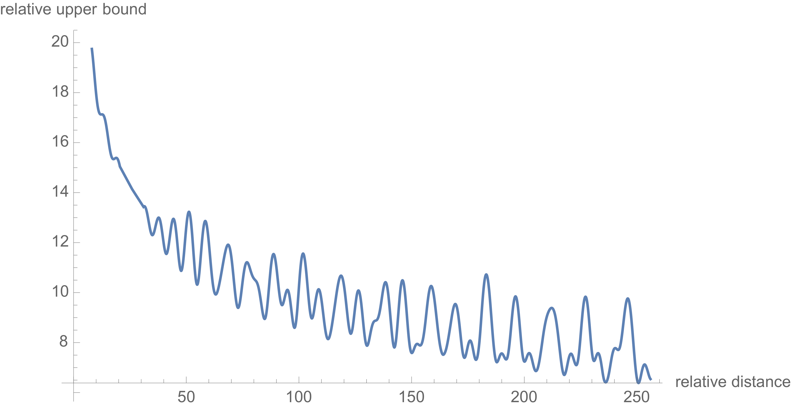
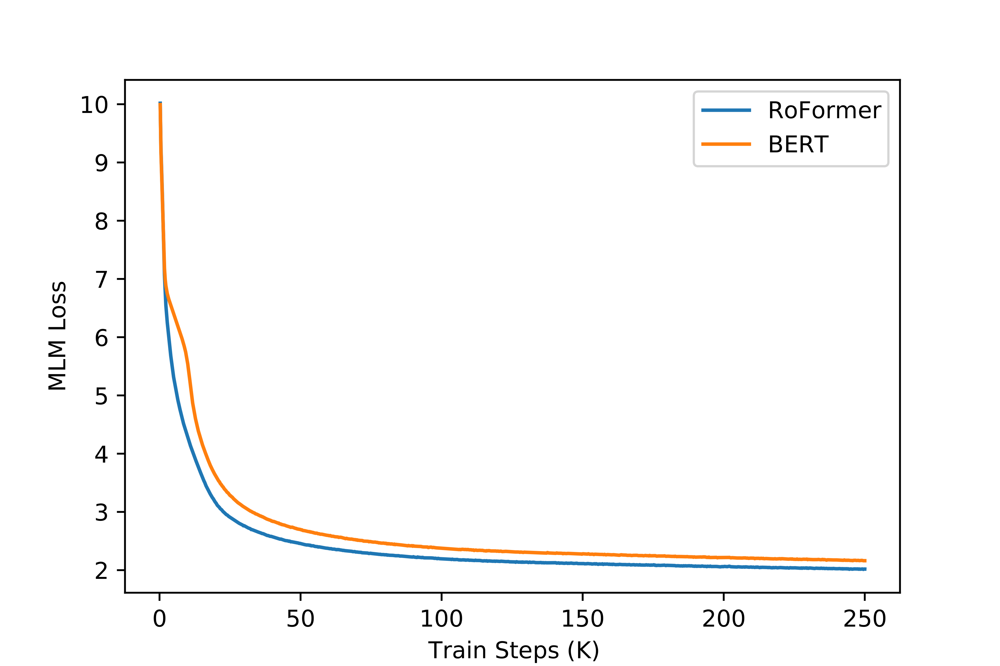

# RoFormer: Enhanced Transformer with Rotary Position Embedding (RoPE)

| 项目 | 内容 |
|------|------|
| **Authors** | Jianlin Su, Yu Lu, Shengfeng Pan, Ahmed Murtadha, Bo Wen, Yunfeng Liu (Zhuiyi Technology) |
| **Published** | 2021-04 |
| **Link** | [arXiv 2104.09864](https://arxiv.org/abs/2104.09864) |

**一句话总结:**
- 提出 [[rope|RoPE]]（Rotary Position Embedding），用旋转矩阵编码绝对位置的同时使 self-attention 自动捕捉相对位置依赖，兼具绝对位置编码的简单性和相对位置编码的表达能力，已成为 LLM 事实标准的位置编码方案。

**核心贡献:**
- **旋转位置编码**：通过旋转矩阵 f{q,k}(xm, m) = R^d_{Θ,m}·W{q,k}·xm 将位置信息注入 query 和 key，使内积 qₘᵀkₙ 仅依赖于相对位置 m-n
- **长期衰减（Long-term Decay）**：RoPE 内积随相对距离增大而衰减，符合 NLP 直觉——相距越远的 token 相关性越低
- **兼容线性注意力**：不改变表示范数，可直接用于 Performer 等线性注意力机制
- **外推能力**：支持超过训练长度的序列（在长文本 Chinese legal 任务上 1024 长度优于 BERT/WoBERT）

---

### 1. Background & Motivation

现有位置编码方案的分类与局限：

| 方案 | 方法 | 局限 |
|:---|:---|:---|
| **绝对位置编码** | 将位置向量加到 token 表示上（训练式或正弦函数） | 无法直接编码相对位置信息 |
| **相对位置编码** | 在 attention score 计算中加入偏置项 | 实现复杂，修改 attention 公式 |
| **旋转位置编码 (RoPE)** | 在 query/key 上应用旋转矩阵 | 兼具两者优点，不修改 attention 公式 |

核心洞察：**位置编码可以通过在 query 和 key 上应用旋转来实现——旋转角度编码绝对位置，而 query-key 内积自动体现相对位置差异。**

### 2. High-Level Method

**2D 推导：**
从 query/key 的内积形式出发，要求 f(q, m)ᵀ f(k, n) = g(q, k, m-n)，即只依赖于相对位置。在 2D 情况下，解为：
- f(q, m) = (q₀ cos mθ - q₁ sin mθ, q₀ sin mθ + q₁ cos mθ)ᵀ
- 即对 q 旋转 mθ 角度

**General Form（d 维）：**
将 d 维空间分为 d/2 个 2D 子空间，每个子空间应用 2D 旋转，得到块对角旋转矩阵：
```
R^d_{Θ,m} = diag(R(mθ₁), R(mθ₂), ..., R(mθ_{d/2}))
θᵢ = 10000^{-2(i-1)/d}
```
则：
- f{q,k}(xm, m) = R^d_{Θ,m}·W{q,k}·xm
- qₘᵀkₙ = (R^d_{Θ,m}·Wq·xm)ᵀ·(R^d_{Θ,n}·Wk·xn) = xᵀWq·R^d_{Θ,n-m}·Wk·xn

内积仅依赖于相对位置 n-m，R^d_{Θ} 是正交矩阵保证数值稳定性。



RoPE 的长期衰减特性：内积上界随相对距离增加而衰减，自动编码了"近强远弱"的位置相关性。

### 3. Results

**机器翻译：**



WMT 2014 En→De，RoFormer 27.5 BLEU vs Transformer-base 27.3。

**MLM 预训练：**


左图：RoFormer 的 MLM loss 下降显著快于 BERT（同等 steps 下更低）。右图：PerFormer + RoPE 相对于无 RoPE 收敛更快、loss 更低——RoPE 兼容线性注意力。

**长文本任务（CAIL2019-SCM Chinese Legal）：**

| Model | max_len=512 | max_len=1024 |
|:---|---:|---:|
| BERT | 64.13% / 67.7% | — |
| WoBERT | 69.14% / 70.1% | 72.36% / 73.2% |
| **RoFormer** | **69.93% / 70.3%** | **74.50% / 73.5%** |

RoFormer 在 1024 长度上超越 WoBERT（+1.5%），说明 RoPE 的外推能力优于训练式绝对位置编码。

### 4. Analysis

**RoPE 的优良性质：**
1. **旋转不变性**：正交旋转矩阵保持向量范数与内积结构，不破坏语义表示
2. **相对位置编码**：qₘᵀkₙ 仅依赖于 n-m，实现真正的相对位置编码
3. **长期衰减**：内积幅度随 |m-n| 增大而衰减，符合 NLP 直觉
4. **兼容线性注意力**：不改变表示范数，可直接用于 Linear Transformer、Performer 等

**与 Sinusoidal 位置编码的关系：**
RoPE 与 Vaswani 的 sinusoidal 编码有共同的形式渊源（都使用 10000^{-2i/d} 作为频率）。区别在于：
- Sinusoidal：直接加到 token 表示上（加法），位置和内积耦合
- RoPE：通过旋转融入 query/key（乘法），位置和内积通过相对位置解耦

### 5. Limitations & Reflection

**局限：**
- **不支持大角度旋转**：当序列长度超过训练时的范围，旋转角度可能超出模型适应的区间 → 后来被 Positional Interpolation 等方法解决
- 仅在 WMT En→De 上做翻译实验，规模较小（Transformer-base 对比）
- 论文未探索超长序列的外推极限（直到后来的工作才揭示 RoPE 的外推能力）
- 中文版文章比英文版发表更早（苏剑林最初在 2021 年初发布在"科学空间"博客）

**思考：**
- RoPE 是**目前 LLM 事实标准的位置编码**（Llama、Mistral、Gemma、Qwen、Baichuan 等均采用）
- 其成功的关键在于：数学优雅（旋转矩阵）、实现简单（无需修改 attention 公式）、天然支持相对位置、不引入额外参数
- 长期衰减性质与 ALiBi 思路不谋而合（[[rope|RoPE]] 的长衰减 vs ALiBi 的线性偏置）——都认为位置相关性应随距离衰减
- RoPE 的可扩展性是后期 Positional Interpolation、NTK-aware scaling、YaRN 等长度外推方法的基础

---

**Extracted Figures:**
- `rope_fig1_illustration.png` — RoPE 旋转位置编码的图形化示意
- `rope_fig2_long_term_decay.png` — 内积上界随相对距离衰减曲线（长期衰减性质）
- `rope_table1_bleu.png` — WMT 2014 En→De BLEU 对比
- `rope_fig3_mlm_loss.png` — MLM 和 PerFormer 训练 loss 曲线
