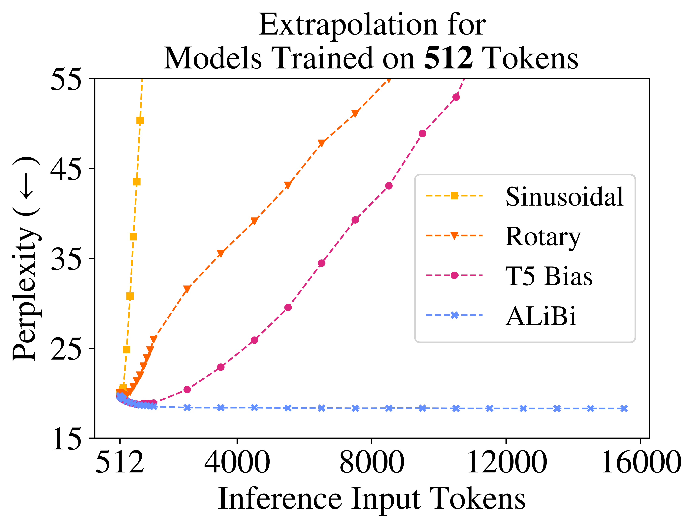
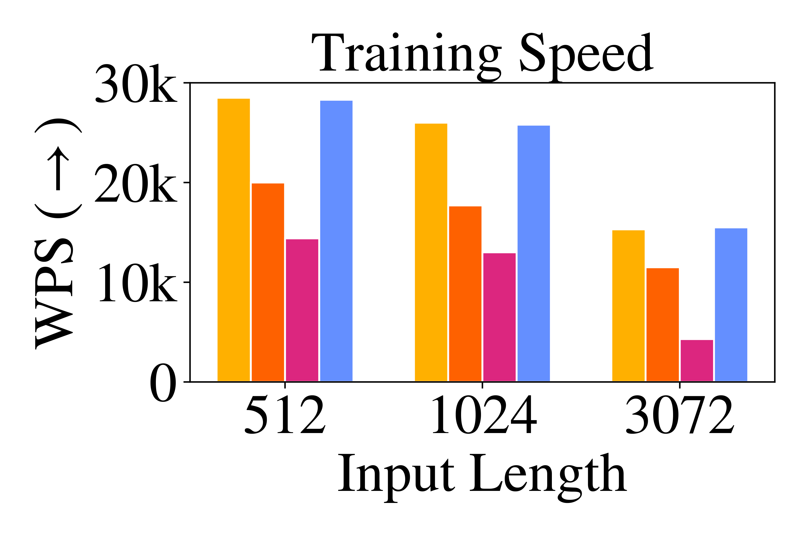
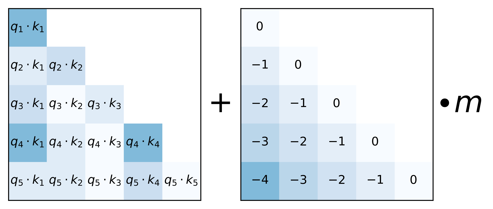
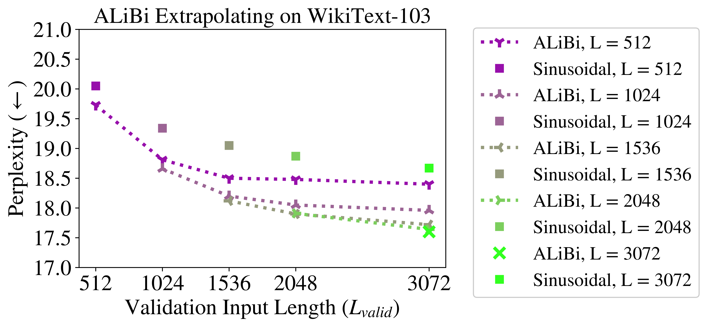
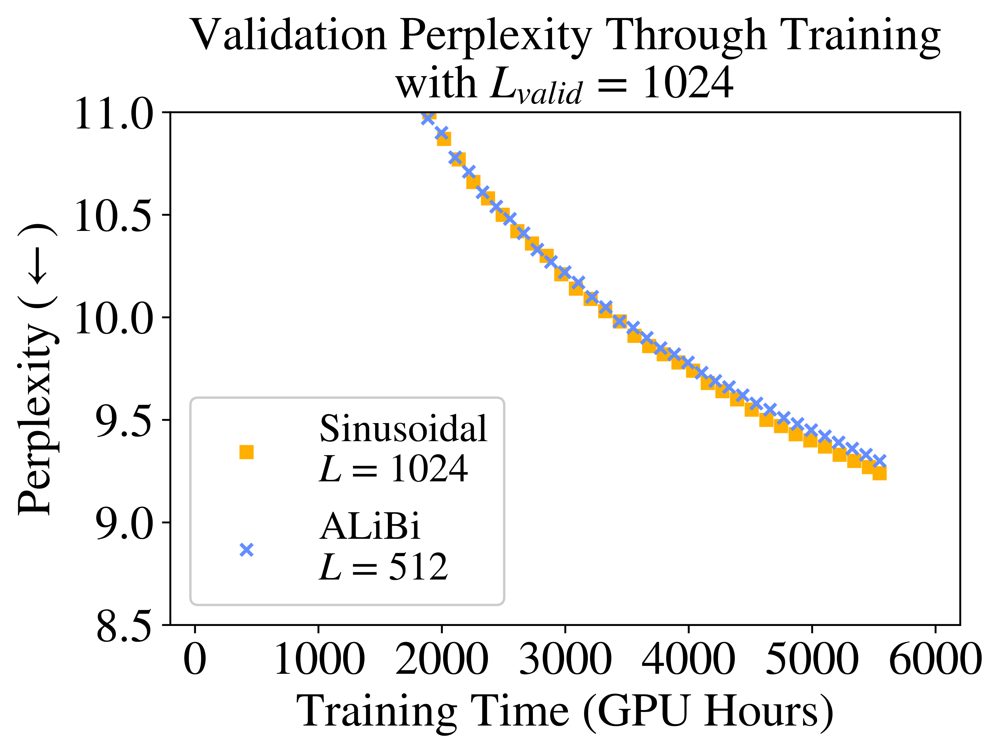

# Train Short, Test Long: Attention with Linear Biases Enables Input Length Extrapolation

| 项目 | 内容 |
|------|------|
| **Authors** | Ofir Press, Noah A. Smith, Mike Lewis (University of Washington, Facebook AI Research, Allen Institute for AI) |
| **Published** | 2021-08 (ICLR 2022) |
| **Link** | [arXiv 2108.12409](https://arxiv.org/abs/2108.12409) |

**一句话总结:**
- 提出 ALiBi（Attention with Linear Biases），一种极简的位置编码方法——不在 word embedding 上加位置向量，只在 attention score 上加与距离成正比的静态线性偏置——使 Transformer 在训练短序列后能推理长序列（如 L=512 训练的模型在 12K tokens 上仍保持低 perplexity），1.3B 参数模型 L=1024 达到 sinusoidal L=2048 的 perplexity 且训练快 11%、内存少 11%。

**核心贡献:**
- **长度外推（Length Extrapolation）**：首次系统证明位置编码方式是 Transformer 能否外推的关键，sinusoidal 的外推能力极弱
- **ALiBi 方法**：极简实现（仅改几行 attention mask 代码），零运行时开销，无需学习参数
- **几何序列斜率**：head-specific 斜率构成几何序列，在多种数据域和模型规模上通用，无需调参
- **"Train Short, Test Long"范式**：训练短序列节省时间和内存，推理长序列保持性能——对长文档、ICL、长文本生成意义重大
- **跨任务验证**：WikiText-103、Toronto BookCorpus、CC100+RoBERTa 大语料、1.3B 大模型

---

### 1. Background & Motivation

Transformer 能否在推理时处理比训练更长的序列？Vaswani et al. (2017) 推测 sinusoidal 位置编码可以做长度外推，但本文首次系统实验发现：**sinusoidal 的外推能力极弱**，训练 L=512、验证长度到 600 时 perplexity 就开始爆炸。

上图展示了四种位置编码方法在 WikiText-103 上的外推表现：
- **Sinusoidal**：两种训练长度（L=512 和 L=1024）都在验证长度略超训练长度后 perplexity 急剧恶化
- **Rotary (RoPE)**：比 sinusoidal 稍好，但仍只能外推几十到几百个 token
- **T5 Bias**：表现更好，可外推到约 2L，但计算速度慢、占用额外内存
- **ALiBi（本文方法）**：在所有长度上持续改善 perplexity，没有外推崩溃

作者观察到一个关键事实：**位置编码方式是决定外推能力的关键**。T5 bias 比 sinusoidal 好，说明不在 value 中注入位置信息（只在 attention score 上操作）有助于外推。这启发了 ALiBi 的设计。

### 2. High-Level Method

**2.1 Why T5 Bias is inefficient**

T5 Bias 虽然外推好，但：
- 训练和推理速度远慢于 sinusoidal（多出 ~20-40% 时间）
- 内存消耗显著更高（训练 L=1024 时多 ~8 GB）
- 使用需要学习的 bias 参数（额外参数量）

**2.2 ALiBi 核心机制**

核心思想极其简单：在 query-key dot product 之后、softmax 之前，加上一个**与距离成正比的线性偏置**：

$$\text{softmax}(q_i K^\top + m \cdot [-(i-1), \ldots, -2, -1, 0])$$

其中 m 是每个 attention head 独有的非学习斜率。对于 8 个 head，斜率设置为几何序列：

$$\text{head}_1: 1/2,\ \text{head}_2: 1/4,\ \ldots,\ \text{head}_8: 1/256$$

对于 n 个 head 的一般情况，从 $2^{-8/n}$ 开始以相同值为公比。

**为什么这样设计？**
- 对近的 query-key 惩罚小（近的位置权重更高），对远的惩罚大 → **recency bias**
- 不同 head 以不同速率增加惩罚 → 多尺度距离感知
- 静态非学习 → 无需调参，且保证任何训练外长度不会遇到未见过的 bias 值

**实现：** 只需将 bias 加入 attention mask 矩阵。由于 mask 已存在，bias 的加操作无额外运行时开销。仅需将 mask 从 L×L 扩展为 n×L×L（每个 head 不同的斜率），内存增加可忽略（最高 100MB）。

### 3. Key Results

**WikiText-103 外推实验：**

| 训练长度 | 模型 | L_valid=512 | L_valid=1024 | L_valid=2048 | L_valid=3072 |
|:---:|:---|:---:|:---:|:---:|:---:|
| L=512 | Sinusoidal | ~19.7 | 爆炸 | — | — |
| L=512 | **ALiBi** | **19.73** | **18.90** | **18.52** | **18.40** |
| L=1024 | Sinusoidal | — | ~18.7 | 爆炸 | — |
| L=1024 | **ALiBi** | — | **18.65** | **18.35** | **18.28** |
| L=2048 | Sinusoidal | — | — | ~18.3 | ~18.5 |
| L=2048 | **ALiBi** | — | — | **18.28** | **18.19** |
| L=3072 | Sinusoidal | — | — | — | 18.48 |
| L=3072 | **ALiBi** | — | — | — | **18.17** |

关键发现：L=512 训练的 ALiBi 外推到 L_valid=3072 时的 perplexity（18.40）**优于 L=3072 训练的 sinusoidal（18.48）**，且训练速度是后者的 **1.84 倍**，内存需求大幅降低。

**1.3B 大模型实验：**

在 CC100+RoBERTa 大语料（461 GB）上训练 1.3B 参数模型：
- ALiBi L=512 训练，在 L_valid=1024 时与 Sinusoidal L=1024 训练的 perplexity 相当
- ALiBi L=1024 训练，在 L_valid=2048 时与 Sinusoidal L=2048 训练相当
- 但 ALiBi 训练快 6-11%，使用少 6-11% 的内存（因为训练序列更短）

**跨数据域验证：**

Toronto BookCorpus 上的结果与 WikiText-103 一致，证明了 ALiBi 的斜率设置在完全不同领域的数据上同样有效，无需调整。

### 4. Analysis

**为什么 ALiBi 能外推而 sinusoidal 不能？**

Sinusoidal 虽然在数学上可以处理任意长度，但训练中模型只见过有限范围内的位置 embedding，在推理时遇到新的 embedding 值，attention 分布的统计特性发生变化，导致 perplexity 爆炸。

ALiBi 的创新在于：**它从不使用位置 embedding，而是直接在 attention score 上施加与距离相关的偏置**。这样：
1. 没有"未见过的位置值"——偏置模式对任意距离都一致
2. 偏置是线性的、静态的——模型学到的是对"距离"的偏好而非对"绝对位置"的响应
3. 多 head 多尺度斜率 → 模型在不同粒度上同时关注近和远的上下文

**为什么 Recency Bias 有效？**

语言建模中，最近的 token 通常对预测下一个 token 最重要（n-gram 统计的合理扩展）。ALiBi 通过线性偏置自然实现了这一点，且因为不同 head 的斜率不同，可以捕捉不同范围的依赖关系。

### 5. Limitations & Reflection

**局限：**
- 外推能力在约 2L 后 perplexity 改善放缓，超过 3L 后可能不再改善，虽然不会爆炸
- 与 RoPE 相比在标准长度（训练长度内）的性能略低（但差距很小）
- 主要适合 decoder-only 语言模型，encoder-decoder 场景未充分探索
- 位置信息的表达能力不如学习型位置编码（如 RoPE + NTK-aware scaling）
- 后续被 [[positional-interpolation]] 等方法在 RoPE 上实现了类似的外推能力

**思考：**
- ALiBi 是"简单取胜"的典范——用几行代码、零额外参数解决了 length extrapolation 问题
- 其核心思想——不在输入注入位置信息，而在 attention score 层面操作——后续成为位置编码设计的重要方向
- 与 [[rope|RoPE]] 的对比很有价值：RoPE 也是 attention score 层面的操作（通过旋转矩阵），ALiBi 通过更直接的方式（加 bias）实现了更强的外推
- "Train short, test long"范式对降低 LLM 训练成本意义重大，但在实际大模型（如 LLaMA）中未被广泛采用（主流改用 RoPE + PI/NTK）
- 与 [[positional-interpolation]] 的比较：ALiBi 天然外推无需微调；PI 需要 1000 步微调但窗口扩展倍数更大

---

**Extracted Figures:**
- `alibi_fig1a_extrapolation_input_sequence.png` — L=512 训练的各位置编码外推 perplexity 对比
- `alibi_fig1b_extrapolation_input_sequence.png` — L=1024 训练的相同对比
- `alibi_fig2a_comparison_batched_training.png` — 各方法的训练速度对比
- `alibi_fig2b_comparison_batched_training.png` — 各方法的推理速度对比
- `alibi_fig2c_comparison_batched_training.png` — 各方法的训练内存对比
- `alibi_fig3_when_computing_attention.png` — ALiBi 核心机制：query-key score + 线性 bias
- `alibi_fig4_models_trained_evaluated.png` — WikiText-103 主结果：所有训练长度的 ALiBi vs Sinusoidal
- `alibi_fig5a_1_parameter_alibi.png` — 1.3B ALiBi L=512 外推到 L=1024 vs Sinusoidal L=1024
- `alibi_fig5b_1_parameter_alibi.png` — 1.3B ALiBi L=1024 外推到 L=2048 vs Sinusoidal L=2048
