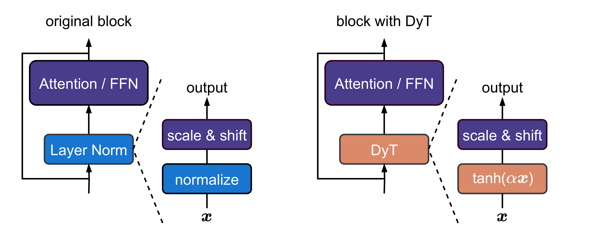
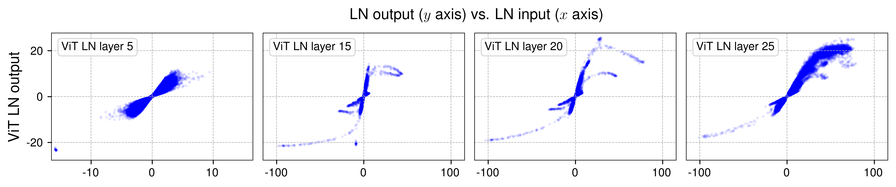
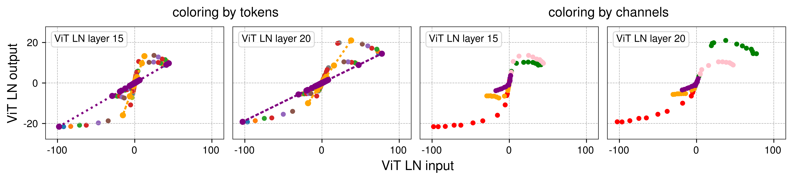
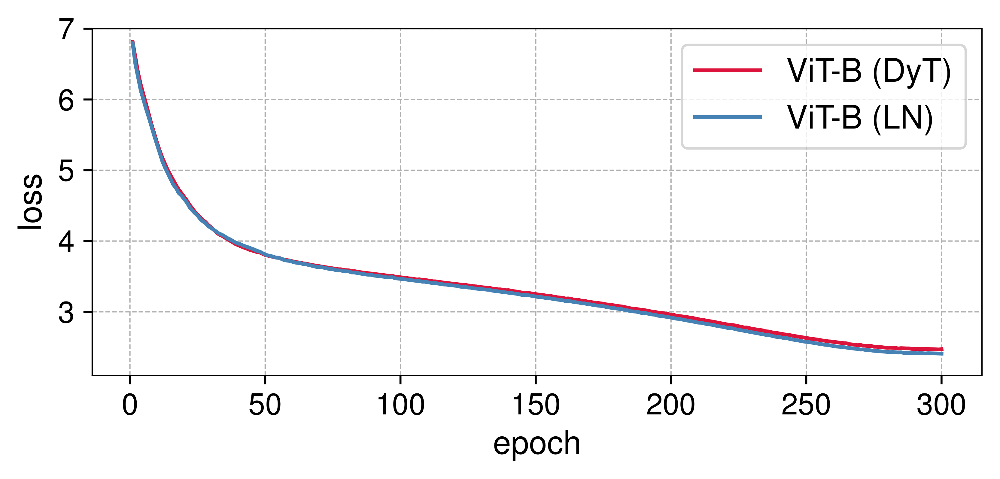
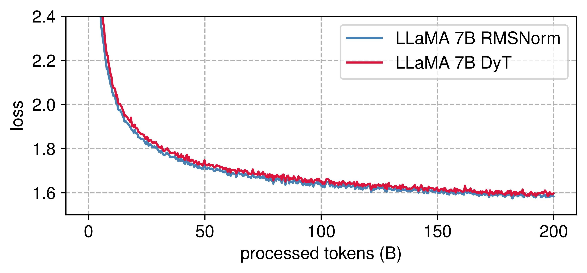
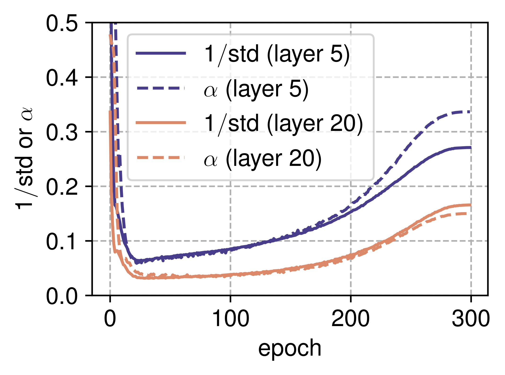

# Transformers without Normalization

| 项目 | 内容 |
|------|------|
| **Authors** | Jiachen Zhu, Xinlei Chen, Kaiming He, Yann LeCun, Zhuang Liu (FAIR, Meta; NYU; MIT; Princeton) |
| **Published** | 2025-03 (arXiv, updated 2025-06) |
| **Link** | [arXiv 2503.10622](https://arxiv.org/abs/2503.10622) |

**一句话总结:**
- 发现 Layer Normalization 在 Transformer 中的输入-输出映射本质上是 tanh 状的 S 形曲线，据此提出 Dynamic Tanh (DyT) —— $\text{DyT}(x) = \gamma \cdot \tanh(\alpha x) + \beta$ —— 作为 normalization 的 drop-in 替代，在 ViT、ConvNeXt、MAE、DINO、DiT、LLaMA 7B-70B、wav2vec 2.0、DNA 模型上全部匹敌或超越原版 LN/RMSNorm，挑战了"normalization 层在现代深度网络中不可或缺"的传统认知。

**核心贡献:**
- **关键发现**：LN 的输入-输出映射是 S 形曲线（类似 tanh），而非简单的线性变换——中间约 99% 的点近似线性，极端值被 squash
- **DyT 方法**：极简的 element-wise 操作 $\tanh(\alpha x)$ + affine 变换，无需计算统计量，可直接替换 normalization
- **跨模态验证**：CV（ViT、ConvNeXt、MAE、DINO、DiT）+ NLP（LLaMA 7B-70B）+ 语音（wav2vec 2.0）+ DNA（HyenaDNA、Caduceus）
- **LLaMA 70B 级验证**：200B tokens 预训练，DyT 在 loss 和 15 个 zero-shot 任务上完全匹配 RMSNorm
- **挑战共识**：首次以足够大规模的证据表明 Transformer 可以完全没有 normalization 层

---

### 1. Background & Motivation

Normalization layers（BN、LN、RMSNorm）已被视为现代深度网络的基础组件。从 2015 年 Batch Normalization 提出以来，几乎所有主流架构都使用 normalization。Layer Normalization 在 Transformer 中尤其重要——每个 sublayer 之后都接一个 LN。

但本文从一个简单问题出发：**Normalization 到底在做什么？**



图 1 展示了原始 Transformer block（左）和用 DyT 替换 LN 后的 block（右）。DyT 的替换方式极其简单——直接替换每个 LN 层，包括 attention 内部、FFN 内部、以及最终的 normalization 层。

**Normalization 的通用公式：**
$$\text{normalization}(x) = \gamma \cdot \frac{x - \mu}{\sqrt{\sigma^2 + \epsilon}} + \beta$$

不同方法（BN、LN、RMSNorm）的区别仅在于 μ 和 σ² 的计算范围。

### 2. High-Level Method

**2.1 关键洞察：LN 的行为类似 tanh**

本文通过对 ViT、wav2vec 2.0、DiT 三个已训练模型的分析，发现了一个惊人的现象：



图中展示了各模型不同深度 LN 层的输入-输出关系：
- **早期层**：近似线性映射（一条直线）
- **深层**：明显的 S 形曲线，与 tanh 函数高度相似

为什么会这样？LN 是按 token 做线性变换（减均值除标准差），但不同 token 的均值和标准差不同，当所有 token 的变换画在一起时，就形成了非线性的 S 形曲线。

**用 token 和 channel 两个视角解释：**



- 同一 token 的所有 channel 构成一条直线（per-token 线性）
- 不同 token 的直线分布在不同的 x 区间
- 极端 channel 的值被 squash——这正是 LN 的关键作用

**2.2 Dynamic Tanh (DyT)**

基于以上观察，本文提出：

$$\text{DyT}(x) = \gamma \cdot \tanh(\alpha x) + \beta$$

其中 α 是可学习标量（初始化 α₀=0.5），γ、β 是 per-channel 可学习向量（与 LN 的 affine 参数相同）。

```
class DyT(nn.Module):
    def __init__(self, C, init_alpha=0.5):
        super().__init__()
        self.alpha = nn.Parameter(torch.ones(1) * init_alpha)
        self.gamma = nn.Parameter(torch.ones(C))
        self.beta = nn.Parameter(torch.zeros(C))

    def forward(self, x):
        x = torch.tanh(self.alpha * x)
        return self.gamma * x + self.beta
```

DyT 不是 normalization——它不计算统计量，不做跨 token/channel 聚合。它是一个 element-wise 操作，但保留了对极端值的 squash 效果。

### 3. Key Results

**ImageNet 分类（ViT 和 ConvNeXt）：**

| 模型 | LN | DyT | 变化 |
|:---|---:|---:|---:|
| ViT-B | 82.3% | 82.5% | ↑0.2% |
| ViT-L | 83.1% | 83.6% | ↑0.5% |
| ConvNeXt-B | 83.7% | 83.7% | — |
| ConvNeXt-L | 84.3% | 84.4% | ↑0.1% |



**LLaMA 大规模语言模型（7B-70B, 200B tokens）：**



| 模型 | RMSNorm Zero-shot | DyT Zero-shot | RMSNorm Loss | DyT Loss |
|:---|---:|---:|---:|---:|
| LLaMA 7B | 0.513 | 0.513 | 1.59 | 1.60 |
| LLaMA 13B | 0.529 | 0.529 | 1.53 | 1.54 |
| LLaMA 34B | 0.536 | 0.536 | 1.50 | 1.50 |
| LLaMA 70B | 0.549 | 0.549 | 1.45 | 1.45 |

DyT 在所有 4 个规模上完全匹配 RMSNorm 的 zero-shot 平均得分和训练 loss。

**其他模态：**

| 任务 | 模型 | LN/RMSNorm | DyT | 变化 |
|:---|:---|---:|---:|---:|
| SSL (MAE ViT-B) | 分类 | 83.2% | 83.2% | — |
| SSL (DINO ViT-B/8) | 分类 | 84.1% | 84.5% | ↑0.4% |
| 扩散模型 (DiT-XL) | FID ↓ | 19.9 | 20.8 | ↑0.9 |
| 语音 (wav2vec 2.0 Large) | loss | 1.92 | 1.91 | ↓0.01 |
| DNA (HyenaDNA) | 分类 | 85.2% | 85.2% | — |

### 4. Analysis

**为什么 LN 呈现 S 形？**

LN 对每个 token 独立做 $(x - \mu)/\sigma$。从数学上看，这是对每个 token 的线性变换。但当将所有 token 的变换结果画在一起时，因为不同 token 的 μ 和 σ 不同，这些线性映射分布在不同的 x 区间。极端值的 token（如某 channel 激活值特别大）被 σ 较大的 token 拉回——形成了直观上的 squash 效果。

**α 的关键作用：**



实验中观察到 α 与 activation 的 1/std 紧密相关。α 在训练中随 1/std 一起波动，说明它在自动学习每个 DyT 层合适的缩放范围。

**消融实验：**

| 变体 | ViT-B |
|:---|---:|
| DyT (tanh + α) | **82.5%** |
| hardtanh + α | 82.2% |
| sigmoid + α | 81.6% |
| Identity + α | diverged |
| tanh 无 α | 81.1% |

- Squashing 函数是关键（identity 直接发散）
- α 可以大幅提升性能（+1.4%）
- tanh 效果最好（平滑 + 零中心）

**与其他去 normalization 方法的对比：**

| 方法 | ViT-B | ViT-L |
|:---|---:|---:|
| LN（基线） | 82.3% | 83.1% |
| Fixup (init-based) | 77.2% | 78.1% |
| SkipInit (init-based) | 74.1% | 75.6% |
| σReparam (weight-norm) | 82.5% | 83.0% |
| **DyT** | **82.8%** | **83.6%** |

DyT 显著优于初始化方法，与 σReparam 持平或更好。

### 5. Limitations & Reflection

**局限：**
- 理论解释有限——为什么 element-wise tanh + α + affine 就能替代 normalization？目前的解释更多是 empirical
- α 在 LLM 中需要小心初始化（attention block 中推荐较大 α₀），还没有通用的自动适配策略
- 只在 Transformer 及其变体上验证，未在纯 CNN 或 RNN 上充分测试
- 与 normalization 混合使用（部分层用 LN 部分层用 DyT）的效果未被探索
- 新方法（2025 年 3 月），社区验证和复现还没有充分展开

**思考：**
- 本文最大贡献是**挑战了 normalization 层不可或滅的共识**——用更简单的 element-wise 操作即可达到同样效果
- 与 [[deepnorm|DeepNorm]] 的关系：DeepNorm 试图修改 normalization 来改进它，DyT 则彻底替换它
- DyT 的简洁性对硬件部署有利——无统计量计算意味着更少的同步、更简单的工程（尤其在训练时）
- 这与 [[alibi|ALiBi]] 的精神有相似之处：用简单操作替代复杂组件（ALiBi 用 bias 替代位置编码，DyT 用 tanh 替代 normalization）
- LLaMA 70B 上的验证使 DyT 的可信度大增——这是 normalize-free 工作有史以来最大的规模
- 本文与 [[transformer]] 概念紧密相关——如果 DyT 被社区广泛接受，将会改变 Transformer block 的标准设计

---

**Extracted Figures:**
- `no-norm_fig1_original_transformer_block.png` — DyT 替换 LN 的架构对比（左：原版，右：DyT）
- `no-norm_fig2a_output_input_selected.png` — ViT LN 层的输入-输出 S 形映射
- `no-norm_fig2b_output_input_selected.png` — wav2vec 2.0 LN 层的 S 形映射
- `no-norm_fig2c_output_input_selected.png` — DiT LN 层的 S 形映射
- `no-norm_fig3_three_different_values.png` — tanh(αx) 在不同 α 下的曲线
- `no-norm_fig4_output_input_two.png` — token/channel 分组下 LN 映射的可视化解释
- `no-norm_fig6a_training_loss_curves.png` — ViT-B 训练 loss 曲线（LN vs DyT 几乎重合）
- `no-norm_fig6b_training_loss_curves.png` — ConvNeXt-B 训练 loss 曲线
- `no-norm_fig7a_llama_pretraining_loss.png` — LLaMA 7B 预训练 loss（DyT vs RMSNorm）
- `no-norm_fig7b_llama_pretraining_loss.png` — LLaMA 13B
- `no-norm_fig7c_llama_pretraining_loss.png` — LLaMA 34B
- `no-norm_fig7d_llama_pretraining_loss.png` — LLaMA 70B
- `no-norm_fig8b_curves_three_squashing.png` — α 在训练中追踪 1/std 的变化
- `no-norm_fig9_performance_different_tasks.png` — 不同 α₀ 对各任务性能的影响
