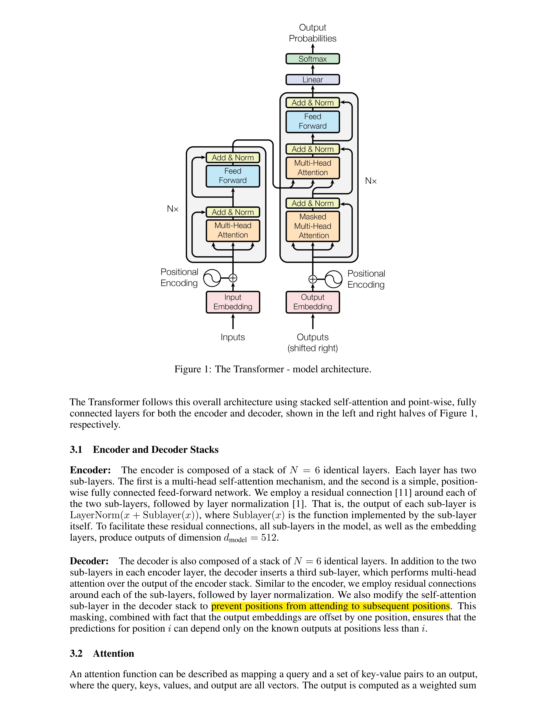
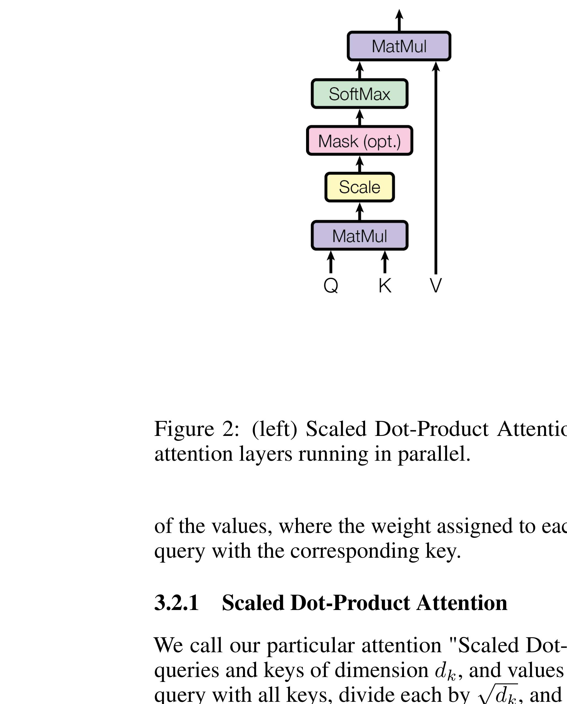
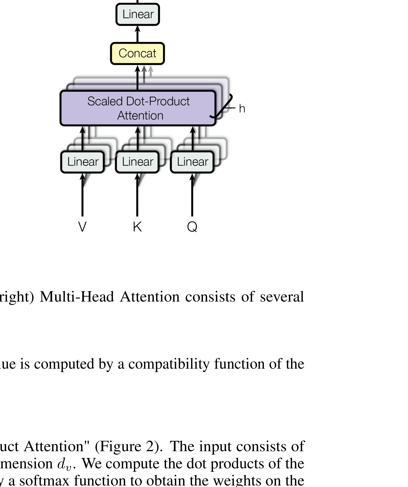
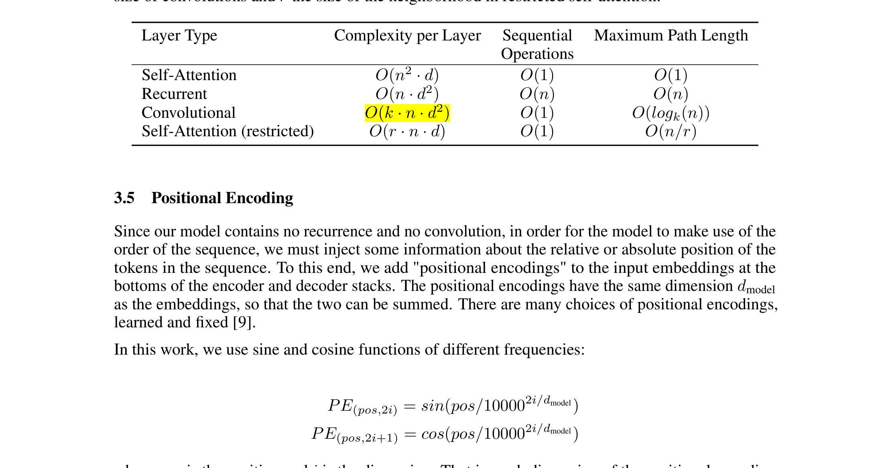
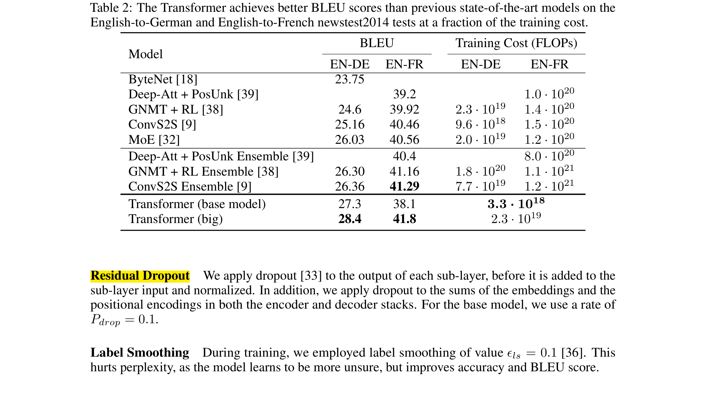
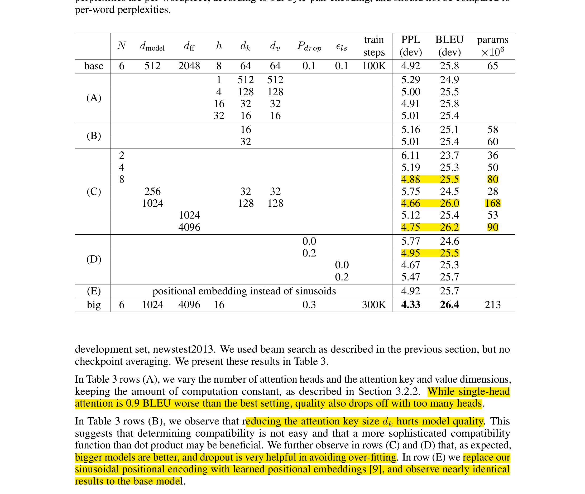
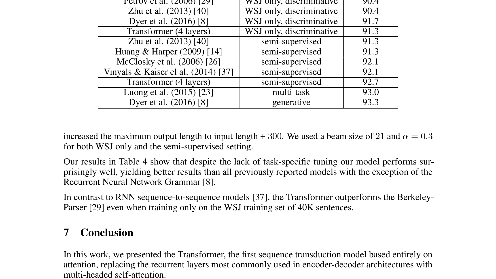

# Attention Is All You Need (Transformer)

| 项目 | 内容 |
|------|------|
| **Authors** | Ashish Vaswani, Noam Shazeer, Niki Parmar, Jakob Uszkoreit, Llion Jones, Aidan N. Gomez, Łukasz Kaiser, Illia Polosukhin (Google Brain, Univ. of Toronto) |
| **Published** | 2017-06 (NeurIPS 2017) |
| **Link** | [arXiv 1706.03762](https://arxiv.org/abs/1706.03762) |

**一句话总结:**
- 首次提出完全基于注意力机制的序列转录架构 Transformer，摒弃 RNN 和 CNN，以更高并行性和更低训练成本在机器翻译上达到 SOTA。

**核心贡献:**
- 提出纯注意力架构 Transformer，消除对循环和卷积的依赖，训练并行度从 O(n) 降至 O(1)
- 设计 Scaled Dot-Product Attention + Multi-Head Attention，允许模型在不同表示子空间联合关注信息
- 引入正弦位置编码，使无循环模型能利用序列顺序信息
- WMT 2014 EN-DE 28.4 BLEU（超此前最佳集成 >2 BLEU），EN-FR 41.8 BLEU，训练成本仅为竞品的几分之一
- 在英语成分句法分析上同样达到 SOTA，验证泛化能力

---

### 1. Background & Motivation

2017 年之前，序列转录任务（如机器翻译）的 SOTA 模型基于**循环神经网络**（RNN/LSTM/GRU）或**卷积神经网络**。RNN 的自回归特性使其无法在训练时并行化——每个时间步必须等待前一步完成。CNN 虽可并行，但需要 O(log_k(n)) 或 O(n/k) 层才能建立远距离依赖。

注意力机制虽已被用于增强 RNN 编码器-解码器架构，但从未被用作唯一的计算原语。本文的核心问题是：**能否彻底去掉循环和卷积，仅靠注意力构建一个高效的序列模型？**

### 2. High-Level Method

Transformer 遵循编码器-解码器架构，但完全由 **self-attention** 和 **position-wise FFN** 构成。

**编码器：** N=6 个相同层，每层包含两个子层：multi-head self-attention → position-wise FFN。每个子层后接 residual connection + layer normalization。

**解码器：** N=6 个相同层，在编码器两层基础上插入第三个子层——对编码器输出做 multi-head cross-attention。解码器 self-attention 使用 **masking** 确保位置 i 只能关注 i 之前的位置（保持自回归性质）。

**Scaled Dot-Product Attention:**
$$
\text{Attention}(Q, K, V) = \text{softmax}\left(\frac{QK^T}{\sqrt{d_k}}\right)V
$$

除以 √d_k 防止点积过大导致 softmax 梯度消失。

**Multi-Head Attention:**
$$
\text{MultiHead}(Q, K, V) = \text{Concat}(\text{head}_1, \ldots, \text{head}_h)W^O
$$
其中 $\text{head}_i = \text{Attention}(QW_i^Q, KW_i^K, VW_i^V)$

使用 h=8 个头，每头维度 d_k = d_v = d_model/h = 64。计算量与单头全维度 attention 相近，但模型能从不同表示子空间联合关注信息。

**三种注意力使用方式：**
- **编码器-解码器注意力：** query 来自解码器，key/value 来自编码器输出——每个解码位置关注所有输入位置
- **编码器 self-attention：** 每个位置关注前一层所有位置
- **解码器 masked self-attention：** 每个位置关注当前位置及之前位置

### 3. Key Implementation Details

**Position-wise FFN：** 每个位置独立应用相同的两层线性变换 + ReLU：FFN(x) = max(0, xW₁ + b₁)W₂ + b₂。d_model=512，内层维度 d_ff=2048。

**位置编码：** 使用不同频率的正弦/余弦函数：
$$
PE_{(pos, 2i)} = \sin(pos / 10000^{2i/d_{\text{model}}})
$$
$$
PE_{(pos, 2i+1)} = \cos(pos / 10000^{2i/d_{\text{model}}})
$$

选择正弦函数是因为它允许模型轻松学习关注相对位置（PE_{pos+k} 可表示为 PE_{pos} 的线性函数）。

**Embedding & Softmax：** 编码器和解码器共享相同的 token embedding 权重矩阵，解码器输出经线性变换 + softmax 得到 next-token 概率。

**训练细节：**
- 数据：WMT 2014 EN-DE（4.5M 句对，BPE 37K vocab），EN-FR（36M 句对，word-piece 32K vocab）
- 硬件：8× NVIDIA P100 GPU
- 优化器：Adam (β₁=0.9, β₂=0.98, ε=1e-9)，学习率 warmup + decay 策略
- 正则化：Residual dropout (P=0.1)，label smoothing (ε=0.1)

### 4. Experiments & Results

**为什么 Self-Attention 优于 RNN 和 CNN：**

Self-attention 每层复杂度 O(n²·d)，但最大路径长度仅为 O(1)——意味着任意两个位置之间只需要常数步就能建立依赖。RNN 需要 O(n) 步，CNN 需要 O(log_k(n))。当序列长度 n 小于表示维度 d 时（机器翻译中通常如此），self-attention 在计算上也是高效的。

**机器翻译主结果：**

| 模型 | EN-DE BLEU | EN-FR BLEU | 训练成本 (FLOPs) |
|------|-----------|-----------|-----------------|
| Transformer (base) | 27.3 | 38.1 | 3.3×10¹⁸ |
| Transformer (big) | **28.4** | **41.8** | 2.3×10¹⁹ |
| 此前最佳集成 | 26.36 | 41.29 | 7.7×10¹⁹ ~ 1.1×10²¹ |

Transformer (big) 在 EN-DE 上超此前最佳集成 2 BLEU，训练成本仅为其 1/3 ~ 1/4。Base 模型仅训练 12 小时即超越所有此前发布模型。

**模型消融实验：**

关键发现：
- (A) 多头注意力数量：h=8 最优，单头低 0.9 BLEU，头过多质量也下降
- (B) 减小 key 维度 d_k 会降低质量
- (C) 更大模型更好（d_model 1024 > 512）
- (D) Dropout 对防止过拟合很重要
- (E) 正玄位置编码与 learned embedding 效果几乎一致

**成分句法分析（泛化能力验证）：**

在仅 40K 训练句子的 WSJ 上取得 91.3 F1，半监督设置下 92.7 F1，超越了除 RNN Grammar 外所有此前方法。证明了 Transformer **无需针对任务特定调整**即可迁移到其他序列任务。

### 5. Limitations & Reflection

**作者承认的局限/未来工作：**
- Self-attention 的 O(n²) 复杂度对长序列场景（图像、音频、视频）是挑战，计划研究局部/受限注意力
- 希望减少生成任务的顺序性（auto-regressive decoding 仍是 O(n) 的）
- 计划将 Transformer 扩展到文本之外的其他模态

**历史影响（个人视角）：**
- 这篇论文是深度学习历史上被引用最多的论文之一，直接开启了整个 Transformer 时代
- Transformer 先统治了 NLP（BERT、GPT），随后扩展到 CV（ViT）、多模态（CLIP）、语音（Whisper）、RL（Gato），完全取代了 RNN/CNN 成为基础架构
- Scaled dot-product attention + multi-head 设计已成为事实标准
- Layer normalization + residual + pre-norm 的组合成为后续几乎所有大模型的标准配置
- 最大局限：O(n²) 的注意力计算复杂度，促使后续大量工作探索高效注意力（稀疏注意力、线性注意力、FlashAttention 等）

**Key Concepts:**
- **[[transformer|Transformer]]** — 完全基于 self-attention 的序列建模架构，现代 LLM 的基础

---

**Extracted Figures:**
- `transformer_fig1_architecture.png` — Transformer 模型架构图（编码器-解码器堆叠）
- `transformer_fig2_scaled_dot_attn.png` — Scaled Dot-Product Attention 示意图
- `transformer_fig2_multi_head_attn.png` — Multi-Head Attention 示意图
- `transformer_table1_complexity.png` — Self-Attention vs RNN vs CNN 的复杂度和路径长度对比
- `transformer_table2_translation_results.png` — WMT 2014 EN-DE/EN-FR 翻译 BLEU 分数与训练成本
- `transformer_table3_model_variations.png` — 架构变体消融实验（头数、维度、dropout 等）
- `transformer_table4_parsing.png` — 英语成分句法分析结果
