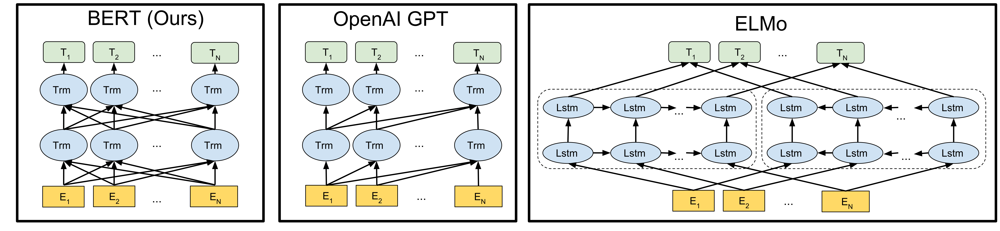
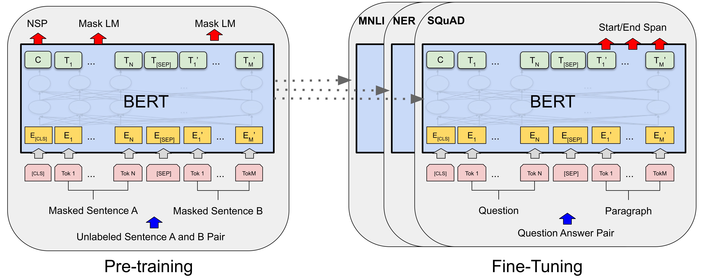
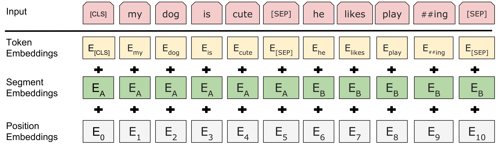
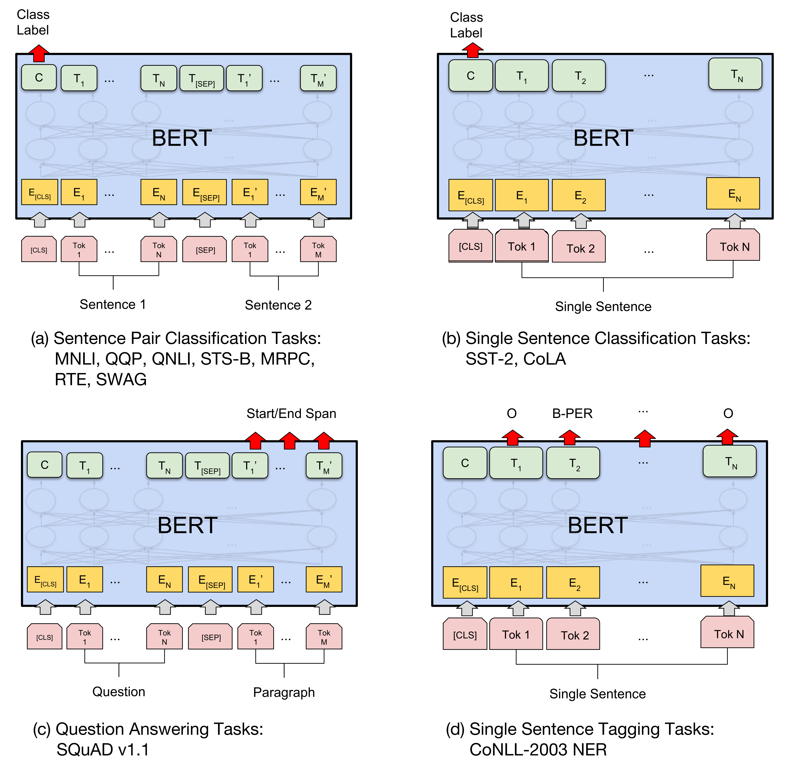
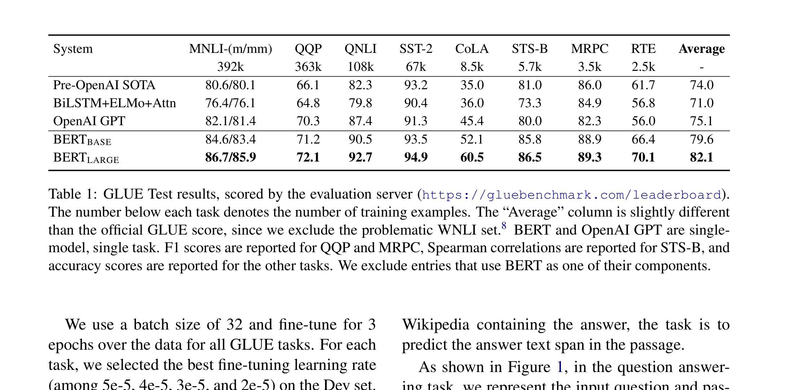
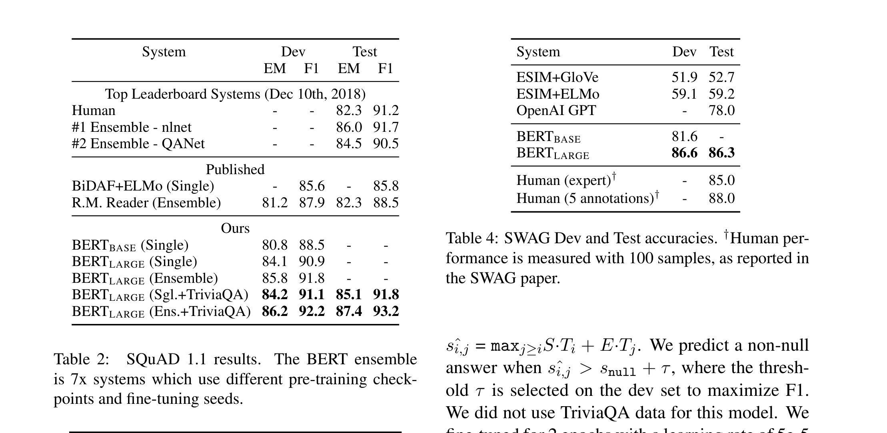
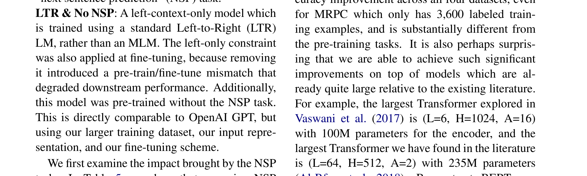
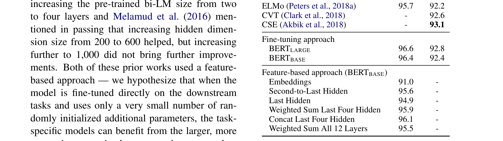
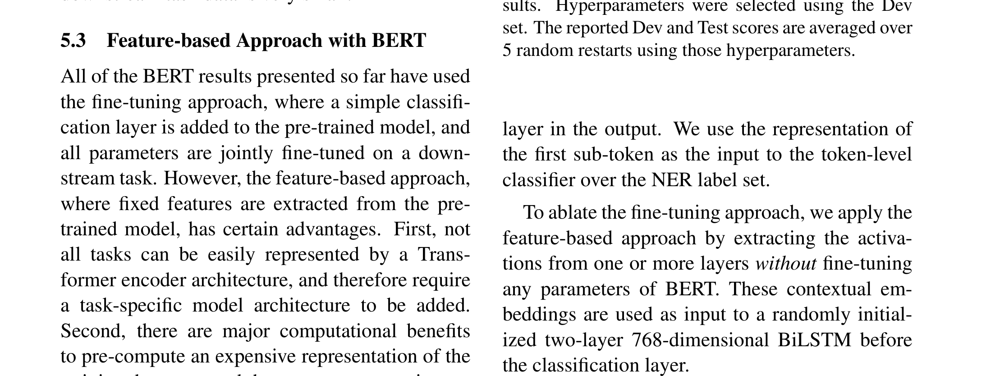

# BERT: Pre-training of Deep Bidirectional Transformers for Language Understanding

| 项目 | 内容 |
|------|------|
| **Authors** | Jacob Devlin, Ming-Wei Chang, Kenton Lee, Kristina Toutanova (Google AI Language) |
| **Published** | 2018-10 (NAACL 2019) |
| **Link** | [arXiv 1810.04805](https://arxiv.org/abs/1810.04805) |

**一句话总结:**
- 提出深度双向 Transformer 预训练模型 BERT，通过 Masked LM + Next Sentence Prediction 从无标注文本中学习双向表示，在 11 项 NLP 任务上取得 SOTA，推动 NLP 进入"预训练+微调"范式。

**核心贡献:**
- 首个基于微调的深度双向预训练模型，突破此前方法（ELMo 的浅层双向拼接、GPT 的单向 LM）的表达上限
- 提出 Masked Language Model (MLM)——随机 mask 15% 的 token 并预测，实现真正的深度双向条件化
- 提出 Next Sentence Prediction (NSP)——学习句子对关系，提升 QA 和 NLI 等下游任务
- GLUE 80.5%（+7.7%），SQuAD v1.1 F1 93.2（+1.5），SQuAD v2.0 F1 83.1（+5.1），11 项任务全部 SOTA

---

### 1. Background & Motivation

2018 年 NLP 领域正从"从头训练"转向"预训练+微调"。存在两条路线：

- **Feature-based（ELMo）：** 预训练双向 LSTM 语言模型，提取上下文相关特征作为额外输入给任务特定架构
- **Fine-tuning（OpenAI GPT）：** 预训练单向（left-to-right）Transformer LM，微调所有参数适配下游任务

核心问题：**现有预训练方法都是单向的**。GPT 使用 left-to-right Transformer，每个 token 只能关注左侧上下文。ELMo 虽拼接了独立训练的 left-to-right 和 right-to-left LSTM，但"双向"仅在最后一层浅层完成，并非真正的深度双向。

BERT 的关键洞察：**只有 BERT 在所有层同时条件化左右上下文**（通过 MLM），而 GPT 只能看左边，ELMo 的 LSTM 拼接并非真正联合双向。

### 2. High-Level Method

BERT 架构是 **multi-layer bidirectional Transformer encoder**（即 Transformer 的编码器部分）。两个主要规格：

| 模型 | Layers (L) | Hidden (H) | Attention Heads (A) | 参数量 |
|------|-----------|-----------|-------------------|--------|
| BERT_BASE | 12 | 768 | 12 | 110M |
| BERT_LARGE | 24 | 1024 | 16 | 340M |

**预训练任务 1: Masked LM (MLM)**

随机 mask 15% 的 token，让模型预测被 mask 的词。为避免预训练（有 [MASK]）和微调（无 [MASK]）不匹配，采用混合策略：
- 80% → 替换为 [MASK]
- 10% → 替换为随机词
- 10% → 保持不变

**预训练任务 2: Next Sentence Prediction (NSP)**

50% 的概率选择真实的下一句（IsNext），50% 的概率选择随机句子（NotNext）。这个二分类任务让 BERT 理解句子间关系。

**输入表示：**

输入 = Token Embeddings + Segment Embeddings + Position Embeddings 之和。
- [CLS] — 每个序列的第一个 token，其最终隐状态用于分类任务
- [SEP] — 分隔两个句子的特殊 token
- Segment Embedding — 区分句子 A/B

### 3. Key Implementation Details

**预训练数据：** BooksCorpus (800M words) + English Wikipedia (2,500M words)，使用文档级 corpus（非打乱的句子级 corpus）以提取长连续序列。WordPiece 30K 词汇表。

**训练配置：** batch size 256 序列（128K tokens/batch），1,000,000 步，Adam (lr=1e-4)，GELU 激活，dropout 0.1。BERT_BASE 在 4 Cloud TPU（16 TPU chips）上训练 4 天，BERT_LARGE 在 16 Cloud TPU（64 TPU chips）上训练 4 天。

**微调范式：** BERT 微调极其简洁——只需替换输入输出层，所有参数端到端微调。每个下游任务只需 1 小时（单 Cloud TPU）或几小时（GPU）。对于不同任务：
- 分类任务 → 取 [CLS] 的隐状态 + 分类层
- 标注任务（NER、SQuAD） → 取每个 token 的隐状态 + 输出层

### 4. Experiments & Results

**GLUE 基准（8 项 NLU 任务）：**

| 模型 | Average | MNLI | QQP | QNLI | SST-2 | CoLA | STS-B | MRPC | RTE |
|------|---------|------|-----|------|-------|------|-------|------|-----|
| OpenAI GPT | 75.1 | 82.1 | 70.3 | 87.4 | 91.3 | 45.4 | 80.0 | 82.3 | 56.0 |
| BERT_BASE | 79.6 | 84.6 | 71.2 | 90.5 | 93.5 | 52.1 | 85.8 | 88.9 | 66.4 |
| BERT_LARGE | **82.1** | **86.7** | **72.1** | **92.7** | **94.9** | **60.5** | **86.5** | **89.3** | **70.1** |

BERT 平均提升 7.0%（相对于此前 SOTA），在 MNLI 上绝对提升 4.6%。

**SQuAD 1.1（答案抽取）& SQuAD 2.0（含不可回答问题）：**

- SQuAD 1.1: BERT_LARGE Ensemble F1 **93.2**（+TriviaQA 数据）
- SQuAD 2.0: BERT_LARGE Single F1 **83.1**（+5.1 超此前最佳）

**消融实验：预训练任务的影响**

| 配置 | MNLI | QNLI | MRPC | SST-2 | SQuAD F1 |
|------|------|------|------|-------|---------|
| BERT_BASE (完整) | 84.4 | 88.4 | 86.7 | 92.7 | 88.5 |
| No NSP | 83.9 | 84.9 | 86.5 | 92.6 | 87.9 |
| LTR & No NSP | 82.1 | 84.3 | 77.5 | 92.1 | 77.8 |

- 去掉 NSP 在 QNLI 和 SQuAD 上显著下降
- LTR（left-to-right）相比 MLM 在所有任务下降，尤其 MRPC (-9.2) 和 SQuAD (-10.7)
- 即使给 LTR 加上 BiLSTM 也无法弥补差距

**模型大小的影响：**

模型越大越好——24 层、1024 hidden、16 heads 的 BERT_LARGE 在所有任务上最优。预训练 PPL 从 5.84 (3层) 降至 3.23 (24层)，下游任务精度同步提升。这与之前研究（增大预训练模型效果有限）的发现不同——关键是 **微调范式** 让任务特定模型能从更大预训练模型中受益。

**NER（特征提取 vs 微调对比）：**

- 微调 BERT_LARGE: **92.8** F1
- 特征提取最佳（拼接最后 4 层）: 96.1 Dev / 匹配微调性能
- BERT 即使用作特征提取器也优于 ELMo (92.2)

### 5. Limitations & Reflection

**局限（作者及后续观察）：**
- MLM 收敛比 left-to-right LM 略慢（每 batch 只预测 15% 的 token）
- [MASK] token 在微调时不出现导致的 pretrain-finetune mismatch，虽有缓解但仍不完美
- 计算成本高：BERT_LARGE 在 64 TPU chips 上训练 4 天，对学术界资源门槛较高
- 最大长度 512 token 的限制（受限于 Transformer 的 O(n²) 注意力）

**历史影响：**
- BERT 开启了 NLP 的"预训练-微调"范式，后续几乎所有模型（RoBERTa、ALBERT、DistilBERT、T5、DeBERTa 等）均在其基础上改进
- BERT 与 GPT 形成了 NLP 的两大路线：encoder-only（理解型）vs decoder-only（生成型），前者主导 2018-2022，后者在 2022+ 通过 ChatGPT 彻底逆转
- 本文最大的教学意义：**让深度学习社区认识到"更好的预训练目标函数 = 更好的下游性能"**，而此前人们更多关注架构创新
- "BERT 时代"建立了一套完整的评估体系（GLUE、SQuAD），推动了 NLP 研究的快速迭代

**Key Concepts:**
- **[[bert|BERT]]** — 深度双向 Transformer 预训练模型，通过 MLM + NSP 学习双向表示
- **[[transformer|Transformer]]** — 基于 self-attention 的编码器-解码器架构，BERT 采用其编码器部分

---

**Extracted Figures:**
- `bert_fig1_pretrain_finetune.png` — BERT 预训练和微调的整体流程示意
- `bert_fig2_input_repr.png` — 输入表示：Token + Segment + Position Embeddings 求和
- `bert_fig3_architecture_comparison.png` — BERT (bi-directional) vs OpenAI GPT (left-to-right) vs ELMo (LSTM concat) 架构对比
- `bert_fig4_finetuning_tasks.png` — 不同下游任务的微调方式（分类、QA、NER）
- `bert_table1_glue.png` — GLUE 8 项任务结果，BERT 平均高于 GPT 7%
- `bert_table2_squad.png` — SQuAD 1.1 和 2.0 的 EM/F1 结果
- `bert_table5_ablation_pretrain.png` — 预训练任务消融：NSP 和双向性的重要性
- `bert_table6_model_size.png` — 模型大小消融：更大的预训练模型一致提升下游性能
- `bert_table7_ner.png` — 特征提取 vs 微调方法在 NER 上的对比
