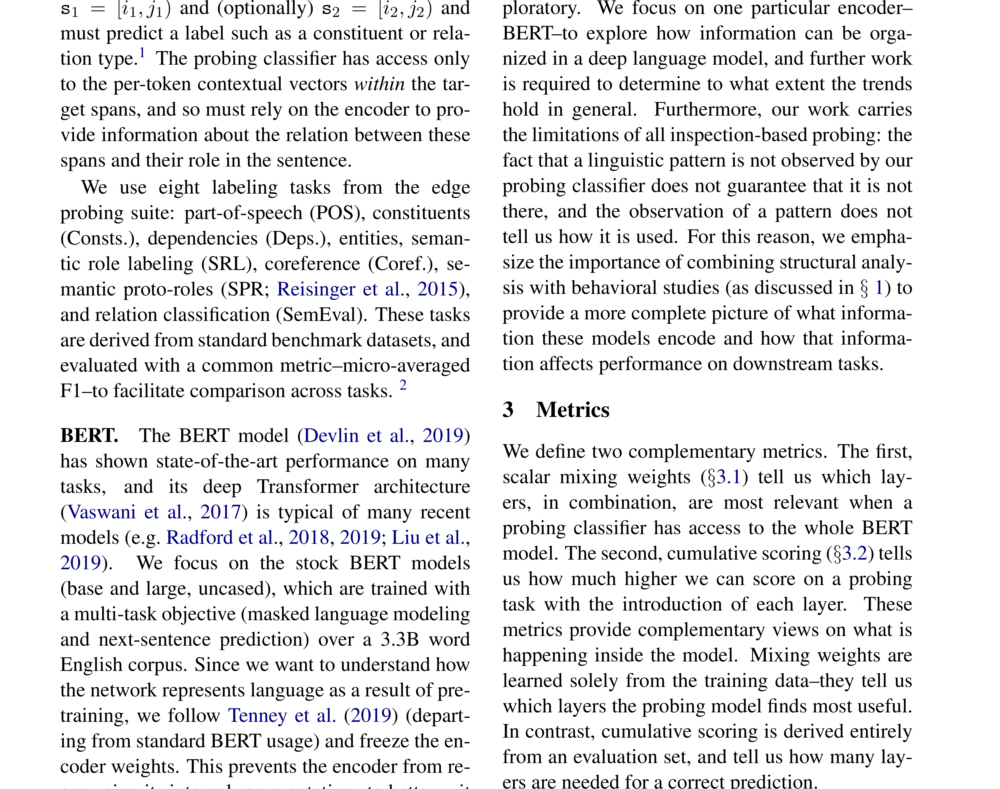
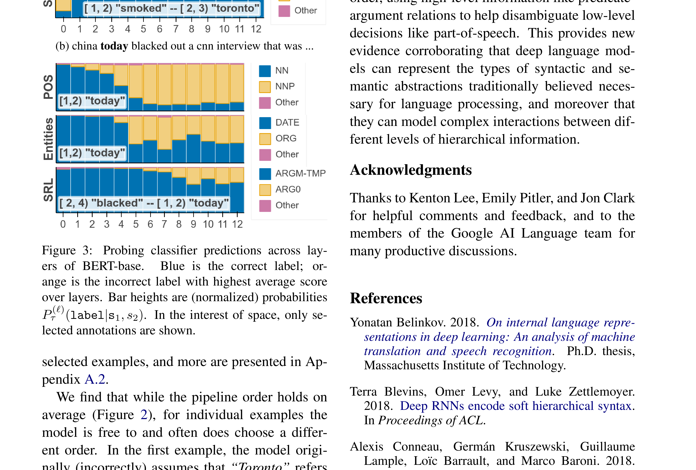

# BERT Rediscovers the Classical NLP Pipeline

| 项目 | 内容 |
|------|------|
| **Authors** | Ian Tenney, Dipanjan Das, Ellie Pavlick (Google Research, Brown University) |
| **Published** | 2019-05 (ACL 2019) |
| **Link** | [arXiv 1905.05950](https://arxiv.org/abs/1905.05950) |

**一句话总结:**
- 通过 edge probing 任务对 BERT 各层进行探测，发现 BERT 内部按经典 NLP pipeline 顺序（词性→句法→语义→指代）编码语言信息，且能动态地用高层语义修正低层决策。

**核心贡献:**
- 证明 BERT 内部以可定位、可解释的方式重现了传统 NLP pipeline 的各个步骤：POS tagging → constituents → dependencies → NER → semantic roles → coreference
- 提出两种互补探测指标：scalar mixing weights（任务信息集中在哪层）和 cumulative scoring（该任务在何时被解析完成）
- 发现句法信息集中在少数层（高局部化），语义信息分散在所有层（低局部化）
- 定性分析表明 BERT 能根据高层语义信息动态修订低层句法标注（非严格按 pipeline 顺序执行）

---

### 1. Background & Motivation

BERT 在几乎所有 NLP 任务上取得 SOTA，但其内部如何表示语言知识尚不明确。此前工作（Conneau et al., 2018; Peters et al., 2018b）已初步观察到不同层级的语言特征出现在 Transformer 的不同层。本文系统性地研究两个问题：

1. **BERT 各层编码的语言信息是否遵循传统 NLP pipeline 的顺序？**
2. **这些信息是严格的串行 pipeline（前一层输出是后一层输入），还是可以在任意层间动态调整？**

### 2. Method

使用 **edge probing** 框架（Tenney et al., 2019），对冻结权重的 BERT，在每层之上训练轻量级分类器，探测其可用的语言信息量。

**探测任务（按传统 pipeline 复杂度排序）：**
- POS tagging — 词性标注
- Constituents — 短语成分
- Dependencies — 依存关系
- Entities (NER) — 命名实体
- Semantic Role Labeling (SRL) — 语义角色
- Coreference — 指代消解
- Semantic Proto-Roles (SPR) / Relations — 语义关系

**两种度量：**
1. **Scalar mixing weights（混合权重）**——学习各层特征的可学习加权和，取权重中心位置衡量
2. **Cumulative scoring（累积分数）**——训练一组逐层累积的分类器，计算每层带来的增量收益

### 3. Key Findings

**发现 1：BERT 内部的层次顺序与经典 NLP pipeline 一致**

| 任务 | 权重中心层 (BERT-large) | 期望层 |
|------|------------------------|--------|
| POS | ~6 | ~6 |
| Constituents | ~8 | ~7 |
| Dependencies | ~9 | ~8 |
| Entities (NER) | ~10 | ~9 |
| SRL | ~11 | ~11 |
| Coreference | ~15 | ~12 |
| Relations/SPR | ~12 | ~12 |

基础句法信息（POS）在较低层编码，高级语义信息（coreference）在高层编码。全部任务按此顺序排列，与传统 NLP pipeline 惊人一致。

**发现 2：句法信息集中，语义信息分散**

句法任务（POS、Constituents）的混合权重集中在少数层（高 K 值），说明这些信息在特定层局部化。语义任务（Relations、SPR）的权重接近均匀分布，信息散布在所有层。

**发现 3：模型可以动态调整标注顺序**

案例分析展示了 BERT 在单个句子上并非严格按 pipeline 顺序执行。举例：
- "he smoked **toronto** in the playoffs"——模型最初将 "Toronto" 标注为 GPE（城市），但之后解析出其语义角色是 ARG1（被 "smoked" 的对象），从而将实体类型修正为 ORG（球队）
- "**china today** blacked out a CNN interview"——模型最初将 "today" 标为普通名词/日期，之后意识到 "china today" 是专有名词（电视台名），修正为 ORG 实体类型

这证明 BERT **既能从上到下也能从下到上传递信息**，高层语义可以逆转低层句法决策。

### 4. Limitations & Reflection

- Edge probing 只能探测各层**是否包含**特定信息，无法区分该信息是"被动存在"还是"主动使用"
- 探针分类器的训练引入了额外参数，可能存在探针学到自身模式而非真正反映 BERT 表示的情况
- 仅分析英文，未能覆盖跨语言场景
- 仅分析 BERT（encoder-only），未对比 decoder-only 模型（如 GPT）

**启示：**
- 本文是 BERT 可解释性研究的代表作之一，提供了理解预训练语言模型内部机制的重要框架
- 验证了"深层网络自动学习从低级到高级的层次化表示"这一直觉
- 动态 pipeline 修正的发现对理解大模型的推理机制有意义——模型并非严格的串行处理器

---

**Extracted Figures:**
- `bert-pipeline_fig1_summary.png` — BERT-large 各探测任务的 F1 分数、权重中心和期望层
- `bert-pipeline_fig2_layer_metrics.png` — 各任务的逐层混合权重和差分分数分布
