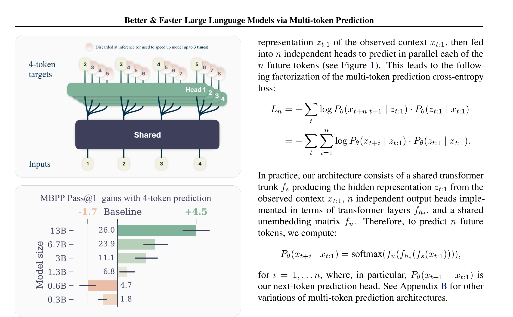
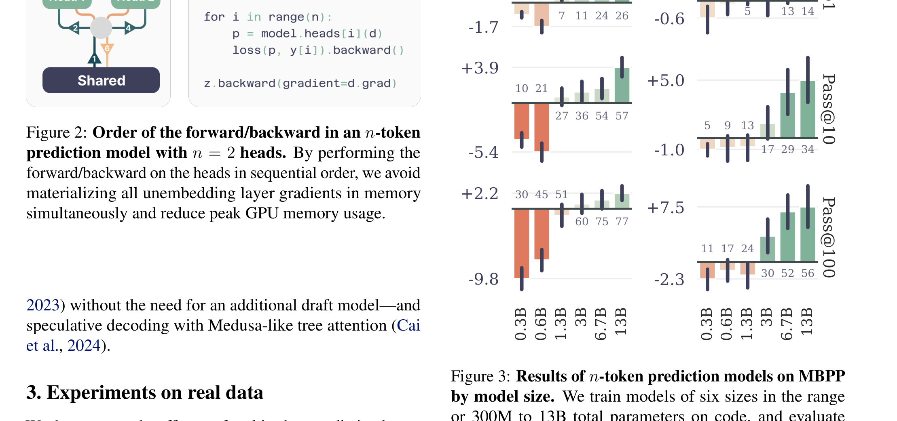
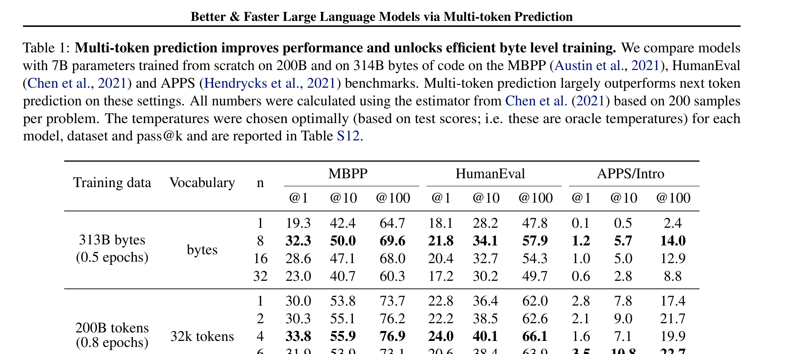
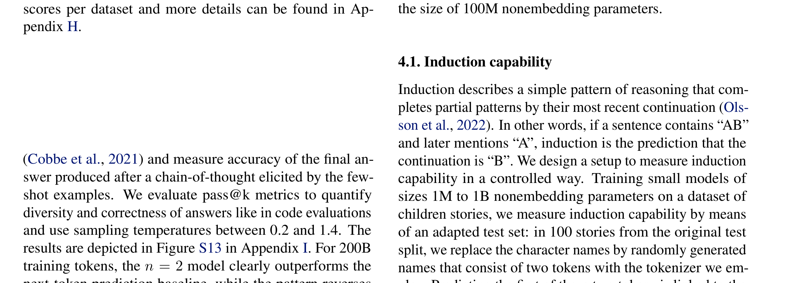
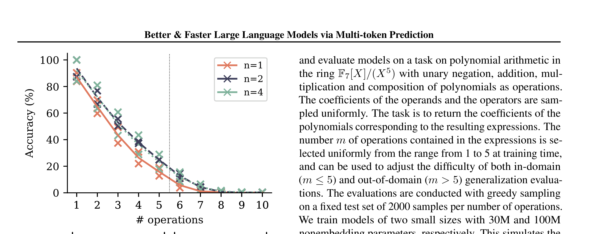
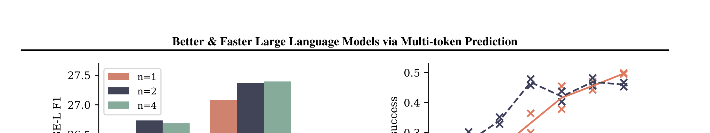

# Better & Faster Large Language Models via Multi-token Prediction

| 项目 | 内容 |
|------|------|
| **Authors** | Fabian Gloeckle, Badr Youbi Idrissi, Baptiste Rozière, David Lopez-Paz, Gabriel Synnaeve (Meta FAIR) |
| **Published** | 2024-06 (ICML 2024) |
| **Link** | [arXiv 2404.19737](https://arxiv.org/abs/2404.19737) |

**一句话总结:**
- 在共享 trunk 上添加 n 个独立 output head，训练 LLM 同时预测未来 n 个 token，提升采样效率且在推理时可通过 self-speculative decoding 实现 3× 加速。

**核心贡献:**
- 提出 multi-token prediction 训练目标：在共享 trunk 上加 n 个独立 transformer 层 head，每个 head 预测一个未来 token
- 设计内存高效实现：顺序 forward/backward 各 head，避免同时物化所有 logits 的显存爆炸
- 代码模型 13B：HumanEval pass@1 提升 12%，MBPP 提升 17%；n=4 最优
- 4-token 模型推理时通过 self-speculative decoding 达到 3× 加速（batch size 无关）
- 对小模型和合成任务验证：multi-token 预测促进 induction head 形成和算法推理能力

---

### 1. Background & Motivation

标准 LLM 训练使用 next-token prediction（teacher forcing）。本文指出这一目标的两个根本问题：

1. **局部模式依赖**——模型只关注下一个 token 的短期预测，忽略长远结构和"艰难决策"
2. **训练-推理分布不匹配**——训练时 teacher forcing 直接提供 ground truth，推理时自回归生成误差累积

核心直觉：**如果模型被迫同时预测未来多个 token，它必须学习更长期的结构化理解，而不仅仅是局部统计规律。**

### 2. High-Level Method

**架构**：共享 Transformer trunk（$f_s$）→ n 个独立 Transformer 层 head（$f_{h_i}$）→ 共享 unembedding 矩阵（$f_u$）。每个 head 预测位置 t+i 的 token：
$$
P_\theta(x_{t+i} | x_{t:1}) = \text{softmax}(f_u(f_{h_i}(f_s(x_{t:1}))))
$$
训练损失为 n 个 head 的交叉熵之和。

**内存高效实现**：vocab 大小 V >> latent 维度 d，logits 向量是显存瓶颈。标准实现同时物化 n 个 head 的 logits → O(nVd) 显存。本文采用**顺序 forward/backward**：依次计算每个 head 的 forward + loss + backward 并立即释放梯度，将峰值内存降低到 O(Vd)（与 n 无关）。

**推理加速**：精确保留 head 1（next-token prediction）用于标准自回归。其余 n-1 个 head 用于 self-speculative decoding——同时预测后续 tokens 作为草案，用原始 head 验证并行接受。

### 3. Key Implementation Details

**架构调整**：为确保公平对比，保持总参数量一致——每增加 n-1 个 head 层，就从 trunk 移除 n-1 层。n=4 时 trunk 减少 3 层加 4 个 head 层 vs baseline 的 trunk 不变。

**训练配置**：模型规模 0.3B-13B，训练 91B-209.7B tokens（code），7B 模型额外训练至 500B/1T。Adam (β₁=0.9, β₂=0.95)，学习率 3e-4，cosine decay，warmup 2000 step。

### 4. Experiments & Results

**代码生成——模型规模扩展：**

n=4（4-token 预测）在大模型（6.7B、13B）上优势显著，小模型（0.3B-0.6B）上 n=2 略好或持平。表明 multi-token 预测的优势随模型规模增大而增大。

**7B 代码模型主结果：**

| 训练数据 | Vocab | n | MBPP@1 | HumanEval@1 | APPS/Intro@1 |
|---------|-------|---|--------|-------------|-------------|
| 200B tokens | 32k | 1 | 30.0 | 22.8 | 2.8 |
|  |  | 4 | **33.8** | **24.0** | 1.6 |
| 1T tokens | 32k | 1 | 40.7 | 31.7 | 5.4 |
|  |  | 4 | **43.1** | 31.6 | 4.3 |

n=4 在 1T tokens（4 epochs）下仍保持优势，说明多 epoch 训练后收益不消失。n=2 在 APPS 上更好（任务更难）。

**Byte 级模型（极端情况）：**

| 配置 | n | MBPP@1 | HumanEval@1 |
|------|---|--------|-------------|
| 7B, 314B bytes | 1 | 19.3 | 18.1 |
|  | **8** | **32.3**(+67%) | **21.8**(+20%) |

Byte 级任务中局部模式更强，multi-token 的收益最明显。

**推理加速（Self-Speculative Decoding）：**

4-token 模型使用 4 个 head 进行 self-speculative decoding：
- 代码：**3.05×** 加速，每步平均接受 3.5 tokens
- 文本：**2.74×** 加速
- 8-byte 模型：**6.39×** 加速（使用 8 heads）

加速在 batch size 1-42 范围内保持一致（不同于传统投机解码需要小 batch 配合 draf model）。

**归纳能力（Induction Head）：**

小模型（<30M 参数）用 next-token 几乎学不到 induction 能力，而 2-token 预测仅在 1M 参数时就展现出 induction 行为。

**算法推理（多项式运算）：**

Multi-token 预测在所有难度级别上准确率更高，尤其在 OOD 泛化上显著提升。**将模型大小翻三倍的效果不如改用 multi-token 预测损失。**

**自然语言——摘要：**

n=2 和 n=4 在 8 个摘要数据集上的平均 ROUGE-L 持续优于 baseline n=1。200B tokens 时 n=4 提升 0.46，n=2 提升 0.51。

**自然语言——多选/推理：** n=2 与 baseline 持平，n=4 略有退化（除 GSM8K pass@100 外）。Multi-token 预测对生成式任务帮助大，对判别式任务帮助小或中性。

### 5. Limitations & Reflection

**局限：**
- 在自然语言的多选/推理基准上无提升（n=4 有时更差），说明该方法更适合生成式任务
- 训练时间略有增加（n=4 约 +7-12%），虽然相对于推理加速是可接受的
- 对大模型的 fn 微调 Llama 2 未取得显著改进——说明该损失对已有训练好的模型做热启动不适用
- 最佳 n 值与任务相关（代码 n=4，摘要 n=2，byte n=8），需单独调节

**思考：**
- 本文最核心的洞察是**将多 token 预测同时作为训练目标和推理加速手段**，而推理加速来自于额外 head 而非独立 draft model
- 与 Medusa 等方法的区别：Medusa 是 finetune 时加 head，本文是从零预训练时就使用 multi-token loss，head 质量更高
- "choice point" 理论很精彩：multi-token loss 隐式放大关键决策点的权重（通过后续相关 token 的误差传播），让模型学会在做选择时更谨慎
- 在 code 任务上效果显著 > 自然语言，可能因为代码的结构化程度更高，"consequential" 和 "inconsequential" token 的区分更明显

**Key Concepts:**
- **[[multi-token-prediction|Multi-Token Prediction]]** — 共享 trunk + n 个独立 head 同时预测未来 n 个 token，兼具训练质量提升和推理自加速

---

**Extracted Figures:**
- `multitoken_fig1_overview.png` — Multi-token prediction 训练/推理架构和 MBPP scaling 结果
- `multitoken_fig3_scaling.png` — MBPP pass@1/10/100 随模型规模变化的趋势
- `multitoken_table1_results.png` — 7B 模型在不同训练数据、vocab、n 值下的代码生成结果
- `multitoken_fig7_induction.png` — 小模型 Induction Head 形成能力的对比
- `multitoken_fig8_arithmetic.png` — 多项式算法推理的准确率和 OOD 泛化
- `multitoken_fig6_summarization.png` — 8 个摘要基准的平均 ROUGE-L F1 对比
