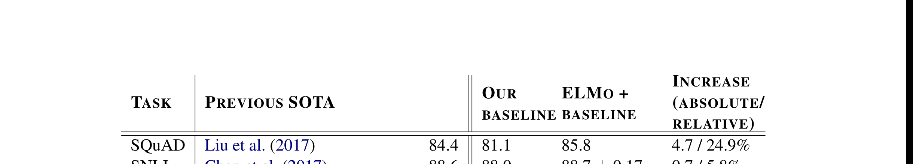
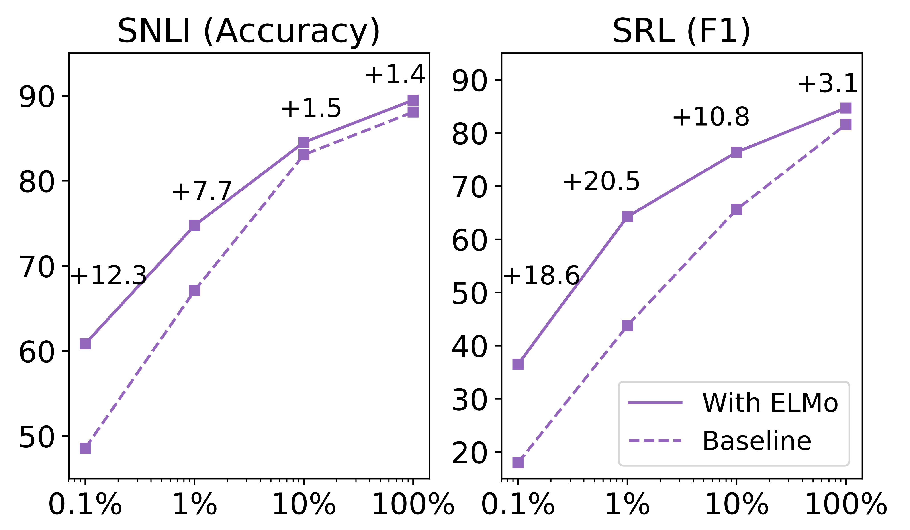
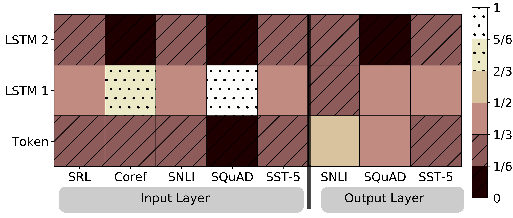

# Deep contextualized word representations (ELMo)

| 项目 | 内容 |
|------|------|
| **Authors** | Matthew E. Peters, Mark Neumann, Mohit Iyyer, Matt Gardner, Christopher Clark, Kenton Lee, Luke Zettlemoyer (Allen AI + UW) |
| **Published** | 2018-02 (NAACL 2018, best paper) |
| **Link** | [arXiv 1802.05365](https://arxiv.org/abs/1802.05365) |

**一句话总结:**
- 提出 ELMo（Embeddings from Language Models），将预训练的双向 LSTM 语言模型所有层的表示加权组合作为词向量，在 6 个 NLP 基准上显著提升 SOTA，开创了"预训练 + 微调"范式在 NLP 的全面应用。

**核心贡献:**
- **深度上下文词向量**：每个 token 的表示是所有 biLM 层的线性组合，而非仅用顶层，充分利用不同层编码的不同信息（低层=句法，高层=语义）
- **即插即用**：ELMo 可直接接入现有 NLP 模型，无需修改架构，仅需额外线性权重
- **大规模 biLM**：2 层 biLSTM（4096 units + 512 dim 投影）+ char CNN，在 1B Word Benchmark 预训练
- **显著提升**：SQuAD +24.9% 相对提升，SRL +17.2%，Coref +9.8%，NER +21%，SST-5 +6.8%，SNLI +5.8%
- **消融验证**：使用全部层 > 仅用顶层，低层编码句法信息（POS 更好），高层编码语义信息（WSD 更好）

---

### 1. Background & Motivation

传统词向量（Word2Vec、GloVe）为每个词分配一个固定的表示向量，无法处理**多义词**问题（如 "play" 在不同语境下含义不同）。此前的工作如 CoVe 使用机器翻译编码器获取上下文表示，但受限于平行语料规模。

核心洞察：**语言模型可以在大量单语数据上预训练，其内部层的表示包含了丰富的句法和语义信息，且不同层编码不同类型的信息**，组合所有层的表示优于仅使用顶层。

### 2. High-Level Method

**ELMo 的计算流程：**

1. **预训练 biLM**：在大规模语料上训练双向 LSTM 语言模型
   - Forward LM：从左到右预测下一个 token
   - Backward LM：从右到左预测前一个 token
   - 联合优化双向 log-likelihood，共享 token 表示（Θₓ）和 Softmax（Θₛ）参数
   
2. **ELMo 表示**：对于每个 token tk，biLM 计算 2L+1 个表示（L=2 即 5 个向量）：
   Rk = {xLMₖ, h⃗LMₖⱼ, h⃖LMₖⱼ | j=1,...,L}
   
   压缩为单个向量：
   **ELmoₖ = γ ⋅ Σⱼ sⱼ ⋅ hLMₖⱼ**
   
   其中 sⱼ 是 softmax 归一化的层权重，γ 是任务特定的缩放系数。

3. **集成到下游任务**：将 ELMo 向量与任务输入拼接（[xₖ; ELMoₖ]），部分任务输出端也拼接

**架构细节：**
- L=2 层 biLSTM，每层 4096 units，投影到 512 dim
- 输入：2048 个 char n-gram CNN 滤波器 + 2 层 highway
- 层间 residual connection
- 总参数量约为 CNN-BIG-LSTM（Józefowicz et al. 2016）的一半

### 3. Key Experiments & Results

**主结果——6 个 NLP 任务全面 SOTA：**

| Task | Previous SOTA | Baseline | ELMo+Baseline | 提升（相对） |
|------|:---:|:---:|:---:|:---:|
| SQuAD (F1) | 84.4 | 81.1 | **85.8** | +24.9% |
| SNLI (Acc) | 88.6 | 88.0 | **88.7** | +5.8% |
| SRL (F1) | 81.7 | 81.4 | **84.6** | +17.2% |
| Coref (avg F1) | 67.2 | 67.2 | **70.4** | +9.8% |
| NER (F1) | 91.93 | 90.15 | **92.22** | +21% |
| SST-5 (Acc) | 53.7 | 51.4 | **54.7** | +6.8% |

**层权重消融——全部层 > 仅顶层：**

在所有三个任务上，使用全部层（All layers, λ=0.001）优于仅用顶层（Last Only）。正则化权重 λ 进一步约束各层权重接近平均值。

**不同层编码不同信息类型：**

GloVe 的 "play" 最近邻混在各种词性和语义中（game, player, play, football），而 biLM 的上下文表示能根据语境准确区分——一个是棒球比赛中的 "play"（spectacular play），另一个是戏剧中的 "play"（Broadway play）。

**POS 与 WSD 分析：**
- **POS 标注**：使用 biLM 第一层表示做线性分类即可达到 97.22%（vs 任务特定 biLSTM 的 97.55%）——低层编码句法信息
- **WSD 词义消歧**：biLM 第二层表现更好（69.0 F1 vs 第一层 67.4）——高层编码语义信息
- **CoVe 对比**：biLM 在 POS 和 WSD 上均优于 CoVe，且差距显著

### 4. Analysis & Ablation

**ELMo 接入位置的影响：**

| 任务 | Input Only | Input & Output | Output Only |
|:---|:---:|:---:|:---:|
| SQuAD | 85.1 | **85.6** | 84.8 |
| SNLI | 88.9 | **89.5** | 88.7 |
| SRL | **84.7** | 84.3 | 80.9 |

输入和输出端都接入 ELMo 通常效果最佳（SQuAD, SNLI），但 SRL 仅在输入端接入最好（84.7 vs 80.9）。

**样本效率：** 加入 ELMo 后，模型在更少的训练样本下达到更好的性能。如 SQuAD 上，使用 ELMo 仅需 10% 的训练数据就能匹配基线模型的完整性能。

**可视化发现：**
- 不同任务学习到的层权重分布不同：SRL 和 SQuAD 倾向于更多使用第一层（句法相关），SNLI 更倾向于第二层（语义相关）

### 5. Limitations & Reflection

**局限：**
- biLSTM 架构**无法并行训练**（相比后来的 Transformer），预训练成本高
- ELMo 只是特征拼接（feature-based），不是微调（fine-tuning）——需为每个任务单独训练模型
- 仅 2 层 biLSTM，层数浅于后来的 BERT（12/24 层），表示深度有限
- 字符 CNN 虽然解决了 OOV 问题，但计算效率不如 BPE/WordPiece

**思考：**
- ELMo 的**核心洞察（不同层编码不同信息，组合所有层优于顶层）** 对后续模型产生了深远影响——BERT 同样使用所有层的表示做下游任务
- 作为"预训练 + 微调"范式的前驱，ELMo 证明了大模型预训练的有效性，直接启发了 BERT、GPT 等
- ELMo 采用的 feature-based 方法相比 fine-tuning 的优势在于**计算灵活**：下游模型不需要 transformer 的 GPU 资源，可以在 ELMo 特征上加简单分类器
- 本文的消融分析非常扎实，每一处设计决策都有实验支撑，是 NLP 论文的典范

**Key Concepts:**
- **[[elmo|ELMo]]** — 将预训练 biLM 所有层表示加权组合为上下文词向量，开创"预训练+微调"范式

---

**Extracted Figures:**
- `elmo_table1_main_results.png` — 6 个 NLP 任务主结果（SQuAD, SNLI, SRL, Coref, NER, SST-5）
- `elmo_table2_layer_ablation.png` — 层权重消融：全部层 vs 仅顶层
- `elmo_table4_nearest_neighbors.png` — "play" 的最近邻：GloVe vs biLM 上下文表示
- `elmo_table5_wsd.png` — WSD 词义消歧结果
