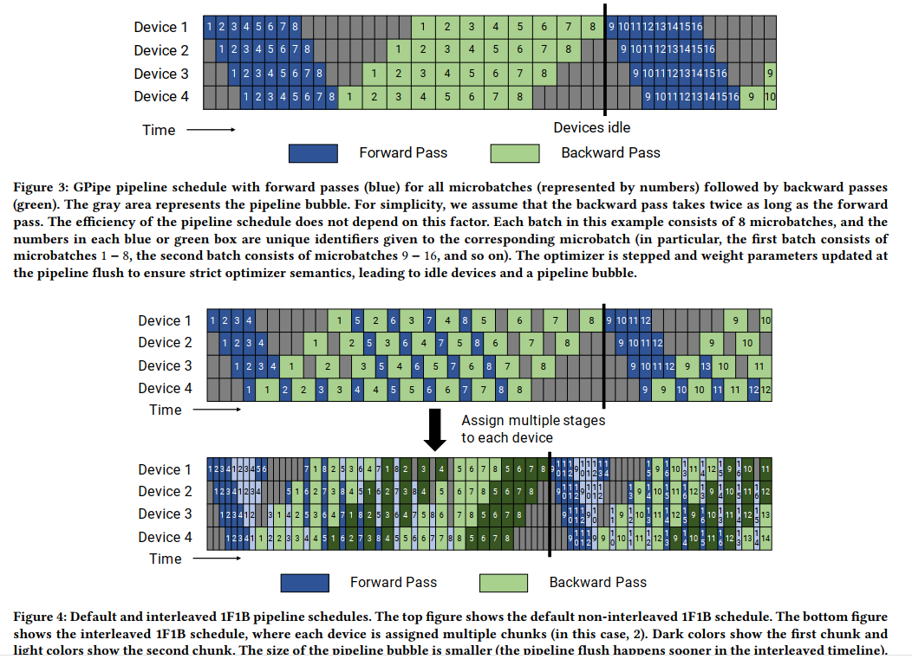
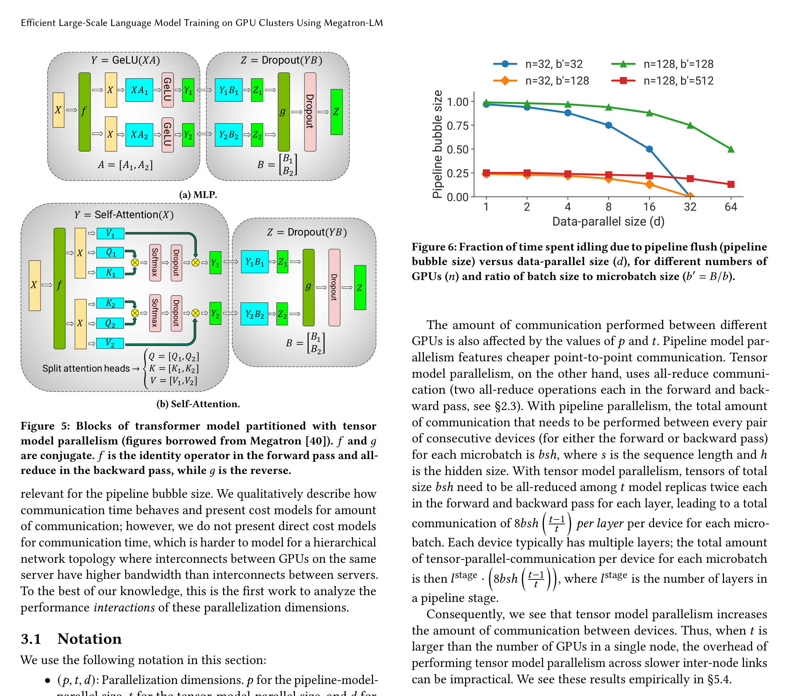

# Efficient Large-Scale Language Model Training on GPU Clusters Using Megatron-LM

### 1. Background & Motivation

之前的模型并行方案各有局限：

- **Tensor parallelism alone**（Megatron-LM）：跨节点 all-reduce 通信慢，且高并行度导致小 GEMM 利用率低
- **Pipeline parallelism alone**（GPipe）：bubble overhead 可达 50%，且流水线排空（pipeline flush）浪费算力
- **Data parallelism alone**：受限于 batch size，无法在数千 GPU 上有效扩展

核心问题：**如何组合 pipeline、tensor 和 data parallelism 来最大化吞吐？**

### 2. High-Level Method

论文提出 **PTD-P**（Pipeline + Tensor + Data Parallelism）组合方案：

- **Tensor parallelism**：在单节点内（8 GPU）使用，利用 NVLink 高速互联
- **Pipeline parallelism**：跨节点使用，仅传输激活张量（点对点通信）
- **Data parallelism**：在 pipeline 副本间使用，梯度 all-reduce

**Interleaved Pipeline Schedule（核心创新）：**

标准的 1F1B schedule 中，每个设备分配 $\frac{L}{p}$ 层。Interleaved schedule 将每层进一步拆分，每个设备负责 $\frac{L}{p}$ 个层集合，每个集合有 $\frac{p}{v}$ 层（$v$ 为 interleave 因子）。

Bubble 占比从 $\frac{p-1}{m}$ 降至 $\frac{1}{v} \cdot \frac{p-1}{m}$。代价是通信量增加 $v$ 倍（可通过多个 InfiniBand 卡并行来缓解）。

### 3. Key Implementation Details

**指导原则：**

- **Takeaway #1**：Tensor parallelism 应在单节点内使用，pipeline parallelism 用于跨节点扩展
- **Takeaway #2**：模型并行度 $M = t \cdot p$ 应足够容纳模型参数和中间状态，剩余设备用于 data parallelism
- **Takeaway #3**：最优 micro-batch size 取决于模型吞吐特性、pipeline 深度和 batch size——需要权衡算术强度和 bubble overhead

**工程优化：**

- **算子融合**：将 element-wise 操作（bias + GeLU + dropout 等）融合为单个 kernel，将大部分计算从 memory-bound 变为 compute-bound → 提升 19% 吞吐
- **Scatter-Gather 优化**：减少跨节点通信量 → 额外 11% 提升
- **Activation recomputation**：小 batch 时降速 33%，但使大 batch 可行 → 最终吞吐可提升 2×

### 4. Experiments & Results

**1 万亿参数模型（3072 A100 GPU）：**

| 指标 | 数值 |
|------|------|
| 模型配置 | GPT, 80 layers, hidden 25600, 128 heads |
| GPU 数 | 3072 (384 DGX A100 nodes) |
| 聚合吞吐 | **502 petaFLOP/s** |
| 单 GPU 吞吐 | **163 teraFLOP/s（52% 理论峰值）** |
| 预估值总训练时间 | ~3 个月 |
| Checkpoint 大小 | 13.8 TB |

**相比 ZeRO-3 的性能优势：**
- 175B 和 530B 模型上，PTD-P 比 ZeRO-3 **高 70% 吞吐**——因为 ZeRO 的跨节点通信量更大

**Interleaved vs 标准 schedule：**
- 吞吐提升 **10%+**，显存占用相当

**各优化贡献：**
- Fused operators: +19%（GPT-3 175B）
- Scatter-gather: +11%
- 相较于 DeepSpeed 方案：52% vs 36% 的 peak flops 利用率

### 5. Limitations & Reflection

**局限性：**

- Parallelism 配置搜索空间庞大，论文仅提供**启发式**而非自动搜索
- Interleaved schedule 增加通信量，需要高带宽互联；在慢速网络下可能适得其反
- 结果依赖于 NVIDIA Selene 集群的 NVSwitch + InfiniBand 高带宽环境，不易迁移到普通集群
- 论文关注的是吞吐而非 convergence，训练稳定性分析较少

**我的判断：**

- PTD-P 的组合方式成为后续 Megatron-Turing NLG、NeMo Megatron 等框架的标准配置——**3D Parallelism** 自此成为训练千亿模型的事实标准
- Interleaved schedule 是对 GPipe/1F1B 的优雅改进——不增加显存的情况下减少 bubble，虽然增通信但通过 NVLink+IB 通道复用缓解
- 对比 [[gpipe-efficient-training-of-giant-neural-networks-using-pipeline-parallelism|GPipe]]（只做 pipeline）、[[megatron-lm-training-multi-billion-parameter-language-models-using-model-parallelism|Megatron-LM]]（只做 tensor），这篇的工作是**系统性组合**而非全新发明——但其价值和难度在工程实践而非理论创新
- 与 [[an-efficient-2d-method-for-training-super-large-deep-learning-models|Optimus（2D）]]相比：PTD-P 用现有技术组合，更务实；Optimus 用 SUMMA 的全新方案，更激进但落地难度大

### 6. Personal Takeaways

- "Tensor parallelism inside node, pipeline parallelism across nodes" 这条原则后来成为了所有大规模训练框架的金科玉律
- 论文的分析框架（memory footprint, device utilization, communication 的三维权衡）对 configuration 选择有很好的指导意义
- 算子融合从 memory-bound 到 compute-bound 的转变在工程上非常关键——19% 的纯性能提升来自 kernel 优化而非并行策略
- 52% 的 peak FLOPS 利用率对于分布式训练来说是极高的数字——说明工程优化的空间远比算法创新大

---

**Key Concepts:**
- [[pipeline-parallelism|Pipeline parallelism]] — 跨节点按层拆分
- [[tensor-parallelism|Tensor parallelism]] — 节点内按矩阵维度拆分
- [[pipeline-parallelism#Bubble Overhead|Pipeline bubble]] — 流水线排空导致的设备空闲
- 3D Parallelism (PTD-P) — Pipeline + Tensor + Data parallelism 的组合方案

**Extracted Figures:**
- `meg_cluster_fig2_ptdp_combination.png` — PTD-P（Pipeline + Tensor + Data）并行组合方案
- `meg_cluster_fig4_interleaved_schedule.png` — 1F1B vs Interleaved 调度对比
- `meg_cluster_fig5_tensor_parallel.png` — Transformer 层内的 tensor parallelism 拆分
- `meg_cluster_fig11_perf_comparison.png` — 多种并行配置下的吞吐性能对比
