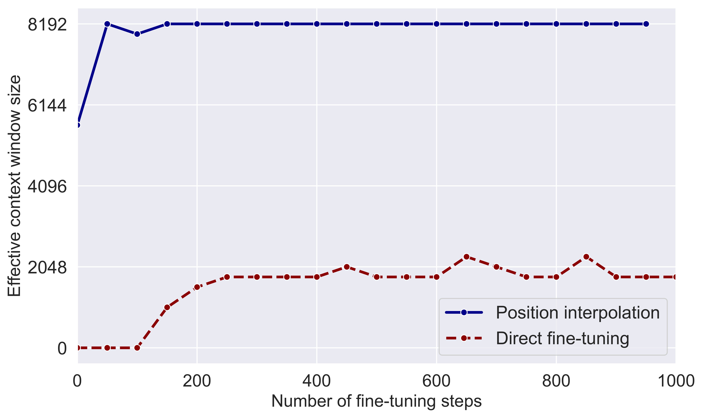
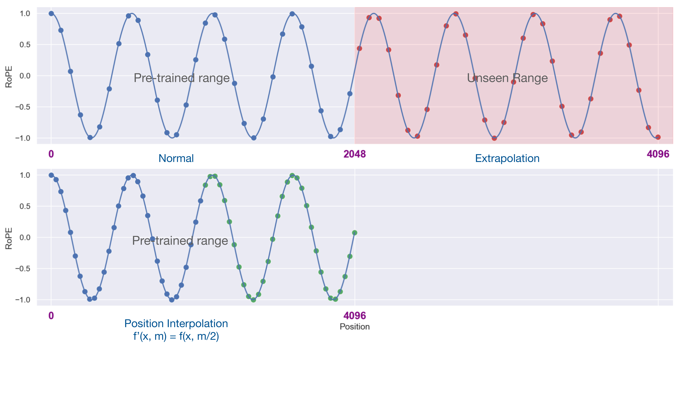
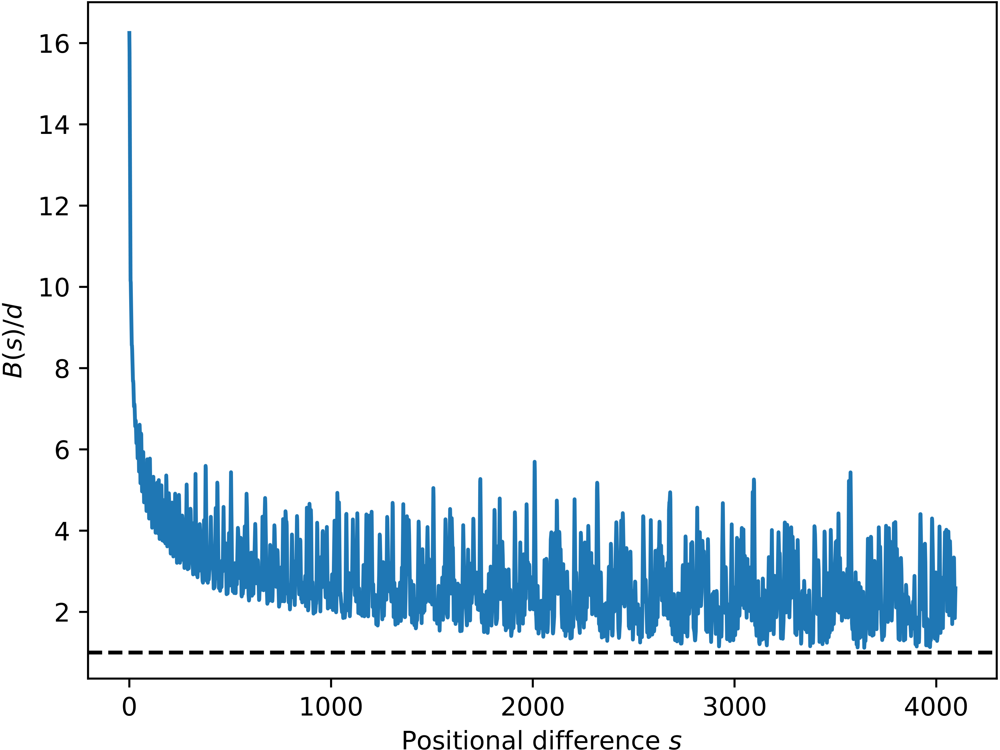
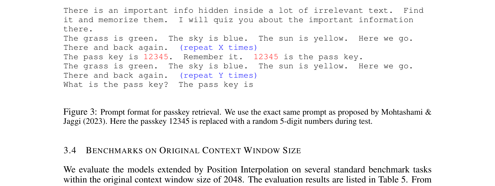
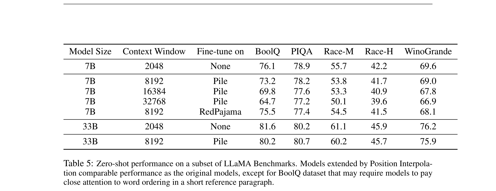
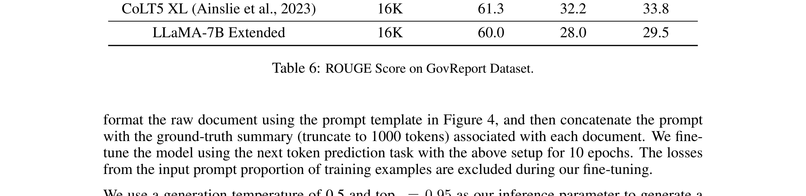

# Extending Context Window of Large Language Models via Positional Interpolation

| 项目 | 内容 |
|------|------|
| **Authors** | Shouyuan Chen, Sherman Wong, Liangjian Chen, Yuandong Tian (Meta) |
| **Published** | 2023-06 |
| **Link** | [arXiv 2306.15595](https://arxiv.org/abs/2306.15595) |

**一句话总结:**
- 提出 Position Interpolation（PI），对 [[rope|RoPE]] 的输入位置索引做线性缩放（而非 extrapolate），配合 1000 steps fine-tuning 即可将 LLaMA 的上下文窗口从 2048 扩展到 32768，理论证明 [[positional-interpolation|interpolation 的 attention score 上界]]比 extrapolation 小 ~600×。

**核心贡献:**
- **线性位置缩放**：将输入位置索引 m 线性缩放为 m/λ（λ = 目标长度 / 原始长度），使所有位置落在预训练区间内，避免 extrapolation 导致的 attention score 灾难性溢出
- **理论保证**（Theorem 2.1）：interpolation bound 比 extrapolation bound 小 ~600×（LLaMA 7B 设定），解释了为什么 interpolation 稳定而 extrapolation 发散
- **极低微调成本**：仅需 1000 steps fine-tuning 即可扩展至 32768，200 steps 即超越原始模型在 2048 窗口上的 perplexity
- **模型质量保持**：扩展后的模型在原始 2048 窗口内任务上退化 ≤2%（7B/33B），长文档摘要 ROUGE-1 达 60.0

---

### 1. Background & Motivation

RoPE-based LLM（如 LLaMA）的上下文窗口固定为 2048 tokens，直接超出预训练范围使用时 perplexity 会飙升到 >10³（相当于未训练模型）。直接 fine-tuning 扩展也极其低效——训练 10000+ steps 后有效窗口仅从 2048 增加到 2560。

核心洞察：**RoPE 的 attention score 在预训练区间 [0, L] 内表现良好，但在区间外可能急剧增大**。因为三角函数族 {e^{isθⱼ}} 是通用函数逼近器，存在系数 hⱼ 使函数在 [0, L] 内值小但在外部巨大。

### 2. High-Level Method

**Position Interpolation（PI）**：对于目标上下文 L' > L，将位置索引 m ∈ [0, L') 线性缩放到 [0, L)：

$$f'(x, m) = f(x, m/\lambda), \quad \lambda = L' / L$$

相当于将 RoPE 旋转角度从 mθᵢ 改为 (m/λ)θᵢ，使所有位置的旋转角度都落在预训练范围内。

**为什么 interpolation 优于 extrapolation（Figure 2 的核心发现）：**

左图：随机拟合的 attention score 函数在 [0, 2048] 内表现良好，但在区间外出界到 8000+。
右图：Interpolation 保证 query-key 位置差 s 始终在相邻整数 grid 之间，函数值平滑有界。

**理论保证（Theorem 2.1）：** Interpolation 的 attention score 上界：

$$|a(s) - a_{\text{linear}}(s)| \leq \frac{1}{8} \max_{j} |h_j| \cdot \frac{\pi^2 d}{2 \ln c} \approx 294.73 \cdot \max_j |h_j|$$

而 extrapolation bound 至少大 600×（LLaMA 7B: d=128, c=10000）。

### 3. Key Results

**长序列语言建模（PG-19）：**

| 模型 | 扩展方法 | 2048 | 4096 | 8192 | 16384 | 32768 |
|:---|:--------:|:---:|:---:|:---:|:---:|:---:|
| LLaMA-7B | FT (8192) | 7.21 | 7.34 | 7.69 | — | — |
| LLaMA-7B | PI (8192) | **7.13** | **6.96** | **6.95** | — | — |
| LLaMA-7B | PI (16384) | 7.11 | 6.93 | 6.82 | 6.83 | — |
| LLaMA-7B | PI (32768) | 7.23 | 7.04 | 6.91 | 6.80 | 6.77 |
| LLaMA-13B | PI (32768) | 6.54 | 6.40 | 6.28 | 6.18 | 6.09 |

PI 扩展的模型 perplexity 随窗口增大持续降低，而直接 FT 随窗口增大反而退化。

**有效上下文窗口（Passkey Retrieval）：**

PI 仅需 200 steps fine-tuning 即可达到目标窗口大小（8192→8192, 16384→16384, 32768→32768），而直接 FT 即使 10000 steps 也仅从 2048 增至 2560。

**零样本基准（原始窗口内任务）：**

PI 扩展至 8192 的模型在原始 2048 窗口内任务上退化 ≤2%（BoolQ 退化最多，因 BoolQ 要求精确关注短参考段落中的词序）。

**长文档摘要：**

16K 扩展模型的 ROUGE-1 60.0，与 CoLT5 XL（61.3）差距不大，且 PI 方法不改变注意力机制。

### 4. Analysis

**为什么 interpolation 只需要很少的 fine-tuning 步骤？**
- Interpolation 的 attention score 上界远小于 extrapolation（600×），因此模型初始状态就接近有效
- 微调只是让模型 "适应新的位置编码分辨率" 而非 "学习新的知识"
- 实验表明 200 steps 即显著改善，1000 steps 完全收敛

**不同 fine-tuning 数据集的影响：**
Pile vs RedPajama 作为微调数据对最终基准性能差异不大，进一步支持了 "PI fine-tuning 是适应而非学习" 的假设。

### 5. Limitations & Reflection

**局限：**
- Perplexity 和 benchmark 性能在扩展到更长窗口时仍有退化（32768 比 8192 退化更大）
- 仅用 next token prediction 微调，未探索 instruction tuning + PI 的联合效果
- 推理成本随窗口线性增长（需 attention O(n²)），PI 本身不降低计算复杂度
- 需要 fine-tuning 步骤，不能零样本直接扩展（与 ALiBi 不同）

**思考：**
- PI 的 **核心洞察是重新定义了问题**：不要问 "如何让模型泛化到未训练过的位置"，而是 "如何让所有位置都在训练过的范围内"
- 这个思路后来被 NTK-aware 扩展（通过改变 θᵢ 基频而非缩放位置索引）和 YaRN（结合 NTK + PI 并新增 temperature 因子）进一步改进
- PI 证明了 RoPE 的可扩展性是其成为 LLM 标准位置编码的关键优势之一
- Concurrent work（kaiokendev 的 SuperHOT）表明 LoRA fine-tuning 也有效，社区快速验证了 PI 的实用性

---

**Extracted Figures:**
- `pi_fig1_interpolation_method.png` — PI 方法示意：位置索引线性缩放使所有位置落在预训练范围内
- `pi_fig2_extrapolation_vs_interpolation.png` — Extrapolation 导致 attention score 在外推区出界 vs Interpolation 保持有界
- `pi_fig3_passkey_prompt.png` — Passkey retrieval 的 prompt 格式
- `pi_table1_pg19_perplexity.png` — PG-19 和 Proof-pile 的 perplexity 结果
- `pi_table4_effective_window.png` — 有效上下文窗口对比（PI vs direct FT）
- `pi_table5_zeroshot_benchmarks.png` — 原始窗口内零样本基准
- `pi_table6_govreport_rouge.png` — GovReport 长文档摘要 ROUGE 分
