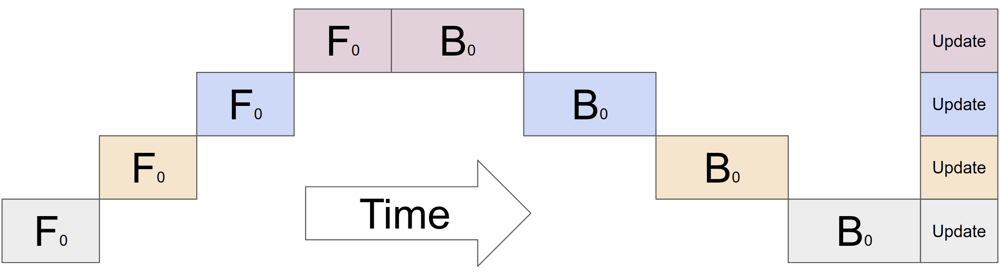
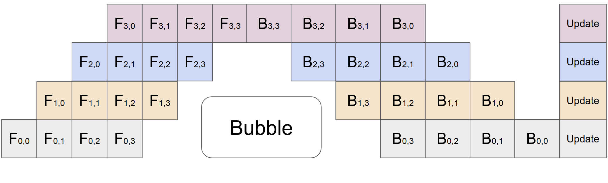
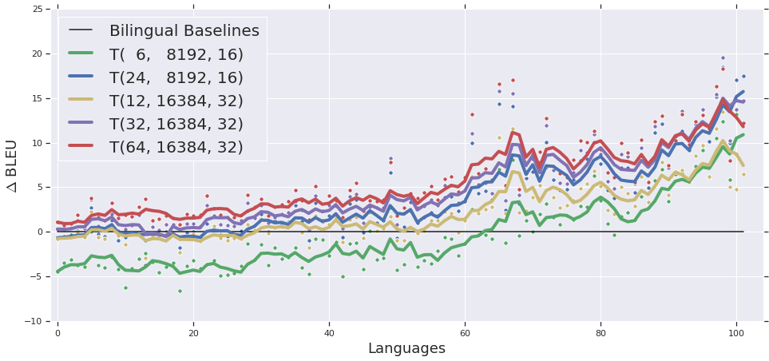

# GPipe: Easy Scaling with Micro-Batch Pipeline Parallelism

| 项目 | 内容 |
|------|------|
| **Authors** | Yanping Huang, Youlong Cheng, Ankur Bapna, Orhan Firat, Mia Xu Chen, Dehao Chen, HyoukJoong Lee, Jiquan Ngiam, Quoc V. Le, Yonghui Wu, Zhifeng Chen (Google) |
| **Published** | 2018-11 (NeurIPS 2019) |
| **Link** | [arXiv 1811.06965](https://arxiv.org/abs/1811.06965) |

**一句话总结:**
- 提出 batch-splitting pipeline parallelism 和同步梯度更新，实现 task-independent、接近线性加速比的模型并行方案，训练 6B 多语言 NMT 和 557M AmoebaNet。

**核心贡献:**
- 首创 micro-batch splitting + 同步梯度更新的 pipeline parallelism 范式
- Bubble overhead 分析：当 $M \ge 4K$ 时可忽略，奠定后续 1F1B 等调度基础
- 首次训练 6B 参数 128 层多语言 Transformer（103 语言），超越所有双语 baseline

---

### 1. Background & Motivation

随着模型规模增长（ImageNet 上 accuracy 与模型大小的强相关、NMT 中 BLEU 随深度提升），单加速器内存成为瓶颈。此前模型并行方法分为两类：

- **SPMD（Mesh-TensorFlow）**：将每层计算拆分到多设备，AllReduce 通信开销大，受限于高速互联
- **异步 pipeline（PipeDream）**：前向后向交错的异步流水线，存在权重陈旧（weight staleness）问题，需要维护多版本参数副本

GPipe 的目标是：**task-independent、高效、可靠的模型并行方案**。

### 2. High-Level Method

GPipe 的核心是 **batch-splitting pipeline parallelism**：

1. 将网络表示为一个层序列，按计算代价均匀分割到 K 个 cell，每个 cell 放在一个加速器上
2. 将大小为 N 的 mini-batch 分为 M 个等大的 micro-batch
3. 前向：micro-batch 依次流过 K 个加速器（pipeline 方式）
4. 反向：对每个 micro-batch 计算梯度时使用前向时的相同参数
5. 梯度累积：mini-batch 结束后，所有 micro-batch 的梯度累加，同步更新参数

梯度累积带来 **同步梯度更新**——无论分区数多少，梯度更新保持一致，训练稳定且可重复。

### 3. Key Implementation Details

- **接口**：仅需指定 (i) 分区数 K, (ii) micro-batch 数 M, (iii) 层序列，极其简洁
- **重物化（Re-materialization / gradient checkpointing）**：前向只存边界激活，反向时重算 cell 内的中间激活，峰值显存从 $O(N \times L)$ 降至 $O(N + \frac{L}{K} \times \frac{N}{M})$
- **Bubble overhead**：$O(\frac{K-1}{M+K-1})$，当 $M \ge 4K$ 时可忽略
- **通信开销极低**：仅在分区边界传递激活张量，无需高速互联（在 PCI-E GPU 上仍取得近线性加速）
- **自动分区**：基于用户提供的 cost estimator，最小化各 cell 间的计算方差

**最大模型容量（Cloud TPUv3, 16GB/core）：**

| 分区数 | 最大层数 | 参数量 | 总参数量内存 |
|-------|---------|-------|------------|
| 1 | 13 | 785.8M | 8.8G |
| 8 | 103 | 5.3B | 59.5G |
| 32 | 415 | 21.0B | 235.1G |
| 128 | 1663 | **83.9B** | 937.9G |

**训练吞吐（normalized, Transformer-48）：**

| M=1 | M=4 | M=32 |
|-----|-----|------|
| K=2: 1.0× | K=2: 1.7× | K=2: 1.8× |
| K=4: 1.07× | K=4: 3.2× | K=4: 3.4× |
| K=8: 1.3× | K=8: **4.8×** | K=8: **6.3×** |

当 $M \gg K$ 时，接近线性加速比（6.3× / 8 ≈ 78.75%）。

### 4. Experiments & Results

**Image Classification（AmoebaNet-B on ImageNet 2012）：**

- 557M 参数 AmoebaNet-B(18, 512)，输入 $480 \times 480$，4 分区
- Top-1 **84.4%**，top-5 **97%**（单 crop），超越此前 83.9% 的 SOTA
- 迁移学习在各数据集上均达到或超越此前最佳结果（CIFAR-10 99.0%, CIFAR-100 91.3%）

**Multilingual NMT（6B 参数 Transformer, 103 语言 → 英语）：**

- 训练 6B 参数、128 层 Transformer：T(64, 16384, 32)，分 16 个分区
- 首次证明一个 NMT 模型可同时学习 100+ 语言对，且**在所有语言上超越各自的双语 baseline**
- **深度 vs 宽度**：同参数量下，**深层模型**在低资源语言上显著优于宽层模型
- **大规模 batch**：测试了 4M tokens/batch（当时文献最大），验证了更大 batch 对翻译质量的正面作用

### 5. Limitations & Reflection

**作者承认的局限：**

- 假设 **单层能放入单个加速器** —— 如果单层参数超过单设备内存，GPipe 无法处理（Mesh-TensorFlow 可以进一步拆分单层）
- **BatchNorm 需要特殊处理** — micro-batch 上的统计量不能直接代表 mini-batch
- 优化困难：深层模型出现 sharp activations + 数据噪声导致的训练不稳定，需要 scaled-down initialization 和 logit clipping

**我的判断：**

- GPipe 是 pipeline parallelism 的奠基性工作——其 batch-splitting + 同步更新的设计模式被后续 1F1B、PipeDream-2BW、Interleaved Pipeline 等工作继承和演化
- 相比 PipeDream（异步、权重陈旧），同步更新保证了训练的**确定性和稳定性**，代价是 bubble overhead
- "单层必须放得下" 这一限制催生了后续 Megatron-LM 的 **tensor parallelism**（将单层矩阵乘法拆到多 GPU）与 pipeline parallelism 的组合使用
- 实验规模在当时非常 impressive（83.9B Transformer、6B NMT），但 GPipe 本身不解决通信拓扑优化问题——分区策略是启发式的

### 6. Personal Takeaways

- **Micro-batch 拆分 + 同步梯度** 的设计是 GPipe 最核心的贡献——它把 pipeline parallelism 变成了一种"傻瓜式"但有效的并行策略
- 与后续 [[megatron-lm-training-multi-billion-parameter-language-models-using-model-parallelism|Megatron-LM]] 对比：GPipe 按层切割（vertical），Megatron-LM 按矩阵维度切割（horizontal），两者正交互补
- GPipe 的 bubble overhead 分析（$M \ge 4K$ 时可忽略）是 pipeline scheduling 的基础结论，后续 VT（1F1B）等 schedule 进一步减少了 bubble
- 深度/宽度的对比（深层更好）对后来 LLM 的 scaling 方向有重要参考价值

---

**Key Concepts:**
- [[pipeline-parallelism|Pipeline parallelism]] — 将模型按层分段放置到不同设备，流水线执行 micro-batch
- Micro-batch splitting — 将 mini-batch 拆分为更小的 micro-batch 以供流水线并行
- Bubble overhead — 流水线启动和排空阶段加速器空闲的时间占比
- [[gradient-checkpointing|Re-materialization (gradient checkpointing)]] — 前向丢弃中间激活、反向时重算，以节省显存
- Synchronous gradient accumulation — 所有 micro-batch 梯度累积后统一更新参数，保证训练一致性

**Extracted Figures:**
- `gpipe_fig1_model_scaling.png` — ImageNet accuracy and BLEU vs model size
- `gpipe_fig2_pipeline_mechanism.png` — GPipe batch-splitting pipeline parallelism mechanism
- `gpipe_fig2c_pipeline_timing.png` — Pipeline timing diagram with bubble overhead
- `gpipe_table1_model_capacity.png` — Maximum model size supported by GPipe
- `gpipe_fig3_translation_quality.png` — Translation quality across 100+ languages with increasing model capacity
