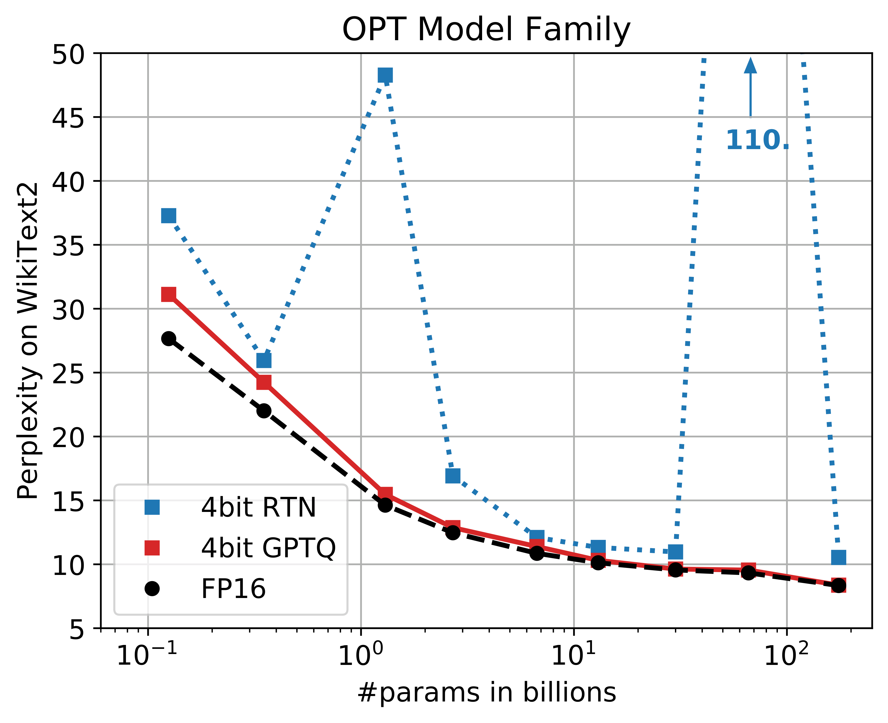
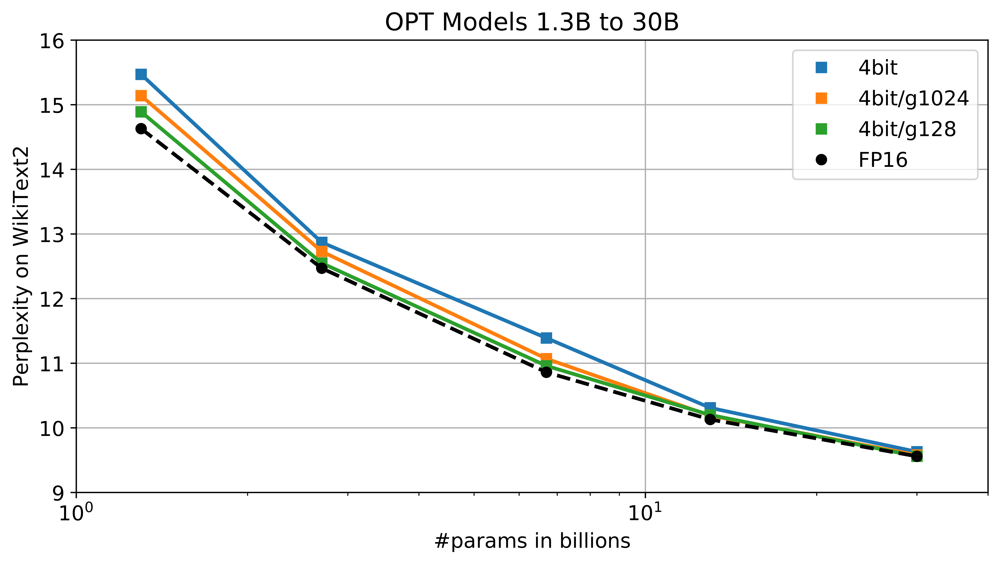
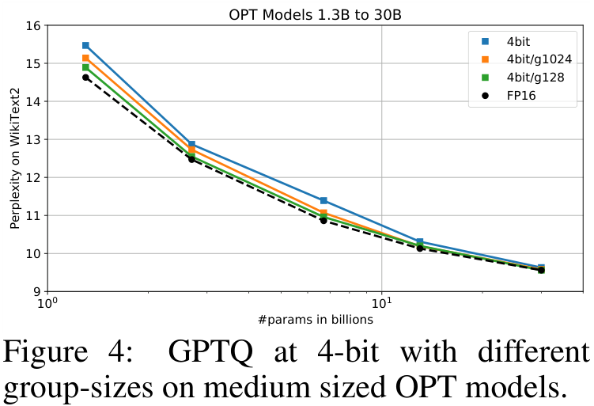

# GPTQ: Accurate Post-Training Quantization for Generative Pre-trained Transformers

| 项目 | 内容 |
|------|------|
| **Authors** | Elias Frantar, Saleh Ashkboos, Torsten Hoefler, Dan Alistarh (IST Austria / ETH Zurich) |
| **Published** | 2022-10 (ICLR 2023) |
| **Link** | [arXiv 2210.17323](https://arxiv.org/abs/2210.17323) |

**一句话总结:**
- 基于 Hessian 二阶近似的 weight-only 量化方法，通过懒惰批量更新和 Cholesky 分解将 OBQ 扩展至 GPT 规模，首次实现 175B 模型单卡推理。

**核心贡献:**
- 将 OBQ（逐权重量化+误差补偿）高效扩展至 GPT 规模（三个实用改进）
- 4-bit GPTQ 在 OPT-175B 上达到无损精度，3.25x 推理加速
- 首次实现 175B 参数模型放入单张 A100-80G 进行生成式推理

---

### 1. Background & Motivation

GPT 系列模型规模巨大（175B 参数），推理成本极高。此前量化方法分两类：一是 [[llm.int8-8-bit-matrix-multiplication-for-transformers-at-scale|LLM.int8()]] 等 W8A8 方法面向推理加速，二是 weight-only 量化用于减少显存占用。但 weight-only 量化在 4-bit 以下精度损失严重，且此前方法缺乏对**大模型**（>100B）的验证。

关键区分：GPTQ 是 weight-only 量化（类似 [[awq-activation-aware-weight-quantization-for-llm-compression-and-acceleration|AWQ]]），但使用**二阶信息（Hessian）**来指导量化决策和误差补偿，而非启发式的 scaling 变换。

### 2. High-Level Method

GPTQ 是 **OBQ（Optimal Brain Quantizer）在大模型上的高效扩展**。OBQ 是一种基于最优脑损伤（Optimal Brain Damage）框架的逐权重量化方法：逐个量化权重，并动态调整剩余权重以补偿量化误差。

数学上，GPTQ 使用 Hessian 矩阵 $H = 2XX^T$（$X$ 为校准数据的激活）来量化每列权重。量化第 $i$ 列时：
1. 找到最优量化值 $q_i = \text{quant}(w_i)$
2. 计算误差 $\delta_i = (q_i - w_i) / H_{ii}^{-1}$
3. 用 $\delta_i$ 更新剩余未量化列：$w_{j>i} \mathrel{-}= \delta_i \cdot H_{:,j}^{-1}$

这一机制本质上是一种 **"解析形式的反向传播"**——不依赖梯度，而是基于二阶近似的闭式解。

**核心创新——三个实用改进使 OBQ 能在 GPT 规模上运行：**
1. **懒惰批量更新（Lazy Batch-Updates）** — 将逐列更新合并为批量更新，复杂度从 $O(d_{\text{row}} \times d_{\text{col}}^3)$ 降至 $O(d_{\text{row}} \times d_{\text{col}}^2)$
2. **Cholesky 预处理** — 一次性计算 Hessian 逆的 Cholesky 分解，避免逐列重复计算
3. **高效分组策略** — 在分组大小（默认 g=128）和量化精度间取得平衡

### 3. Key Implementation Details

- **量化方案**：weight-only，支持 2/3/4/8 bit，以 4-bit 为主
- **分组量化**：默认 group_size=128，每组独立的 scale 和 zero-point
- **二阶信息**：使用 Hessian 矩阵（Fisher Information Matrix 的近似），通过校准数据计算
- **校准数据**：从预训练数据取 128 个样本，序列长度 2048
- **量化速度**：175B 模型约 **4 GPU 小时**（4×A100）
- **开源实现**：GitHub 开源，继承自 OPTQ 框架

完整的 GPTQ 量化流程如图，通过 Hessian 逆矩阵的 Cholesky 分解实现高效的批量列更新。

### 4. Experiments & Results

**WikiText-2 perplexity（OPT-175B）：**

| 方法 | 3-bit | 4-bit |
|------|-------|-------|
| RTN | 无穷大（崩溃） | 13.21 |
| GPTQ | **8.36** | **8.05** |

对比 FP16 baseline（8.07）：4-bit GPTQ **无损**（8.05 vs 8.07），3-bit 仅退化 0.29。更完整的结果对比包含多个模型和 bit 精度。

**推理加速：**
- NVIDIA A100: **3.25×** 加速
- NVIDIA A6000: **4.5×** 加速
- 首次将 175B 模型放入**单张 A100-80G** 进行生成式推理

**跨模型验证：**

| 模型 | 精度 | FP16 PPL | GPTQ PPL |
|------|------|---------|-----------|
| OPT-175B | 4-bit | 8.07 | **8.05** |
| OPT-175B | 3-bit | 8.07 | **8.36** |
| LLaMA-65B | 4-bit | 8.08 | **8.14** |

### 5. Limitations & Reflection

**作者承认的局限：**
- 校准过程需要数小时（虽然远少于全训练），[[awq-activation-aware-weight-quantization-for-llm-compression-and-acceleration|AWQ]] 等 zero-shot 方法速度更快
- Hessian 计算需要额外内存和计算，小模型上 overhead 相对更大
- Weight-only 方案不加速 compute-bound 场景（长序列生成时激活计算仍是瓶颈）

**我的判断：**
- 与 AWQ 的路线不同：GPTQ 走的是**数学优化路线**（Hessian-guided 误差补偿），AWQ 走的是**启发式路线**（激活感知 scaling）。两者在实际精度上接近，但 AWQ 部署更快
- GPTQ 的理论框架更优雅（有严格的误差界分析），但实操中 AWQ 的简洁性更受工程团队欢迎
- 在 2-bit / ternary 等极端量化下 GPTQ 仍有合理精度，这是 AWQ 未验证的
- 后续工作（如 GPTQ + AWQ 的混合方案）在社区中被广泛尝试

### 6. Personal Takeaways

- GPTQ 和 AWQ 形成了 weight-only 量化的两条技术路线对比：**二阶近似 vs 激活感知启发式**。理解两者对实战中选择量化方案很有帮助
- 量化线完整了：LLM.int8() → [[smoothquant-accurate-and-efficient-post-training-quantization-for-large-language-models|SmoothQuant]]（W8A8 主流方案）→ **GPTQ / AWQ**（W4A16 两条路线）
- GPTQ 的误差补偿机制在思路上和 SmoothQuant、AWQ 不同——它不是"重分配"误差（scaling 变换），而是"补偿"误差（Hessian 更新）
- 首次实现 175B 模型单卡推理是重要的里程碑，在当时是天花板级别的成果

---

**Key Concepts:**
- [[quantization|Weight-only quantization (W4A16)]] — 权重 4-bit + 激活 16-bit，主要减少显存而非加速计算
- Optimal Brain Quantizer (OBQ) — 基于二阶信息的逐权重量化框架，逐个量化并补偿误差
- [[gptq|Hessian-guided quantization]] — 使用 Hessian 矩阵的逆指导量化决策和误差补偿
- Lazy batch-update — 延迟更新策略，将 OBQ 的复杂度降至 GPT 规模可行
- [[quantization|Group-wise quantization]] — 按 128 个 weight 一组共享 scale/zero-point

**Extracted Figures:**
- `gptq_fig1_method.png` — OBQ→GPTQ 方法：逐列量化 + Hessian 误差补偿
- `gptq_fig_ablation.png` — GPTQ 算法流程：Cholesky 预处理 + 懒惰批量更新
- `gptq_fig_speedup.png` — GPTQ 4-bit 推理加速比与 175B 模型单卡部署
- `gptq_table_results.png` — 跨模型量化精度对比
