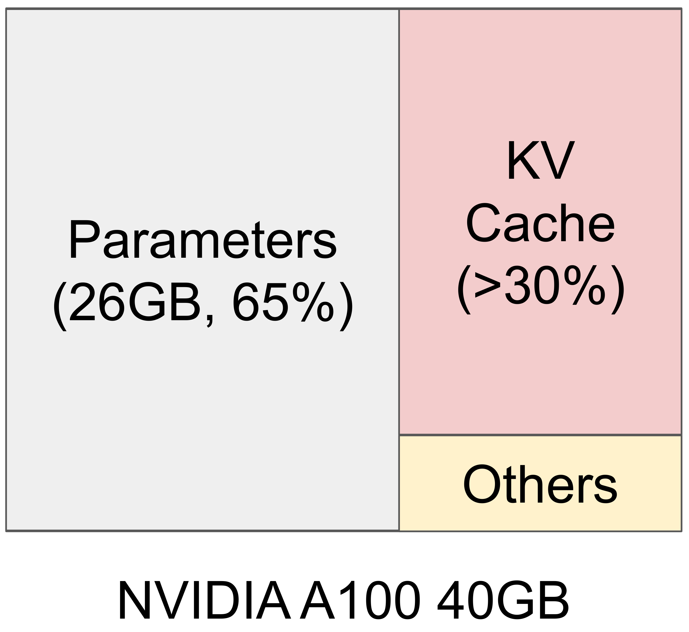
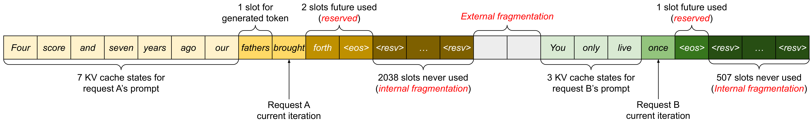
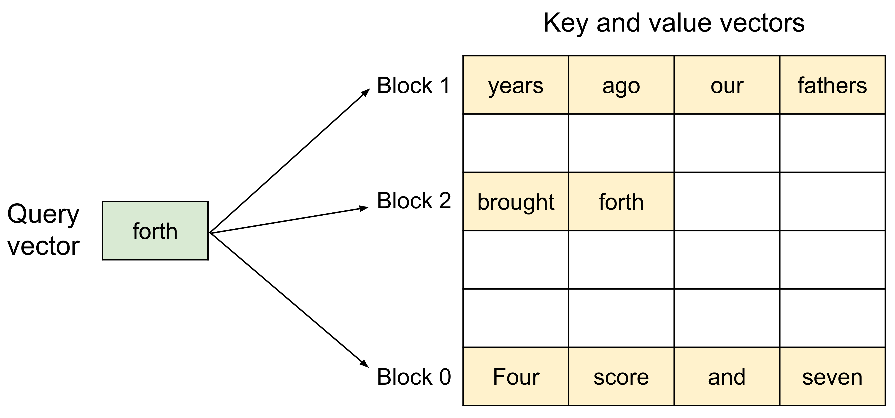
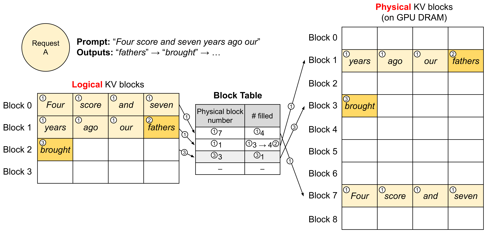
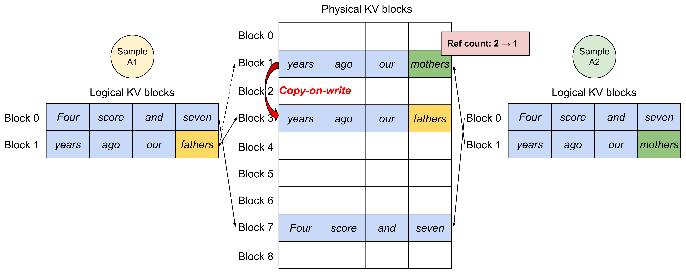
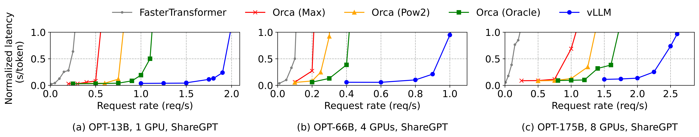
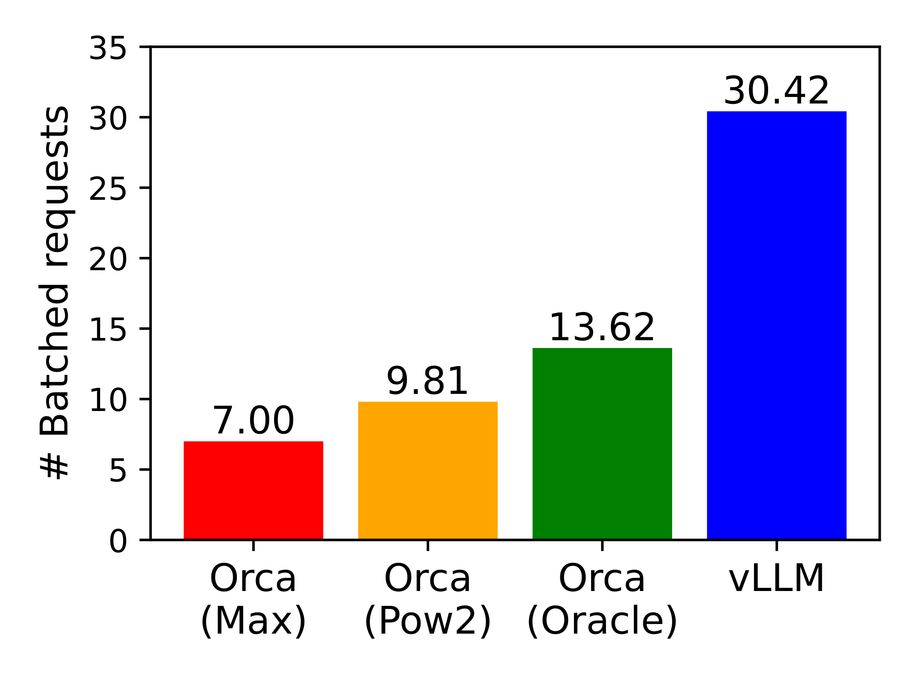

# Efficient Memory Management for Large Language Model Serving with PagedAttention (vLLM)

| 项目 | 内容 |
|------|------|
| **Authors** | Woosuk Kwon, Zhuohan Li, Siyuan Zhuang, Ying Sheng, Lianmin Zheng, Cody Hao Yu, Joseph E. Gonzalez, Hao Zhang, Ion Stoica (UC Berkeley, Stanford, UC San Diego) |
| **Published** | 2023-10 (SOSP 2023) |
| **Link** | [arXiv 2309.06180](https://arxiv.org/abs/2309.06180) |

**一句话总结:**
- 将操作系统虚拟内存和分页技术引入 LLM 推理的 KV cache 管理，提出 PagedAttention 算法和 vLLM 系统，在相同延迟约束下吞吐量提升 2-4×。

**核心贡献:**
- 识别 LLM serving 中 KV cache 管理的两大低效：内存碎片化（仅 20.4-38.2% 利用率）和无法共享
- 提出 PagedAttention——允许 attention KV 向量存储在非连续分页内存中，操作系统的分页思想首次被应用于 LLM 推理
- 构建 vLLM 端到端 serving 系统，通过 block table 实现逻辑到物理块的映射、动态分配和 copy-on-write 共享
- 在 OPT-13B/66B/175B 和 LLaMA-13B 上验证，vLLM 比 FasterTransformer 和 Orca 提升 2-4× 吞吐量

---

### 1. Background & Motivation

LLM serving 要提升吞吐量就必须将足够多的请求组成 batch 一起处理。然而，每个请求的 **KV cache** 极其庞大（OPT-13B 单 token 需 800KB，单请求可达 1.6 GB），且随生成过程动态增长和收缩。

上图（左）展示了 A100 40GB 上 13B 参数模型的显存分配：参数量占 65%，KV cache 占超过 30%。在 batch size 增大时（右图），现有系统（FasterTransformer）吞吐量迅速饱和，而 vLLM 能持续增长。

现有系统（FasterTransformer、Orca）将 KV cache 存储在**连续内存空间**中，这导致两个根本问题：

**问题 1：严重的内存碎片化。** 系统必须为每个请求预分配最大长度（如 2048 token）的连续空间。实际输出通常远短于最大值，造成严重的内部碎片。同时，不同请求的预分配大小不同导致外部碎片。

实测仅 20.4%-38.2% 的 KV cache 内存用于存储实际 token 状态，其余被碎片化和预留浪费。

**问题 2：无法跨请求共享内存。** 并行采样（parallel sampling）和 beam search 等高级解码方法会生成多个共享部分 prompt 的输出序列。但在连续内存方案中，各序列的 KV cache 存放于独立空间，无法共享。

作者认为，瓶颈本质上是**内存容量跟不上算力增长**：A100 到 H100 算力翻倍，显存仍为 80GB，内存将成为更严重的瓶颈。

### 2. High-Level Method

核心洞察：将操作系统的**分页（paging）** 和**虚拟内存**思想引入 KV cache 管理。

**PagedAttention** 将每个序列的 KV cache 划分为固定大小的 **KV blocks**（block size = B token）。每个 block 包含连续的 B 个 key 向量和 B 个 value 向量。Attention 计算被改写为逐 block 的块式运算，使得 KV cache 可以存储在**非连续**的物理内存中。

vLLM 引入 **block table**（类似 OS 的页表）来维护每个请求的**逻辑 KV block → 物理 KV block** 的映射：
- 逻辑块是请求视角的连续地址空间
- 物理块是 GPU 显存中实际存放 KV 向量的位置
- 无需预分配整个序列的最大长度，按需分配物理块
- 每个 block table 条目记录物理块号和已填充位置数

### 3. Key Implementation Details

**系统架构：** vLLM 采用 centralized scheduler 协调多个分布式 GPU worker。KV cache manager 运行在 scheduler 中，通过控制消息将 block table 广播给所有 worker。GPU worker 在 attention 层根据 block table 读取 KV cache，并通过 all-reduce 同步中间结果。

**解码流程（以单序列为例）：**
1. **Prefill 阶段：** 使用常规 attention 计算 prompt 的 KV cache，分配至少 2 个物理块（7 token prompt → block 0 放 4 tokens + block 1 放 3 tokens，block 1 空 1 slot）
2. **Decode 阶段 1：** PagedAttention 在物理块 7 和 1 上计算，新 token 写入 block 1 的空 slot
3. **Decode 阶段 2：** block 1 满，分配新物理块 3，更新 block table

**Copy-on-Write 共享：** 并行采样时，多个输出序列共享同一 prompt 的物理块。vLLM 为每个物理块维护引用计数。当某一序列需要修改共享块时，触发 copy-on-write 分配新块并拷贝数据。

**调度与抢占：** FCFS 调度策略。显存不足时采用 **all-or-nothing** 驱逐策略——一个请求的所有 KV block 必须完整在 GPU 中才能继续解码。vLLM 支持两种恢复机制：
- **Recomputation（重算）：** 从 checkpoint 重新计算被驱逐的 KV cache，block size 无关
- **Swapping（换出）：** 将 GPU block 换出到 CPU 内存，再换入

实测 recomputation 在小 block size 时更高效（可低至 swap 延迟的 20%）。

**分布式支持：** Tensor parallelism 下每个 worker 持有部分 attention head，但所有 worker 共享同一 block table 映射。scheduler 在每个 decode iteration 广播 block table，workers 据此读取自身负责的 KV cache 分片。

### 4. Experiments & Results

**实验设置：** OPT-13B（1×A100）、OPT-66B（4×A100）、OPT-175B（8×A100-80GB），基于 ShareGPT 和 Alpaca 数据集合成的请求 trace。

**基本采样：** vLLM 比 Orca (Oracle) 的可持续请求率高 **1.7×-2.7×**，比 Orca (Max) 高 **2.7×-8×**，比 FasterTransformer 高至 **22×**。

上图解释原因：vLLM 能 batch 更多请求——ShareGPT 上比 Orca (Oracle) 多 2.2×，比 Orca (Max) 多 4.3×；Alpaca 上差距更大（因短序列多，碎片化影响更严重）。

**并行采样与 Beam Search：**

| 解码方法 | 内存节省 |
|---------|---------|
| 并行采样 (2 路) | 6.1% |
| 并行采样 (6 路) | 9.8% |
| Beam search (width 2) | 37.6% |
| Beam search (width 6) | 55.2% |

Beam search 因中间候选之间存在大量重叠路径，共享效益显著高于并行采样。

**共享前缀：** 机器翻译场景，vLLM 利用共享前缀缓存（类似 OS 共享库），相比 Orca 提升 **1.67×（one-shot）** 至 **3.58×（few-shot）** 吞吐量。

**Chatbot 场景：** 长对话历史导致大量请求达到 1024 token 约束，vLLM 依然保持 2× 更高吞吐量。

**Ablation - Block Size 影响：**
- Attention kernel 延迟：vLLM 在小 context（≤512）和 batch size 8 时略慢于 FasterTransformer，但在大 context（≥1024）和 batch size 32 时更优
- 端到端：block size 16-64 为最优区间，小 block size 增加 overhead，太大则失去灵活性

**Ablation - Recomputation vs Swapping：**
- Block size ≤16 时 recomputation 更优（开销恒定为 swap 的 ~20%）
- Block size ≥64 时 swapping 更优（单次传输数据量大，PCIe 利用率高）
- Block size 16-64 时两者表现接近

### 5. Limitations & Reflection

**作者承认的局限：**
- PagedAttention 的非连续内存访问和地址间接层（indirection）会引入 kernel 额外开销，在小 batch、小 context 场景不如连续内存方案
- 方法适用于 LLM serving 这类 memory-bound、输出长度未知的动态场景，但不一定适用于 DNN 训练（静态 tensor shape）或 compute-bound 的推理场景
- Recomputation vs swapping 需要在 block size 层面做权衡，没有统一的全局最优策略

**个人思考：**
- PagedAttention 最精彩之处是将 OS 经典设计映射到 LLM 推理的独特特性上——这是一个典型的"降维打击"式创新
- 该论文直接催生了 vLLM 项目，目前已成 LLM 推理的事实标准之一，后续几乎所有推理框架（TensorRT-LLM、SGLang 等）都采纳了类 paged attention 的设计
- Block table 和 copy-on-write 的引入使前缀缓存（prefix caching）成为可能，后后续 Prompt Caching 等实用技术的理论基础
- 局限在于论文仅在 NVIDIA A100 上验证，但该设计本质上是硬件无关的

**Key Concepts:**
- **PagedAttention —** 将 KV cache 分页为非连续物理块管理的 attention 算法，是 vLLM 的核心技术基础
- **KV Cache Block Table —** 逻辑到物理块的映射表，类似 OS 页表，支持动态分配和跨序列共享
- **Copy-on-Write KV Cache —** 在物理块引用计数 >1 时复制后修改的机制，实现零开销共享

---

**Extracted Figures:**
- `fig1_memory_throughput.png` — A100 显存分配（参数 vs KV cache）及 vLLM 吞吐量对比
- `pagedattention_fig2_memory_waste.png` — 现有系统仅 20.4-38.2% KV cache 内存利用率
- `pagedattention_fig5_algorithm.png` — PagedAttention 分块存储 KV 向量的核心示意
- `pagedattention_fig6_block_table.png` — 逻辑到物理 block 的地址翻译与 block table 结构
- `pagedattention_fig8_parallel_sampling_cow.png` — 并行采样中 copy-on-write 机制的示例
- `pagedattention_fig12_throughput_latency.png` — OPT-13B/66B/175B 在 ShareGPT/Alpaca 上的主实验结果
- `pagedattention_fig13_batched_requests.png` — 各系统实际 batch 的请求数对比
- `pagedattention_fig11_length_distribution.png` — ShareGPT 和 Alpaca 数据集的输入/输出长度分布
- `pagedattention_table1_model_sizes.png` — 实验所用模型和服务器的详细配置
