# FlashInfer: Efficient and Customizable Attention Engine for LLM Inference Serving

| 项目 | 内容 |
|------|------|
| **Authors** | Zihao Ye, Lequn Chen, Ruihang Lai, Wuwei Lin, Yineng Zhang, Stephanie Wang, Tianqi Chen, Baris Kasikci, Vinod Grover, Arvind Krishnamurthy, Luis Ceze (University of Washington, NVIDIA, Perplexity AI, CMU) |
| **Published** | 2025-01 (MLSys 2025) |
| **Link** | [arXiv 2501.01005](https://arxiv.org/abs/2501.01005) |

**一句话总结:**
- FlashInfer 是一个基于代码生成的可定制 attention 引擎，通过 block-sparse 统一格式、JIT 编译的可定制 attention 模板和动态负载均衡调度，在主流 LLM serving 框架中实现 29-69% 的 inter-token-latency 降低。

**核心贡献:**
- 提出 **block-sparse 统一格式**，将 PageTable、RadixTree 等多种 KV-cache 存储结构统一为 Block Compressed Sparse Row (BSR) 矩阵表示，同时提出 **composable formats**（组合格式）以不同 block size 分片存储共享/独立 KV-cache 区域
- 构建 **JIT 编译 attention 模板**，允许用户通过几十行 CUDA 代码定义自定义 attention 变体（如 logits 变换、score 运算），编译为高效 block-sparse kernel
- 设计 **动态负载均衡调度器**（load-balanced scheduler），在 CUDAGraph 静态约束下按 sequence length 动态分配 workload，消除 SM 空闲
- 提供 **head-group fusion** 优化 GQA/MQA 场景下 KV-cache 的行与 head 维度的融合加速

---

### 1. Background & Motivation

LLM inference serving 面临日益复杂的 attention 计算需求。在推理阶段，attention 机制读取 KV cache（存储历史上下文）并基于当前 query 计算输出。随着 LLM 应用场景的多样化，attention kernel 需要满足以下挑战：

**KV-cache 存储异构性：** 不同 serving 框架采用不同的 KV-cache 存储结构——PagedAttention（vLLM）用 page table、RadixAttention（SGLang）用 radix tree、Tree Attention（speculative decoding）用树结构。每种结构都需定制 attention kernel，造成高维护成本。

**Attention 变种多样性：** 现代 LLM 出现 GQA/MQA、特殊 mask（如 ALiBi、sliding window）、自定义 score 计算（如 sigmoid attention）等多种 attention 变体，需要灵活的 kernel 实现策略。

**负载动态性：** LLM serving 中请求的序列长度高度可变，且在每个 decode step 中变化。静态调度方案难以充分利用 GPU SM。

FlashInfer 定位为解决上述挑战的统一 attention 引擎，其设计决策之一是基于 CUDA/CUTLASS 而非 Triton，以便利用 Hopper 架构的 warp specialization 和 TMA 等高级特性。

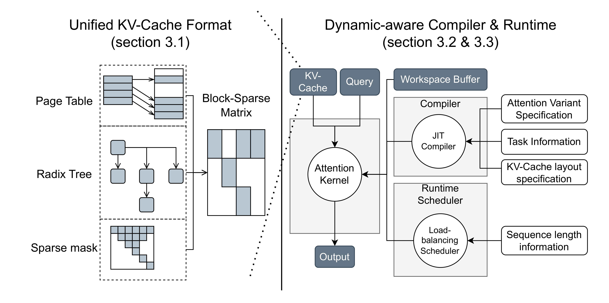

### 2. High-Level Method

FlashInfer 采用 **code-generation** 路线，通过三个核心设计实现高效和可定制：

#### 2.1 Block-Sparse 统一格式

将 PageTable（vLLM）和 RadixTree（SGLang）统一表示为 **BSR (Block Compressed Sparse Row) 矩阵**。查询对应矩阵的行，KV-cache page 对应矩阵的列，非零块表示被访问的 KV-cache pages。

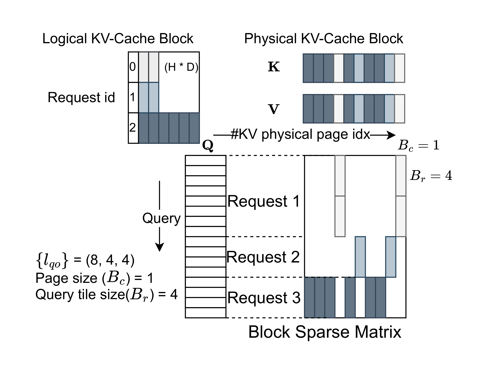

Query 和 output 矩阵用 **ragged tensor**（jagged array）紧凑打包，避免 padding 浪费。KV-cache 采用 BSR 格式，block size 按应用需求定义：$B_r$ 对应 query tile size，$B_c$ 对应 KV page size。

#### 2.2 Composable Formats（组合格式）

基于不同请求共享前缀（shared prefix）的观察，FlashInfer 提出将 KV-cache sparse matrix 拆分为多个 BSR 子矩阵，每个子矩阵使用不同的 block size：

- 共享前缀区域 → 大 block size BSR（共享内存效率高）
- 独立后缀区域 → 小 block size BSR（避免碎片）

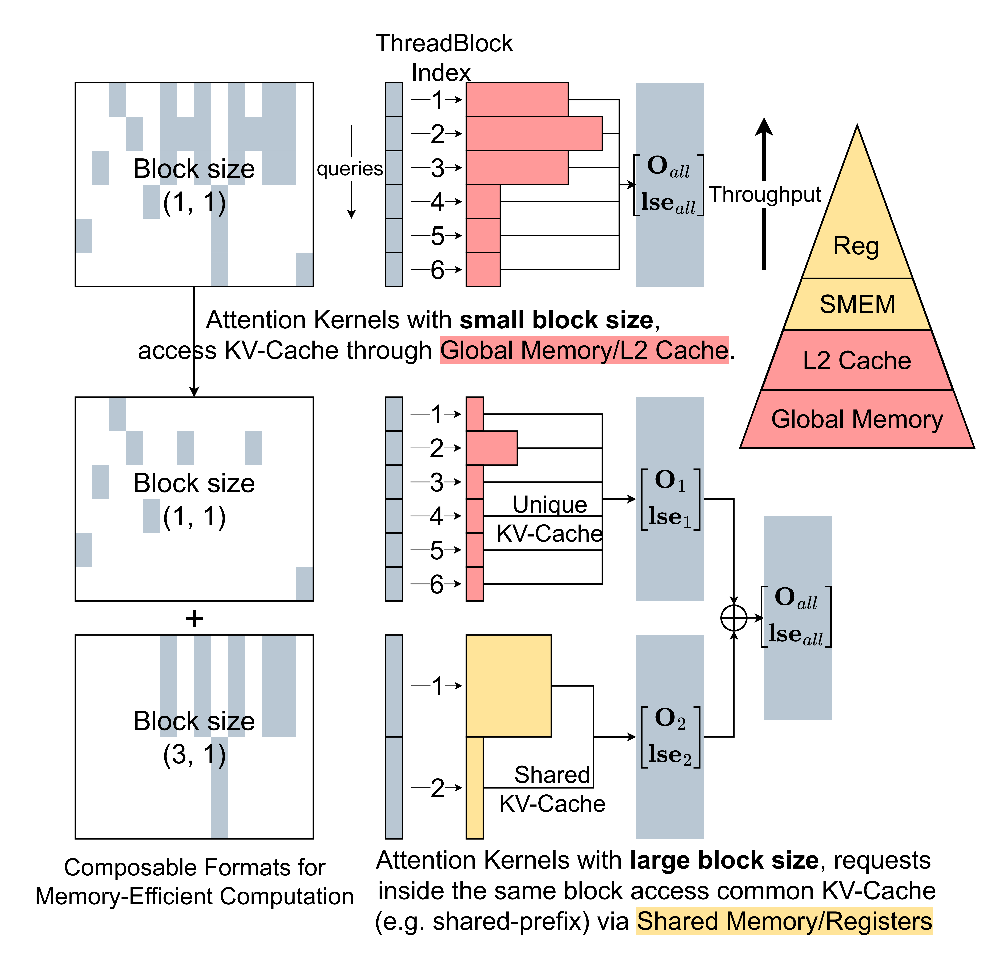

这种拆分无需数据移动，只需重新计算 indices 和 pointer 数组。

#### 2.3 可定制 Attention 模板 + JIT 编译

FlashInfer 提供 CUDA/CUTLASS 模板，支持从 Turing 到 Hopper 架构。关键特性：

- **灵活的 sparse tile 加载：** 将 scatter global memory 中不连续的块搬运到 contiguous shared memory，适配 tensor core 输入要求

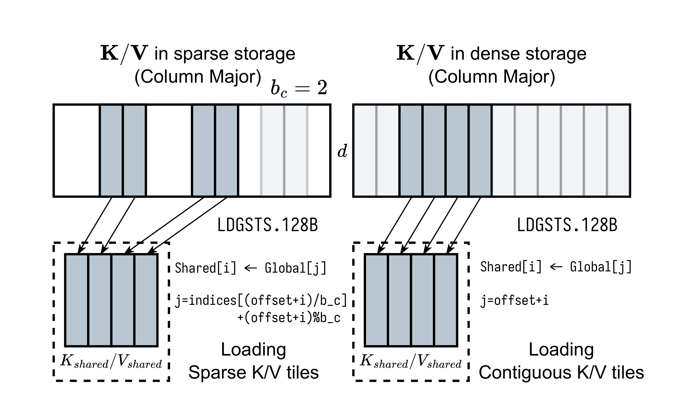

- **多 tile size 配置：** query tile size 1 使用 CUDA Cores（decode），其余使用 Tensor Cores（prefill）
- **JIT compilation：** 用户通过 `AttentionSpec` 类定义 logits 变换函数（如 sigmoid、bias、RoPE），JIT 编译为高效 block-sparse kernel

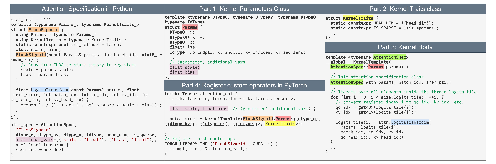

JIT 编译在 init 时完成并缓存。用户只需 ~20 行额外代码即能实现 RoPE 与 attention 的融合 kernel。

#### 2.4 动态负载均衡调度

受 Stream-K 启发但采用确定性聚合（无原子操作），FlashInfer 的调度器将长 KV 序列分片（split-K），通过贪心算法将 chunk 分配到 CTAs，最小化总执行时间。

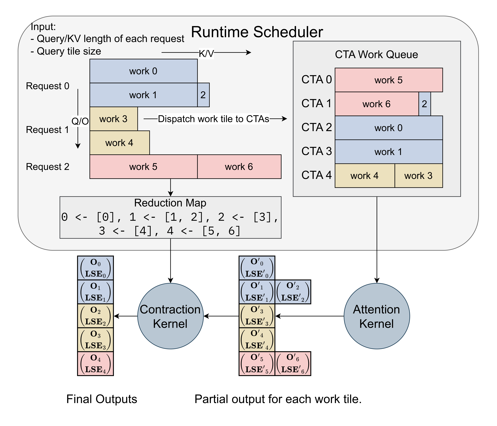

**关键设计：** scheduler 适合在 CPU 上运行（每 generation step 执行一次），plan 结果缓存到 GPU 端。与 CUDAGraph 兼容——`plan()` 函数在 CUDAGraph 外运行，`run()` 在 CUDAGraph 内捕获。

### 3. Key Implementation Details

**Head-Group Fusion for GQA：** GQA 中多个 query head 共享同一 KV head。FlashInfer 将 query-head 维度与行维度融合为 fused row index，使一个 threadblock 加载的 KV-cache 可被组内所有 query head 复用。

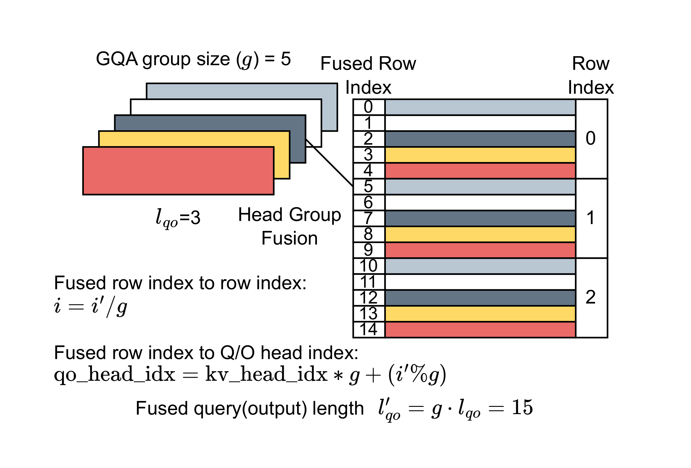

**Stream-K 调度的确定性适配：** 原生 Stream-K 使用原子操作聚合 split-k 结果导致非确定性输出。FlashInfer 在 CPU 上预先计算确定性聚合顺序，CTAs 按序写入 partial output，contraction kernel 按确定顺序合并。

**FP8–FP16 混合精度 Attention：** KV-cache 存储为 FP8（减少带宽和存储），query/output 保持 FP16。利用 fast numerical array converter 加速 dequantization。

**Workspace Memory 管理：**
- Pinned host buffer 存储 scheduler metadata，`cudaMemcpyAsync` 传至 GPU
- Split-K write-through 优化：短 KV 的请求直接写 final output，绕过 workspace
- CUDAGraph 兼容：workspace 各 section 在 capture 时固定地址不变

**PyTorch 编程接口：**
```python
# Init: JIT compile kernel
attn = FlashInferWrapper(spec, ...)
# Init CUDA Graph
g = torch.cuda.CUDAGraph()
attn.plan(seqlen_info)  # dummy plan
with torch.cuda.graph(g):
    attn.run(q, k, v, ...)
# Generation loop
while not finished:
    seqlen_info.update()
    attn.plan(seqlen_info)  # CPU, per step
    g.replay()              # GPU, capture attn.run
```

`plan` 和 `run` 分离的设计灵感来自 **Inspector-Executor (IE) model**。

### 4. Experiments & Results

#### 4.1 End-to-End LLM Serving (SGLang 集成)

在 SGLang v0.3.4 中替换 Triton 后端为 FlashInfer，测试 A100 40GB 和 H100 80GB 上 Llama 3.1 8B/70B：

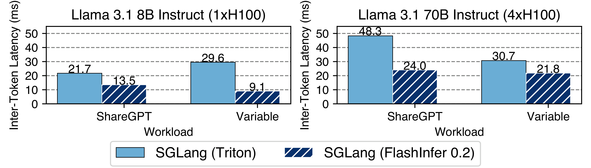

- ITL（inter-token-latency）降低 **29-69%** 对比 Triton 后端
- TTFT（time-to-first-token）降低 **28-30%**（长上下文场景）
- 并行生成（parallel generation）加速 **13-17%**

#### 4.2 Kernel-Level 性能

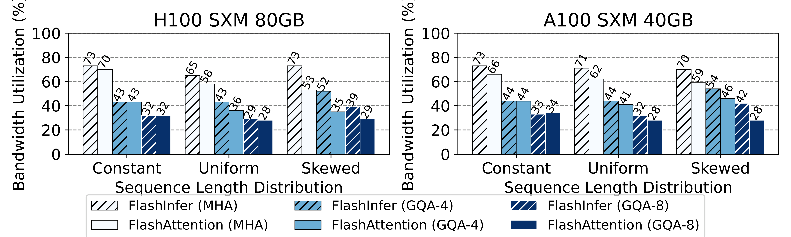

FlashInfer 在 uniform 和 skewed 序列长度分布下显著优于 FlashAttention kernel，归功于：
1. 负载均衡动态调度器（消除 SM 空闲）
2. 灵活的 tile size 选择（decode kernel 使用更优 tile size）

#### 4.3 长上下文推理 — StreamingLLM 的融合 kernel

使用 ~20 行自定义代码将 RoPE 与 attention 融合，在 H100 上 StreamingLLM 推理延迟显著降低：

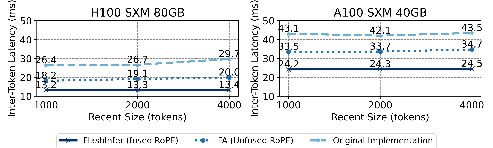

#### 4.4 Composable Formats 效果

在 MLC-Engine 上测试，并行度 $4 \leq n \leq 32$ 时组合格式带来一致加速：

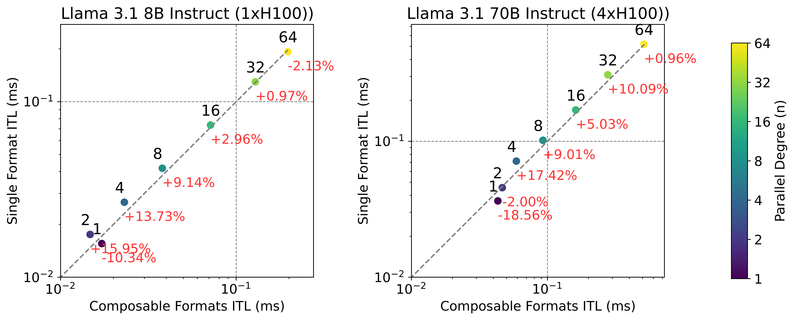

- 峰值加速在 n=4：ITL 降低 13.73%（8B）/ 17.42%（70B），TTFT 降低 16.41%（8B）/ 22.86%（70B）

#### 4.5 Sparse Gathering Overhead

FlashInfer 的 sparse KV-cache loading 在 prefill 中因需额外索引查找略有性能开销，但 decode 中因带宽瓶颈，sparse/dense 差异几乎无关紧要：

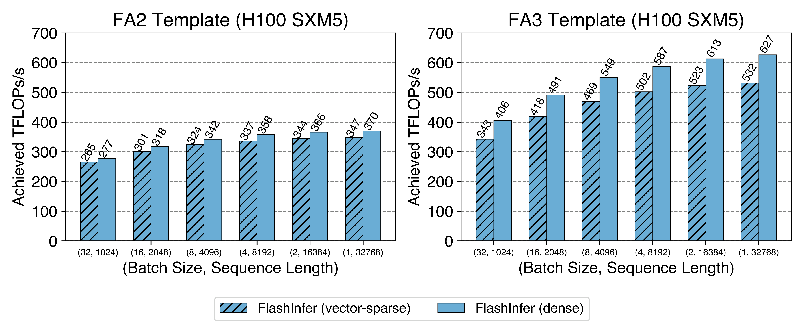

#### 4.6 消融实验

| 实验 | 关键结论 |
|------|---------|
| Load-balancing scheduler 消融 | 长序列场景（U(4096, 16384)）ITL 从 13.89ms 降至 8.63ms（38% 提升） |
| FlexAttention 对比 | FlashInfer 所有 sequence length 和 attention variant 上一致超越 FlexAttention，长序列差距最大 |
| vLLM 集成 | 与 vLLM 默认 backend 吞吐量持平，FP8 模式下 ITL/TTFT 更好 |

### 5. Limitations & Reflection

**作者承认的局限：**
- 目前仅支持 forward pass，不适用于训练场景（backward attention kernel 已计划）
- 基于 CUDA/CUTLASS 而非 Triton，虽然性能更优但可移植性受限（负载均衡调度器设计本身是 backend-agnostic 的）
- Composable formats 在并行度过低（n<4）或过高（n>32）时优势减弱
- 大 block column size 时可利用 TMA 做 sparse gathering，但灵活性降低

**个人思考：**
- FlashInfer 的核心理念是将 attention kernel 的 **computation** 与 **scheduling** 分离——通过 code-generation 和 runtime scheduler 实现这一经典分离
- BSR 统一 PageTable/RadixTree 等不同数据结构的抽象能力令人印象深刻，这种 "存储格式统一 + JIT 编译" 的范式可能是 GPU kernel 开发的通用方向
- CUDAGraph 兼容性是实际部署的关键：每步 CPU scheduling + 静态 GPU graph replay 的混合模式是 serving 系统的务实选择
- 与 SGLang 的深度绑定体现了 "垂直优化" 的工程哲学——从 serving framework 到 kernel 全面优化
- 主要局限是 NVIDIA-only（CUDA/CUTLASS），但 LLM 推理优化生态目前几乎完全围绕 NVIDIA GPU

**Key Concepts:**
- **Block-Sparse Row (BSR) Format —** 将 KV-cache 数据页表组织为块稀疏矩阵的格式，统一 PageTable/RadixTree 等异构存储
- **Composable Formats —** 将 KV-cache sparse matrix 按共享/独立区域拆分为不同 block size 的 BSR 子矩阵的组合格式
- **Inspector-Executor (IE) Model —** 将调度规划（inspector/plan）与执行（executor/run）分离的计算模型，FlashInfer 用于解耦 CPU scheduling 和 GPU kernel execution
- **Head-Group Fusion —** GQA 中将 query-head 维度与行维度融合，使 threadblock 单次 KV-cache 加载可被组内所有 head 复用

---

**Extracted Figures:**
- `flashinfer_fig1_overview_system_design.png` — FlashInfer 系统设计总览：JIT 编译 + 运行时调度
- `flashinfer_fig2_representation_page_bsr.png` — Page Table 在 BSR 格式下的表示
- `flashinfer_fig3_composable_formats_shared.png` — Composable formats 共享前缀优化结构
- `flashinfer_fig4_data_transfer_global.png` — Global 到 shared memory 的稀疏/稠密数据传输
- `flashinfer_fig5_jit_compiler_attention.png` — JIT 编译器架构与 attention 变体模板
- `flashinfer_fig6_load_balanced_runtime.png` — 负载均衡运行时调度器工作流
- `flashinfer_fig7a_medium_inter_token.png` — SGLang ITL & TTFT 主实验结果
- `flashinfer_fig7b_medium_inter_token.png` — SGLang ITL & TTFT 主实验结果 (续)
- `flashinfer_fig8a_achieved_bandwidth_flops.png` — Decode/prefill kernel 带宽 & FLOPs 利用率
- `flashinfer_fig8b_achieved_bandwidth_flops.png` — Decode/prefill kernel 带宽 & FLOPs 利用率 (续)
- `flashinfer_fig9a_end_end_latency.png` — StreamingLLM 端到端延迟 (fused vs unfused)
- `flashinfer_fig9b_end_end_latency.png` — StreamingLLM 端到端延迟 (fused 带宽利用率)
- `flashinfer_fig10a_itl_ttft_mlc.png` — Composable formats ITL & TTFT 加速
- `flashinfer_fig10b_itl_ttft_mlc.png` — Composable formats ITL & TTFT 加速 (续)
- `flashinfer_fig11_head_group_fusion.png` — GQA head-group fusion 融合策略
- `flashinfer_fig12a_achieved_tflops_prefill.png` — Sparse/dense KV-cache prefill 性能对比
- `flashinfer_fig12b_achieved_tflops_prefill.png` — Sparse/dense KV-cache decode 带宽利用率
