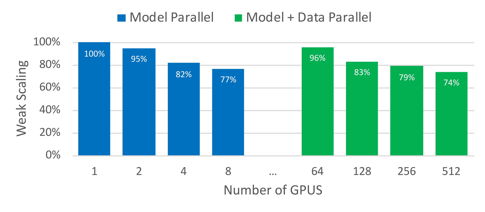
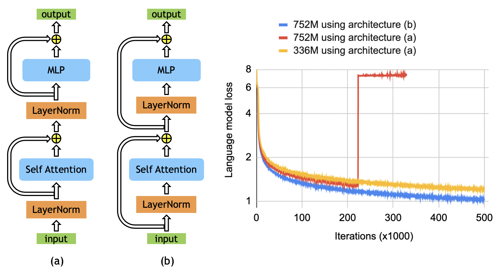

# Megatron-LM: Training Multi-Billion Parameter Language Models Using Model Parallelism

| 项目 | 内容 |
|------|------|
| **Authors** | Mohammad Shoeybi, Mostofa Patwary, Raul Puri, Patrick LeGresley, Jared Casper, Bryan Catanzaro (NVIDIA) |
| **Published** | 2019-09 (SC 2020) |
| **Link** | [arXiv 1909.08053](https://arxiv.org/abs/1909.08053) |

**一句话总结:**
- 提出简单高效的 intra-layer tensor parallelism，仅需在 PyTorch 中插入少量通信原语，512 GPU 上训练 8.3B GPT-2 达 76% 扩展效率。

**核心贡献:**
- 利用 Transformer 结构实现列/行拆分 GEMM 配对，消除中间同步点（f/g 算子）
- 发现 BERT 的 Pre-LN vs Post-LN 对训练稳定性至关重要（影响后续所有大模型架构）
- 8.3B GPT-2 在 WikiText103（10.81 ppl）和 3.9B BERT 在 RACE（90.9%）达到 SOTA

---

### 1. Background & Motivation

语言模型规模持续增长（GPT-2、BERT），单个 GPU 的内存无法容纳。
已有方案的问题：

- **GPipe / PipeDream** — pipeline parallelism（垂直切分），假设单层可放入单个设备
- **Mesh-TensorFlow** — SPMD 方案灵活但需重写模型和新编译器

Megatron-LM 的定位：**简单、高效的 intra-layer model parallelism**（tensor parallelism），不依赖新编译器或框架，在 PyTorch 中仅需插入少量通信原语即可实现。与 pipeline parallelism 正交互补。

### 2. High-Level Method

核心思路：利用 Transformer 多头注意力和 MLP 的固有结构，将矩阵乘法按列/行拆分到多 GPU。



**MLP 块并行（Figure 3a）：**

第一个 GEMM 按**列拆分**（$A = [A_1, A_2]$），使得 GeLU 可以在各 GPU 上独立计算：

$$[Y_1, Y_2] = [\text{GeLU}(XA_1), \text{GeLU}(XA_2)]$$

第二个 GEMM 按**行拆分**，直接从 GeLU 输出取输入，无需通信。输出通过 all-reduce 合并。

关键设计：将两个 GEMM 之间的同步点消除，整个 MLP 块仅需前向 1 次 all-reduce（`g` 算子）+ 反向 1 次 all-reduce（`f` 算子）。

**Self-Attention 块并行（Figure 3b）：**

将 QKV 的 GEMM 按列拆分，每个 GPU 处理部分 attention head。输出线性层按行拆分，与 MLP 类似。

**f 算子和 g 算子的实现**（仅 2 行 PyTorch）：

```python
class f(torch.autograd.Function):
    def forward(ctx, x): return x
    def backward(ctx, gradient): all_reduce(gradient); return gradient
```

- `f`: 前向恒等，反向 all-reduce（梯度同步）
- `g`: 前向 all-reduce（激活同步），反向恒等

每个 Transformer 层共 **4 次通信操作**（前向 2 次 + 反向 2 次）。

### 3. Key Implementation Details

- **Vocabulary 并行**：将 embedding 矩阵按 vocab 维度列拆分，输出 logits 的 all-gather 通过融合交叉熵损失优化为标量通信
- **LayerNorm / Dropout / Residual**：各 GPU 上重复计算（duplicated），不拆分——这些轻量操作的计算成本远低于通信成本
- **混合数据并行**：模型并行组内拆模型，组间做数据并行，梯度 all-reduce 在各数据并行组内并行执行
- **Random seed 管理**：residual dropout 在各 GPU 用相同种子（保证一致性），model parallel region 内 dropout 各 GPU 用不同种子

**训练配置：**
- 32 个 DGX-2H 服务器，共 512 张 Tesla V100 32GB
- 混合精度训练（FP16 + dynamic loss scaling）
- 权重初始化前 residual layers 除以 $\sqrt{2N}$（$N$ 为层数）
- 全局梯度裁剪 1.0
- Activation checkpointing（每层一次）

**模型配置与扩展性：**

| 参数量 | Hidden | Heads | Layers | Model并行 | 总GPU |
|-------|--------|-------|--------|----------|------|
| 1.2B | 1536 | 16 | 40 | 1 | 64 |
| 2.5B | 1920 | 20 | 54 | 2 | 128 |
| 4.2B | 2304 | 24 | 64 | 4 | 256 |
| **8.3B** | 3072 | 32 | 72 | **8** | **512** |

### 4. Experiments & Results

**GPT-2 扩展性：**

- 8.3B 模型 8-way model parallel + 64-way data parallel：**76% 扩展效率**（相对单 GPU baseline）
- 15.1 PetaFLOPs 持续算力
- WikiText103 perplexity **10.81**（SOTA 15.79），LAMBADA accuracy **66.51%**（SOTA 63.24%）

**BERT 扩展性——LayerNorm 位置的关键发现：**

原始 BERT 架构在增大到 1.3B 时出现精度退化。Megatron 发现 **LayerNorm 放置位置**是关键：将 LayerNorm 放在 residual 分支之前（Pre-LN）而非之后（Post-LN），可稳定训练并使精度随模型规模提升而单调上升。



| 模型 | MNLI | QQP | SQuAD 1.1 F1 | SQuAD 2.0 F1 | RACE |
|------|------|-----|-------------|-------------|------|
| 336M (BERT-large) | 89.7/90.0 | 92.3 | 94.2 | 88.1 | 83.0 |
| 1.3B | 90.9/91.0 | 92.6 | 94.9 | 90.2 | 87.3 |
| **3.9B** | **91.4/91.4** | **92.7** | **95.5** | **91.2** | **89.5** |

3.9B BERT 在 RACE 上以 **90.9%** 达到 SOTA（此前 89.4%）。

### 5. Limitations & Reflection

**作者承认的局限/未来方向：**

- 超过 16B 参数时，单台 DGX-2H（16 GPU）无法容纳，需要 **hybrid intra-layer + inter-layer model parallelism**
- Attention head 数增多会降低扩展效率（小 GEMM 问题）
- Strong scaling 有收益递减（1.2B 模型从 1→8 GPU 只加速 ~3×）

**我的判断：**

- Megatron-LM 的 tensor parallelism 是 **GPipe 的自然互补**——GPipe 解决跨层切片（层放不下），Megatron-LM 解决层内切片（单层放不下）
- 比起 Mesh-TensorFlow 的框架级方案，Megatron-LM 的"不需要编译器"是一个很实际的优势——对生产团队来说，在现有代码中插入几个通信算子远比迁移到新框架可行
- BERT LayerNorm 位置的发现是简洁有力：Pre-LN 后来成为了几乎所有大模型（GPT-3, LLaMA 等）的标准配置
- 需要注意的是，Megatron-LM 论文只展示了 **模型训练** 的扩展性，实际上 tensor parallelism 在推理时同样关键——后续 Megatron-Turing NLG、Megatron Service 等工作将这套方法扩展到了推理部署
- 后续 [[gpipe-efficient-training-of-giant-neural-networks-using-pipeline-parallelism|GPipe]] + Megatron-LM 的组合（3D parallelism）成为训练千亿参数模型的事实标准

### 6. Personal Takeaways

- **f 和 g 算子的设计是工程极简的典范**——用 autograd Function 的两个 `forward`/`backward` 行自然实现了前向/反向的通信语义，不需要改动 PyTorch 框架
- 列拆分 GEMM + 行拆分 GEMM 的配对策略消除了中间同步点，是 Megatron-LM 最关键的 insight
- Pre-LN 的发现影响深远——GPT-3、LLaMA、Mistral 等后续几乎所有大模型都采用 Pre-LN
- Megatron-LM 把 tensor parallelism 变成了 PyTorch 级别的工具（后集成进 NeMo Megatron），极大降低了大规模训练的接入门槛

---

**Key Concepts:**
- [[tensor-parallelism|Tensor parallelism (intra-layer model parallelism)]] — 将单一矩阵乘法按行/列拆分到多 GPU
- [[pipeline-parallelism|Pipeline parallelism]] — 将模型按层切片到不同设备的正交方案
- Pre-LN / Post-LN — LayerNorm 在 residual 前/后的放置方式，对训练稳定性有显著影响
- [[gradient-checkpointing|Activation checkpointing (re-materialization)]] — 前向丢弃中间激活、反向重算
- Hybrid model + data parallelism — 模型并行组内拆模型，组间做数据并行

**Extracted Figures:**
- `megatron_fig1_scaling.png` — Model parallel FLOPS + scaling efficiency on 512 GPUs
- `megatron_fig3a_mlp_parallel.png` — MLP block model parallelism (column split + row split)
- `megatron_fig4_communication.png` — 4 communication operations in a transformer layer
- `megatron_fig7_bert_layernorm.png` — BERT LayerNorm position (Pre-LN vs Post-LN)
- `megatron_fig8_hybrid_parallel.png` — Hybrid model + data parallel GPU grouping
