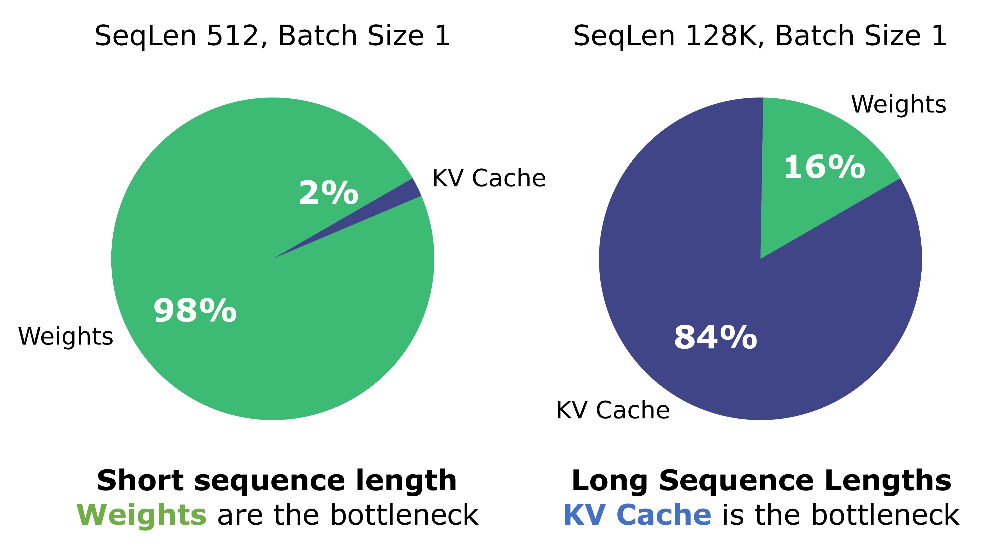
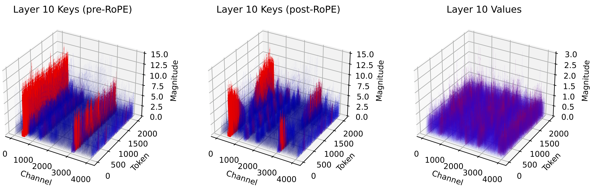
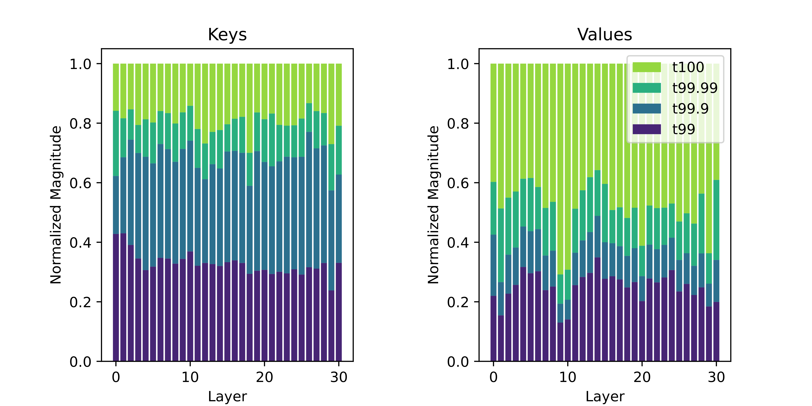
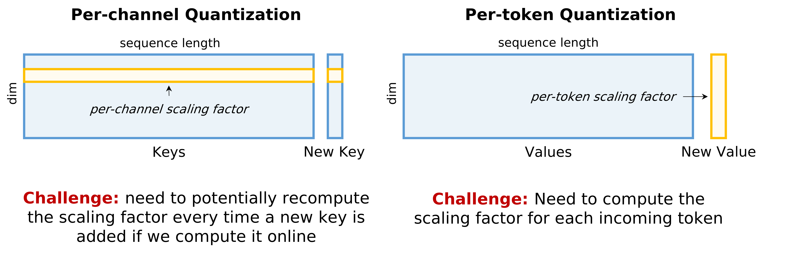
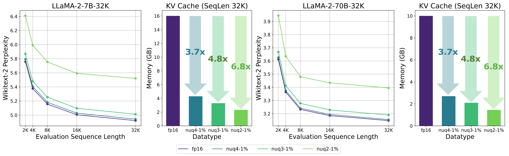

# KVQuant: Towards 10 Million Context Length LLM Inference with KV Cache Quantization

| 项目 | 内容 |
|------|------|
| **Authors** | Coleman Hooper, Sehoon Kim, Hiva Mohammadzadeh, Michael W. Mahoney, Yakun Sophia Shao, Kurt Keutzer, Amir Gholami (UC Berkeley, ICSI, LBNL) |
| **Published** | 2024-01 (ICML 2024) |
| **Link** | [arXiv 2401.18079](https://arxiv.org/abs/2401.18079) |

**一句话总结:**
- KVQuant 通过四项创新——Per-Channel Key Quantization、Pre-RoPE Key Quantization、Non-Uniform Quantization (nuqX) 和 Per-Vector Dense-and-Sparse Quantization——首次实现 KV cache 3-bit 量化下 < 0.1 perplexity 退化，支持单 A100-80GB 上 LLaMA-7B 百万级上下文推理。

**核心贡献:**
- **Per-Channel Key Quantization** — 发现 Key 存在 channel-wise outlier 结构、Value 存在 token-wise outlier，因此对 Key 按 channel 量化、Value 按 token 量化，大幅提升低比特精度
- **Pre-RoPE Key Quantization** — RoPE 旋转操作会混合 channel 对，破坏 outlier 的一致性。在 RoPE 之前量化 Key（pre-RoPE），再 fused kernel 在 dequant 后实时应用 RoPE，进一步降低量化误差
- **nuqX Non-Uniform Datatype** — 离线用 calibration set 按 sensitivity-weighted k-means 导出每层的非均匀数据类型（nuq4/nuq3/nuq2），在线 rescale 到 per-channel/per-token scale
- **Per-Vector Dense-and-Sparse Quantization** — 每条向量（per-channel 或 per-token）独立检测 outlier，将 outlier 与正常值分离存储，减少 dynamic range 偏移
- **Attention Sink-Aware Quantization** — 保留首个 token 在 fp16（因 attention sink 现象，首个 token 的 quantization error 影响不对称地大）
- 在 LLaMA / Llama-2 / Llama-3 / Mistral 全系列模型上验证，3-bit 1% outlier 的精度与 fp16 基线差距 < 0.1 perplexity；可在 **1 张 A100-80GB 上运行 1M 上下文**，**8 张 GPU 上运行 10M 上下文**

---

### 1. Background & Motivation

LLM 推理分为 prefill（并行处理 prompt）和 generation（自回归）两个阶段。在 generation 阶段，模型需要缓存每层的 Key 和 Value 中间激活（即 **KV cache**），以 condition 后续 token 的生成。KV cache 大小与 batch size × sequence length 成正比：$2 \cdot n \cdot h \cdot d \cdot e \cdot b \cdot l$。

长序列场景下 KV cache 成为内存主导瓶颈：

如上图（左），LLaMA-7B 在序列长度 512 时权重占 84%，但在 128K 时 KV cache 占 84%。KV cache 加载在推理时始终是 **memory-bandwidth bound**（即使 batch 增大，各序列仍依赖独立 past context，无 batch-level parallelism），因此压缩 KV cache 即使增加 dequant 计算开销也有净收益。

已有 KV cache 量化方案（如 ATOM、FlexGen、KIVI）在 sub-4-bit 精度下表现不佳，主要因为：
1. 未能处理 Key activation 的 channel-wise outlier 结构
2. RoPE 对 Key 量化精度的影响未被重视
3. 均匀量化和固定非均匀数据类型（如 NormalFloat）的 signpost 分配不够优化
4. Outlier 处理粒度不够细

### 2. High-Level Method

KVQuant 通过四项关键技术实现 ultra-low precision KV cache 量化：

#### 2.1 Per-Channel Key Quantization

通过对 KV cache 分布的详细分析，论文发现：
- Key activations：存在固定的 **outlier channels**——某些 channel 在所有 token 上持续具有较大幅值
- Value activations：outlier 更分散，同时有 outlier channel 和 outlier token，但程度更轻

传统方法（ATOM、FlexGen）对所有 Key 使用 per-token 量化，即共享 scale/zero-point 在同一 token 的所有 channel 上。但这会因 outlier channel 拉大 dynamic range 而降低其他 channel 的量化精度。

KVQuant 对 **Key 按 channel 量化**（per-channel quantization），对 **Value 按 token 量化**（per-token quantization），使 scale/zero-point 更贴合实际分布。对于 LLaMA-7B 3-bit，此举带来 **3.82 perplexity 改善**。

#### 2.2 Pre-RoPE Key Quantization

Key 向量在存储前需应用 RoPE 旋转。然而 RoPE 会成对混合 channel（pairwise rotation），导致旋转后 channel 间的幅值模式不一致，使得原本连续的 outlier channel 变得不稳定，增加量化难度。

KVQuant 在 **RoPE 之前** 量化 Key（即量化原始投影 $K_n$ 而非旋转后的 $\tilde{K}_n = R_{\theta,n}^d \cdot K_n$），推理时 fused kernel 在 dequant 后再实时应用 RoPE。此举对 3-bit LLaMA-7B 额外带来 **0.82 perplexity 改善**。

#### 2.3 nuqX: Per-Layer Sensitivity-Weighted Non-Uniform Datatype

均匀量化在 low-bit 下对 KV cache 非均匀分布拟合不佳。NormalFloat 虽然是非均匀的，但 signpost 位置由数据分布统计特性（正态假设）决定而非任务敏感度。

KVQuant 提出 **nuqX**（nuq4/nuq3/nuq2）：
1. 在 calibration set 上离线计算每层的 non-uniform quantization signposts
2. 使用 **Fisher information matrix**（对角化近似）作为每个元素的 sensitivity weight
3. 运行 sensitivity-weighted k-means：最小化加权量化误差 $\sum_i \mathbf{F}_{ii} \cdot (A_i - \hat{A}_i)^2$
4. 导出的 datatype 是 **per-tensor** 的，在线使用时再 rescaled 到 per-channel/per-token

这样既保证 signpost 贴合数据分布，又避免在线 K-means 的计算开销。

#### 2.4 Per-Vector Dense-and-Sparse Quantization

KV cache activation 中存在少量极端 outlier 值，会严重拉大 dynamic range，降低其余值的量化精度。

现有 dense-and-sparse 方法（如 LLM.int8()、SqueezeLLM）对整个 layer 使用统一 outlier threshold。但不同 channel/token 的 outlier 分布差异大。

KVQuant 采用 **per-vector dense-and-sparse quantization**：
- 每条向量（per-channel 或 per-token）有独立的 outlier threshold
- Key 的 per-channel outlier threshold 可离线校准（因 channel 模式稳定）
- Value 的 per-token outlier threshold 在线计算（高效，无需更新历史缓存）
- 去除 outlier 后，剩余值归一化到 [-1, 1]，再按 nuqX 量化
- Outlier 存储为稀疏格式（CSR/CSC），与量化值分别存储

去除 1% outlier 后，3-bit LLaMA-7B 额外获得 **0.19 perplexity 改善**。

#### 2.5 Attention Sink-Aware Quantization

Attention Sink 现象：模型在开头几层后倾向于给第一个 token 分配很大的 attention score，即使该 token 在语义上不重要。

KVQuant 发现第一个 token 对 quantization error 的敏感度不成比例地高。因此**将第一个 token 保留在 fp16**（不量化），在校准过程中也忽略第一个 token。这尤其有利于 2-bit 量化场景。

### 3. Key Implementation Details

**校准策略：**

| 组件 | 校准方式 | 原因 |
|------|---------|------|
| Key per-channel scale/zero-point | 离线校准 | 每 append 新 Key 需更新所有历史 cache 的 scale |
| Key outlier threshold (per-channel) | 离线校准 | channel 模式稳定，可离线 |
| Value per-token scale/zero-point | 在线计算 | 只需当前 token，不涉及历史更新 |
| Value outlier threshold (per-token) | 在线计算 | 高效，仅需当前 token 的统计 |
| nuqX datatype signposts | 离线计算 | 每层共享，固定不变 |

**CUDA Kernel 实现：**
- 量化存储：4-bit 元素作为 lookup table 索引，dequant 为 fp16
- Key kernel：fused dequant + RoPE 应用，支持 on-the-fly rotation
- 稀疏 outlier：CSR/CSC 格式，sparse matrix-dense vector 乘法
- 性能：4-bit dense-and-sparse kernel 比 fp16 matvec **~1.7× 加速**（A6000, 16K seqlen）

### 4. Experiments & Results

#### 4.1 主实验结果（Perplexity）

| 方法 | LLaMA-7B PPL | KV Cache Size (128K) |
|------|-------------|---------------------|
| fp16 baseline | 5.68 | 64.0 GB |
| int3 | 10.87 | 12.0 GB |
| nf3 | 7.33 | 12.0 GB |
| ATOM-3bit | 6.17 | 12.6 GB |
| FlexGen-3bit | 5.93 | 13.2 GB |
| **KVQuant-3bit** | **5.87** | **12.0 GB** |
| **KVQuant-3bit-1%** | **5.75** (+0.07) | **13.3 GB** |
| **KVQuant-2bit-1%** | **6.01** (+0.33) | **9.3 GB** |

KVQuant 在 3-bit 下优于所有对比方法，接近 fp16 基线（仅 +0.07 perplexity 退化）。

#### 4.2 长上下文评估

**Perplexity vs 序列长度：** KVQuant-3bit-1% 在不同序列长度（2K-32K）上保持与 fp16 一致的 perplexity，无退化：

**Passkey Retrieval：** KVQuant-3bit-1% 在 2K-32K 范围内 passkey 检索成功率几乎与 fp16 相当，优于 KIVI（KIVI 因保留局部 fp16 residual window 更利于尾部 token，但对早期 token 的表示精度不足）。

| Method | 2K | 4K | 8K | 16K | 32K | Avg Bit |
|--------|----|----|----|-----|-----|---------|
| fp16 | 1 | 1 | 1 | 1 | 1 | 16 |
| KIVI-2-gs32-r128 | 0.76 | 0.72 | 0.72 | 0.68 | 0.70 | 3.05 |
| **nuq3-1%** | **0.98** | **1** | **1** | **1** | **1** | **3.33** |

**LongBench / RULER 评估：** 在多项长上下文理解基准上，KVQuant-3bit-1% 保持 fp16 的 94-95% 性能，显著优于 KIVI。

#### 4.3 联合 Weight + KV Cache 量化

与 SqueezeLLM weight-only 量化联合使用时，KVQuant 几乎不引入额外精度损失：

| Weights | KV Cache | LLaMA-7B | LLaMA-13B |
|---------|----------|-----------|------------|
| w4-s45 | nuq4-1% | 5.79 (+0.02) | 5.18 (+0.01) |
| w3-s45 | nuq3-1% | 6.23 (+0.10) | 5.52 (+0.07) |

#### 4.4 Kernel 性能

| Operation | l=2K | l=4K | l=16K |
|-----------|------|------|-------|
| Key fp16 matvec | 33.3 μs | 59.1 μs | 219.4 μs |
| Key nuq4-1% | **25.6 μs** | **39.9 μs** | **126.3 μs** |
| Value fp16 matvec | 26.0 μs | 50.2 μs | 203.7 μs |
| Value nuq4-1% | **22.1 μs** | **37.9 μs** | **124.5 μs** |

序列越长，压缩带来的 memory bandwidth 节省效果越显著。

#### 4.5 内存节省与上下文能力

| 配置 | 模型 | 上下文长度 | 所需 GPU |
|------|------|-----------|---------|
| nuq2-1% | LLaMA-7B | 1M | 1× A100-80GB |
| nuq2-1% | LLaMA-7B | 10M | 8× A100-80GB |
| nuq3-1% | LLaMA-65B | 1M | 8× A100-80GB |

KVQuant 提供 **3.7× (nuq4) 到 6.8× (nuq2) 的 KV cache 压缩比**，是支撑超长上下文推理的核心技术。

### 5. Limitations & Reflection

**作者承认的局限：**
- Per-channel Key 量化需离线校准 scale/zero-point，对域偏移（distribution shift）的鲁棒性未充分验证
- 2-bit 量化虽然内存节省大，但 perplexity 退化仍较明显（~0.33），需 Attention Sink 机制辅助
- Kernel 优化在 A6000 上验证，未在更新的 Hopper 架构（H100）上测试
- 与 token 级别的 KV cache 淘汰策略（如 H2O、Scissorhands）的兼容性未探索

**个人思考：**
- KVQuant 最令人印象深刻的在于细致入微的 distribution analysis——每种方法都有坚实的数据分布观察支撑
- Pre-RoPE Key Quantization 的 insight 非常精妙：RoPE 混合 channel 的旋转操作虽然对位置编码是必需的，却无意中破坏了量化友好性。在量化前撤除旋转、量化后再应用的思路值得在其他涉及旋转/正交变换的场景中推广
- Per-vector Dense-and-Sparse 与现有 dense-and-sparse 方法的本质区别在于 outlier threshold 的粒度——以 1% outlier 为代价换取剩余 99% 值的精度大幅提升，tradeoff 非常划算
- 与 [[PagedAttention]] 是正交的技术——PagedAttention 解决 KV cache 的内存碎片和管理效率，KVQuant 解决每个 cache entry 本身的存储密度
- 从产业应用角度看，KV cache 量化是目前长上下文推理中最实用的技术之一，与 weight quantization 结合可全面压缩模型占用

**Key Concepts:**
- **KV Cache Quantization —** 对 LLM 推理中存储的 Key 和 Value 中间激活进行低精度量化，以减少长上下文推理的内存占用
- **Pre-RoPE Key Quantization —** 在应用 rotary position embedding 之前对 Key 激活进行量化，避免旋转操作破坏 outlier channel 的一致性
- **nuqX (Non-Uniform Quantization Datatype) —** 基于 sensitivity-weighted k-means 离线导出的每层非均匀量化数据类型
- **Per-Vector Dense-and-Sparse Quantization —** 每条向量（per-channel 或 per-token）独立检测 outlier 并分离存储的量化方法
- **Attention Sink-Aware Quantization —** 因 attention sink 现象而将第一个 token 保留在 fp16 的量化策略

---

**Extracted Figures:**
- `kvquant_fig1a_model_size_versus.png` — KV cache vs 权重的内存占比分解（短序列 vs 长序列）
- `kvquant_fig1b_model_size_versus.png` — KVQuant 各技术组件的逐步 perplexity 改善
- `kvquant_fig2_example_distributions_activation.png` — Key pre-RoPE / post-RoPE / Value 的激活分布对比
- `kvquant_fig3_perplexity_results_llama.png` — 不同序列长度下的 perplexity 结果（LLaMA-2-7B-32K 和 Llama-2-70B-32K）
- `kvquant_fig4_distribution_magnitude_elements.png` — Key 和 Value activation 各层幅值分布（少量 outlier 主导 dynamic range）
- `kvquant_fig5_one_typically_achieves.png` — 离线 vs 在线校准策略的分析与对比
