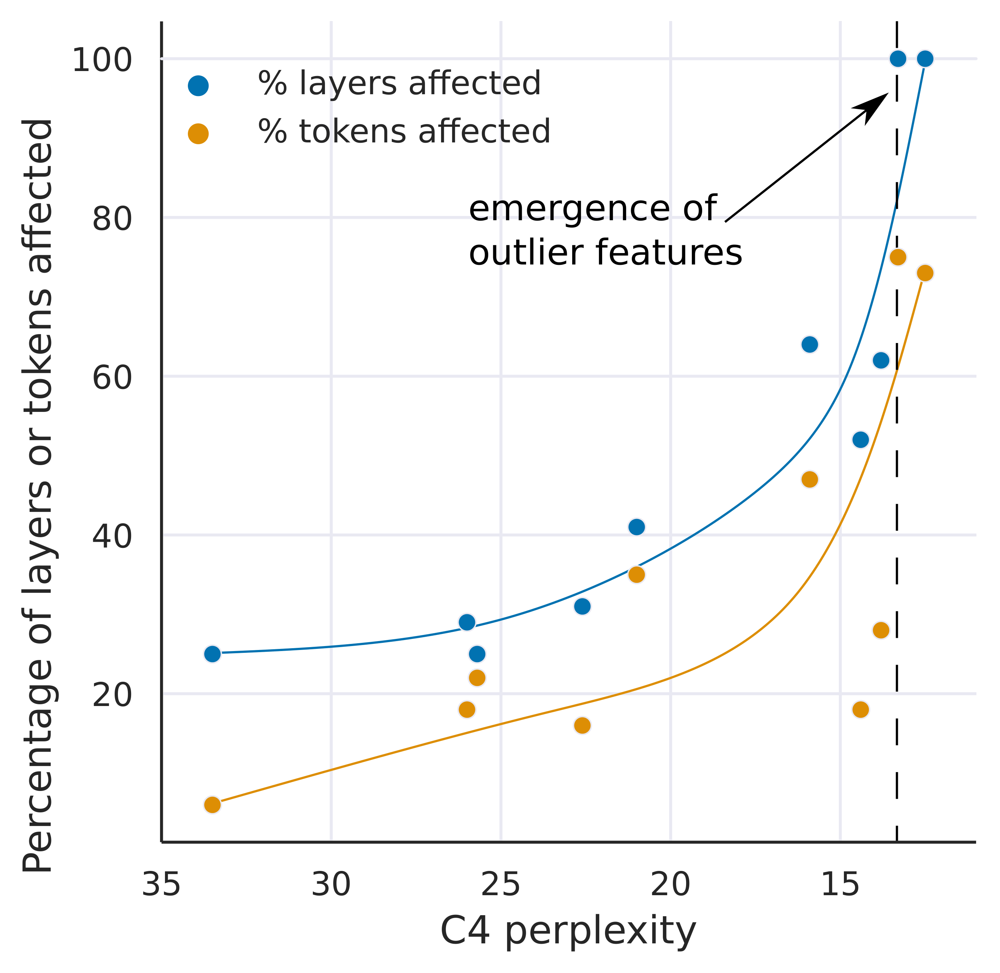
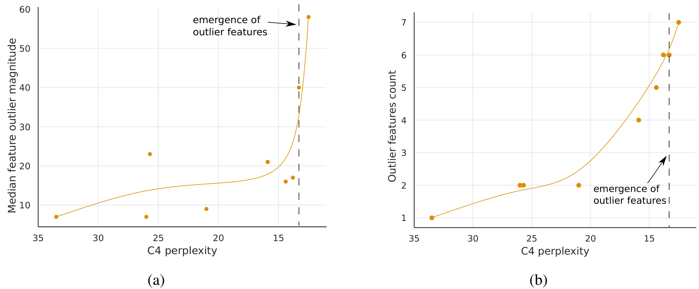
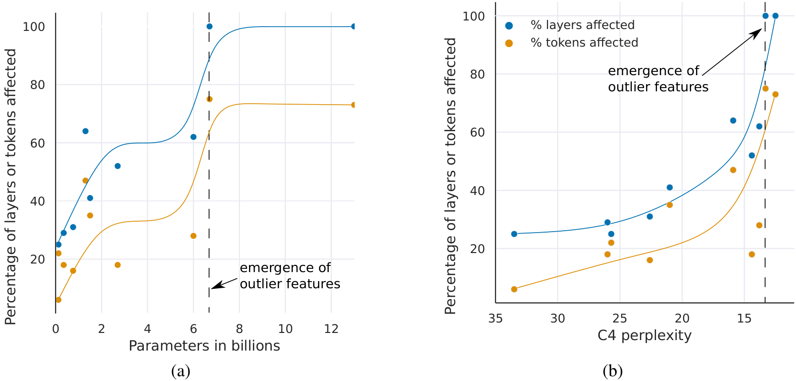

# LLM.int8(): 8-bit Matrix Multiplication for Transformers at Scale

| 项目 | 内容 |
|------|------|
| **Authors** | Tim Dettmers, Mike Lewis, Younes Belkada, Luke Zettlemoyer (Meta AI / University of Washington) |
| **Published** | 2022-08 (NeurIPS 2022) |
| **Link** | [arXiv 2208.07339](https://arxiv.org/abs/2208.07339) |

**一句话总结:**
- 首次实现 175B 参数 Transformer 的无精度损失 INT8 推理，核心发现是 6.7B 参数时异常值特征相变式涌现。

**核心贡献:**
- 系统性地发现并分析了大模型在 6.7B 参数时出现的 emergent outlier 现象
- 提出 vector-wise quantization + mixed-precision decomposition 的两阶段方案（LLM.int8()）
- 在 OPT-175B 上实现 2x 加速和 2x 内存节省，精度完整保持 FP16 水平

---

### 1. Background & Motivation

随着 LLM 规模增长（GPT-3 175B 等），推理所需 GPU 内存急剧增加。FP16 推理需要大量显存（175B 模型 ~350GB），而现有的 8-bit 量化方法在模型超过 350M 参数时就会出现精度下降。

此前没有人能实现多亿参数 Transformer 的**无损 8-bit 量化**。核心障碍在于：大模型中的极端 outlier 特征会破坏量化精度，但此前对这一现象的认知是缺失的。这篇论文首次系统性地分析和解决了这一问题。

### 2. High-Level Method

**核心发现：** 当 Transformer 规模达到 **6.7B 参数**时，所有层中会**相变式涌现**极端 outlier 特征（幅度是其他维度的 20 倍以上），这些 outlier 虽然只集中在约 7 个特征维度，但影响 75% 的序列维度，并且对模型性能至关重要——将它们置零会导致 perplexity 退化 600-1000%。

作者进一步分析了 outlier 特征幅值与 C4 perplexity 的关系（Figure 3）：outlier 在 6.7B 时涌现后，其幅度和数量随模型规模增大而增加，直接导致常规量化方法的 perplexity 急剧退化。

基于此发现，论文提出了 **LLM.int8()** 的两部分量化方案（Figure 2）：

1. **Vector-wise quantization** — 矩阵乘法中每个内积独立使用量化归一化常数（c_x, c_w），比 per-tensor 更精确，可处理到 2.7B 规模
2. **Mixed-precision decomposition** — 检测 outlier 特征维度（阈值 α=6.0），将其分离出来用 16-bit 计算，其余 99.9% 的值用 8-bit 计算，最后将两部分结果累加

### 3. Key Implementation Details

- **量化类型**: absmax symmetric quantization，缩放至 [-127, 127]
- **Vector-wise**: 对 hidden states $X \in \mathbb{R}^{s \times h}$ 每行一个缩放常数，对 weights $W \in \mathbb{R}^{h \times o}$ 每列一个缩放常数，反归一化通过外积 $c_x \otimes c_w$ 完成
- **Outlier 检测**: 幅度 > 6.0 的特征即视为 outlier；对于 13B 以下模型，outlier 维度 |O| ≤ 7
- **部署流程**: 加载 16/32-bit checkpoint → 将 feed-forward 和 attention projection 层转换为 Int8 → 立即推理，无需微调
- **开源**: bitsandbytes 库 + Hugging Face Transformers 集成

### 4. Experiments & Results

**OPT 模型 C4 perplexity：**

| 规模 | FP16 | absmax | zeropoint | LLM.int8() |
|------|------|--------|-----------|------------|
| 125M | 25.65 | 87.76 | 56.66 | 25.83 |
| 1.3B | 15.91 | 16.55 | 16.24 | 15.93 |
| 2.7B | 14.43 | 15.11 | 14.76 | 14.44 |
| 6.7B | 13.30 | 14.59 | 13.49 | 13.24 |
| 13B | 12.45 | 19.08 | 13.94 | **12.45** |

- 在 OPT 125M→175B 的 zero-shot 评测（WinoGrande, HellaSwag, PIQA, LAMBADA）中，LLM.int8() **完整保持 16-bit 精度**
- 其他方法在 6.7B+ 时退化为随机性能
- 大模型（175B）推理速度约 **2x 快于 FP16 baseline**；小模型（<6.7B）由于量化开销反而略慢
- 内存减少约 **2x**（175B 模型从 ~350GB 降至 ~175GB）

### 5. Limitations & Reflection

**作者承认的局限：**
- Mixed-precision decomposition 在 GPU 上实现效率不高 —— 每次矩阵乘法都需要分解和拼接，带来额外开销
- 仅适用于推理，不支持训练/微调场景的量化
- Outlier 分析仅限于 Transformer 架构，不确定是否适用于其他架构
- 小模型（<6.7B）的量化不仅无加速反而变慢

**我的判断：**
- Mixed-precision 的硬件不友好是最大痛点 —— 这也直接催生了后续 [[smoothquant-accurate-and-efficient-post-training-quantization-for-large-language-models|SmoothQuant]] 等纯 INT8 方案的研究
- Outlier 涌现的 "6.7B 相变" 分析非常扎实，但论文未深入解释 outlier 为什么会出现（只是描述了现象）
- 实验覆盖的模型族主要来自 Meta（OPT），对其他架构的泛化性验证不足

### 6. Personal Takeaways

- **Outlier 涌现的相变分析**是这篇论文最有价值的贡献 —— 后续所有 LLM 量化工作（[[smoothquant-accurate-and-efficient-post-training-quantization-for-large-language-models|SmoothQuant]]、[[awq-activation-aware-weight-quantization-for-llm-compression-and-acceleration|AWQ]]、[[gptq-accurate-post-training-quantization-for-generative-pre-trained-transformers|GPTQ]]）都建立在这个发现的基础上
- Vector-wise quantization 的思路简洁有效，值得在其他量化场景复用
- 一个问题：如果 6.7B 是量化难度的相变点，那么其他模型能力（如 reasoning）是否也存在类似的相变现象？

---

**Key Concepts:**
- [[quantization|Absmax quantization]] — 通过除以张量绝对最大值缩放到 [-127, 127] 的对称量化
- [[quantization|Zeropoint quantization]] — 使用归一化动态范围和零点偏移的非对称量化
- [[quantization|Vector-wise quantization]] — 矩阵乘法每个内积独立缩放，提升量化精度
- [[mixed-precision-decomposition|Mixed-precision decomposition]] — 将 outlier 维度用 16-bit 计算、其余 8-bit 的混合方案
- [[emergent-outliers|Emergent outliers]] — 6.7B 参数时相变式涌现的极端特征，幅度是其他维度的 20 倍

**Extracted Figures:**
- `llmint8_fig1_outlier_emergence.png` — Outlier 涌现导致常规量化在 6.7B 失效，LLM.int8() 保持精度
- `llmint8_fig2_schematic.png` — LLM.int8() 的两部分流程：outlier 分解 + vector-wise 量化
- `llmint8_fig3_outlier_analysis.png` — Outlier 特征幅值和数量与 perplexity 退化的相关性
- `llmint8_table_results.png` — OPT 模型全量实验结果（zero-shot + perplexity）
