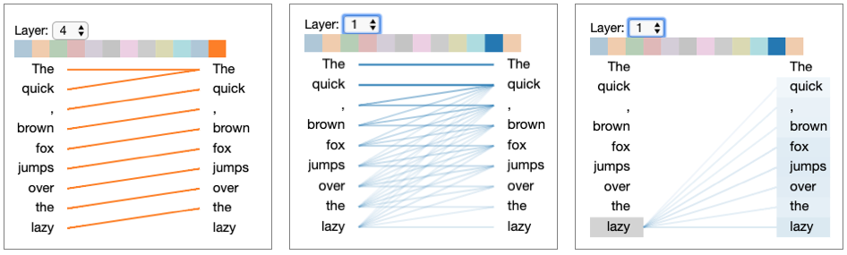
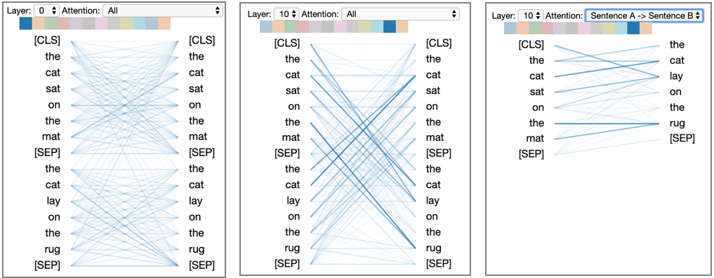
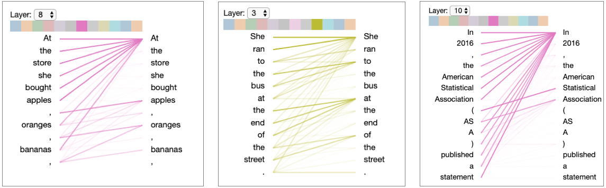
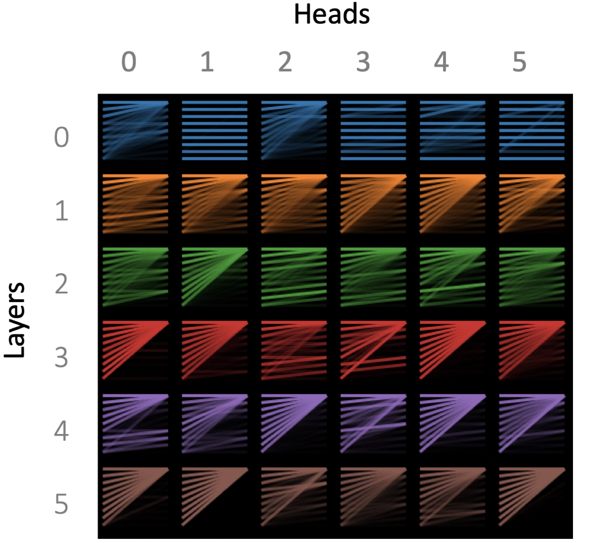
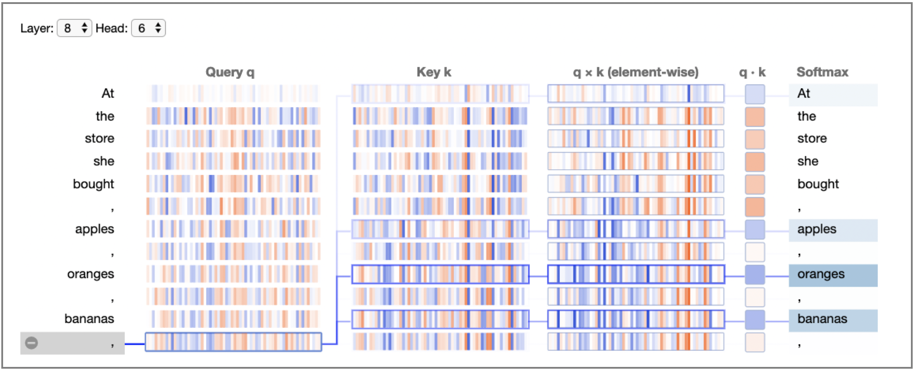
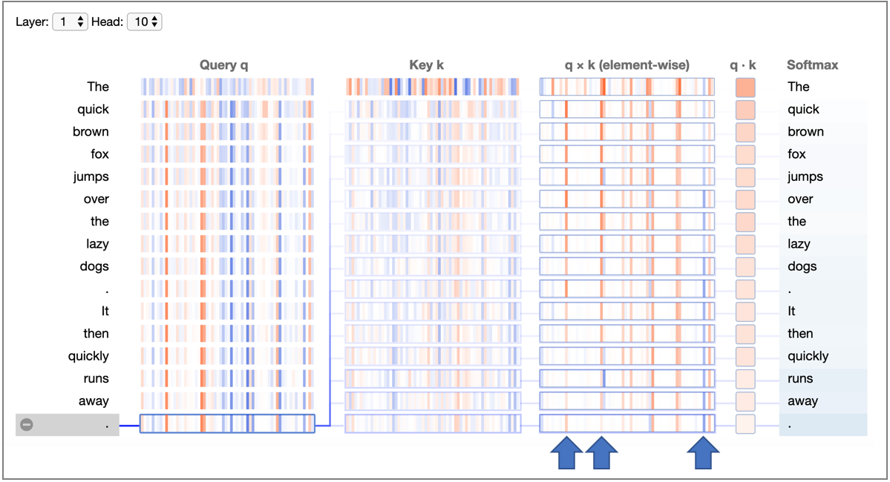
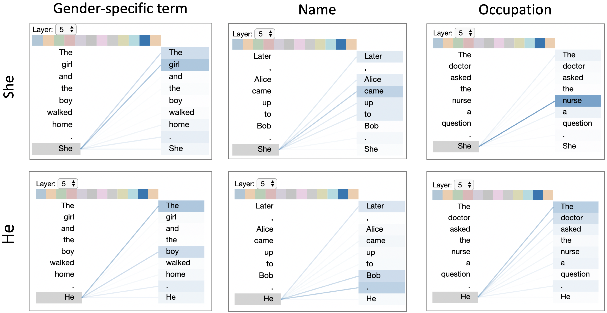

# Visualizing Attention in Transformer-Based Language Representation Models

| 项目 | 内容 |
|------|------|
| **Authors** | Jesse Vig (Palo Alto Research Center) |
| **Published** | 2019-04 |
| **Link** | [arXiv 1904.02679](https://arxiv.org/abs/1904.02679) |

**一句话总结:**
- 提出一个三层次（attention-head view / model view / neuron view）的注意力可视化开源工具，支持 BERT（encoder-only）和 GPT-2（decoder-only）的 multi-head self-attention 分析，并展示了模型偏差检测、重复模式识别、神经元行为归因三类应用场景。

**核心贡献:**
- 将原有的 encoder-decoder attention 可视化工具（Tensor2Tensor）适配到 encoder-only（BERT）和 decoder-only（GPT-2）架构
- 新增 **model view**：以 small multiples 缩略图表格展示所有 layers × heads 的 attention 模式全貌
- 新增 **neuron view**：追踪从 query/key 向量到 element-wise 乘积再到 softmax 的完整计算过程，将宏观 attention 模式归因到具体神经元
- 通过 GPT-2 的三个用例展示可视化工具的实用价值：
  - 性别偏差检测（coreference 中的 doctor/nurse 关联）
  - 空 attention 模式发现（大量 head 聚焦首个 token 的 null attention）
  - 单个神经元对 attention 衰减率的控制

---

### 1. Background & Motivation

Transformer 模型（BERT、GPT-2）的核心是 multi-head self-attention 架构。Attention 机制的一个重要优势是其可解释性——通过显示模型关注输入的哪些部分，可帮助理解模型决策。

已有的 attention 可视化工具包括：
- **Attention-matrix heatmaps**（Bahdanau et al., 2015）：显示 attention 矩阵的原始热图
- **Bipartite graph representations**（Liu et al., 2018; Strobelt et al., 2018）：用二分图连接源/目标 token
- **Tensor2Tensor 可视化**（Jones, 2017）：专为 Transformer encoder-decoder 模型设计的 bipartite 可视化

已有工具的局限：
1. 仅支持 encoder-decoder 架构，未适配当时新出现的 BERT（encoder-only）和 GPT-2（decoder-only）
2. 缺乏跨层跨头的宏观视角
3. 无法将 attention 模式追溯到具体的 query/key 神经元

### 2. Three-Level Visualization

#### 2.1 Attention-Head View（注意力头视图）

对每个注意力头，以 **bipartite graph** 形式显示源 token 到目标 token 的 attention 连线。线宽反映 attention score 大小，颜色标识对应的 attention head。

用户可切换层和头、按 token 过滤 attention、按句子过滤（BERT sentence-pair 模式）。

观察到 GPT-2 的典型 attention 模式：
- 部分 head 中每个词只关注前一个词（位置性模式）
- 部分 head 的 attention 均匀分散在前文各词上

Further observed lexical patterns in GPT-2:

#### 2.2 Model View（模型视图）

以 **small multiples** 表格形式展示所有 layers（行）× heads（列）的 attention 缩略图，提供用户快速浏览 attention 模式随深度演化。

观察发现：
- 早期层（layer 0, 1）存在大量位置性 attention（关注同一 token 或前一个 token）
- 大量 head 展现出 "聚焦首个 token" 的 **null attention** 模式——当某 head 负责的语言特征在输入中不存在时，它将所有 attention 指向第一个 token
- 这一发现提示模型可能需要一个专门的 null position 来区分 "无关注" 和 "关注首个 token"

#### 2.3 Neuron View（神经元视图）

从 attention-head 和 model view 的宏观层面深入到微观层面，展示具体 query/key 神经元对 attention 的计算过程。从左到右依次展示：

1. **Query q**：选中 token 的 64 维 query 向量
2. **Key k**：各目标 token 的 64 维 key 向量
3. **q × k (element-wise)**：选中的 query 与各 key 的 element-wise 乘积
4. **q · k**：点积结果
5. **Softmax**：归一化后的 attention 分数

正值为蓝色，负值为橙色，饱和度反映幅值大小。

该视图揭示的关键发现：
1. 在特定 attention head 中，attention score 几乎与输入文本内容无关（所有 query 向量几乎相同）
2. 仅少数几个神经元位置主导了 attention 随距离衰减的速率

蓝色箭头标记的神经元位置上，element-wise 乘积随距离增加而递减，直接控制 attention 的衰减率。

### 3. Use Cases

#### 3.1 模型偏差检测

GPT-2 条件文本生成示例：
- 输入 "The doctor asked the nurse a question. She..." → 生成 "I'm not sure what you're talking about"（She → nurse）
- 输入 "The doctor asked the nurse a question. He..." → 生成 "asked her if she ever had a heart attack"（He → doctor）

通过 coreference-related attention head 的可视化，发现 She → nurse 的 attention 更强，He → doctor 的 attention 更强，表明模型可能编码了关于性别与职业关联的偏差。

#### 3.2 重复模式识别

Model view 揭示大量 attention head 聚焦于首个 token——这是一种 null attention 模式，当 head 负责的语言特征在输入中不存在时触发。这一观察对模型设计有启发意义：模型可能需要一个专用的 null position 以区分 "无关注" 和 "关注第一个 token"。

#### 3.3 神经元行为归因

Neuron view 定位到 attention distance-decay 模式由少数神经元控制。这意味着：
- 通过编辑这些神经元（neuron editing, Bau et al., 2019），可以控制 attention 的衰减率
- 可根据文本复杂度调整衰减率：复杂文本用慢衰减（长上下文窗口），简单文本用快衰减

### 4. Limitations & Reflection

**作者承认的局限：**
- 未定量评估 attention 对模型预测的影响程度（未进行如 Jain & Wallace 2019 的 faithfulness 分析）
- 三个视图是分离的，未集成到统一接口
- 仅可视化 query 和 key，未包含 value 向量的分析
- 未支持用户干预模型（修改 attention 或编辑神经元），这被列为未来工作

**个人思考：**
- 这篇论文的价值更多在工具工程层面而非理论创新——将已有的 Tensor2Tensor 可视化适配到 BERT/GPT-2，并增加新的分析维度
- Neuron view 是最具洞察力的创新：将宏观 attention 模式归因到微观神经元的技术路线，为后来的 mechanistic interpretability 研究提供了早期蓝本
- Model view 的 small multiples 设计模式极其实用——很多 LM 可解释性论文后来都采用了类似的 "所有 head 一览" 的可视化形式
- 对于 "Attention is not Explanation"（Jain & Wallace 2019）的批评，该工具本身不回应 attention 作为解释的有效性，但提供了研究者自己判断的工具
- 性别偏差检测用例从 NLP fairness 角度看非常具有代表性和影响力

**Key Concepts:**
- **Attention-Head View —** 以 bipartite graph 显示单个 attention head 的源-目标 token 连接关系的可视化视图
- **Model View —** 以 small multiples 缩略图表格展示模型所有 layers × heads attention 模式的全景视图
- **Neuron View —** 追踪从 query/key 向量经 element-wise 乘积到 softmax 的完整计算链，将 attention 模式归因到具体神经元的细粒度视图
- **Null Attention Pattern —** 当 attention head 负责的语言特征在输入中不存在时，将所有 attention 聚焦于首个 token 的模式

---

**Extracted Figures:**
- `attn-viz_fig1a_attention_head_view.png` — GPT-2 注意力头视图（三种 attention 模式）
- `attn-viz_fig1b_attention_head_view.png` — BERT 注意力头视图（sentence-pair 过滤）
- `attn-viz_fig2_examples_attention_heads.png` — GPT-2 中特定词法模式 head 示例
- `attn-viz_fig3_attention_pattern_gpt.png` — 指代消解 attention 模式中的性别偏差
- `attn-viz_fig4_model_view_gpt.png` — GPT-2 模型视图（small multiples 缩略图表格）
- `attn-viz_fig5_neuron_view_gpt.png` — 第 8 层第 6 头的神经元视图
- `attn-viz_fig6_neuron_view_gpt.png` — 第 1 层第 10 头的距离衰减 attention 模式
