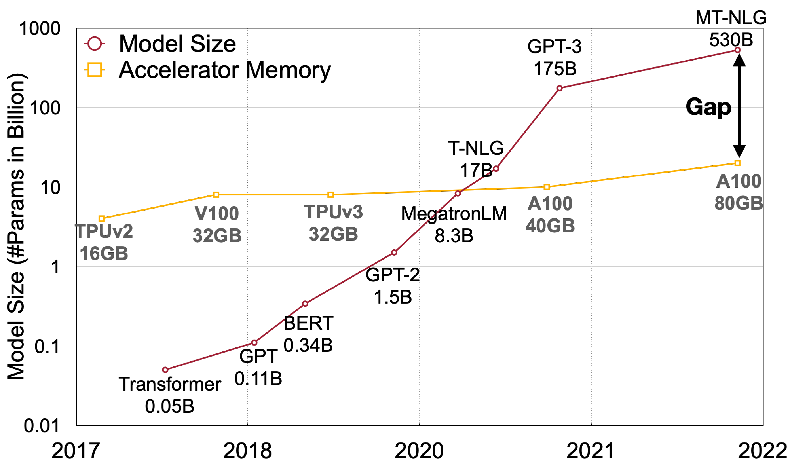
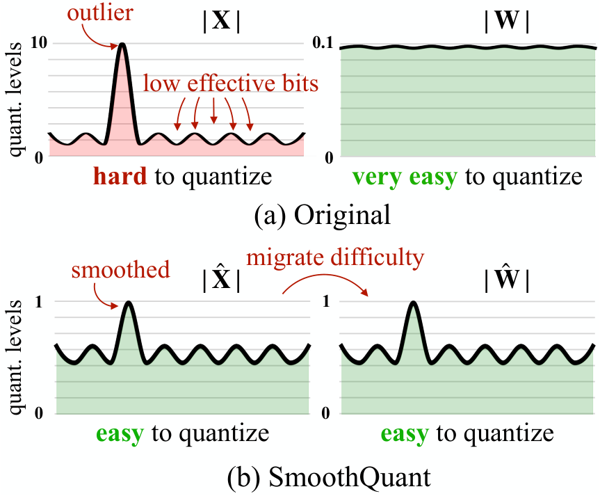
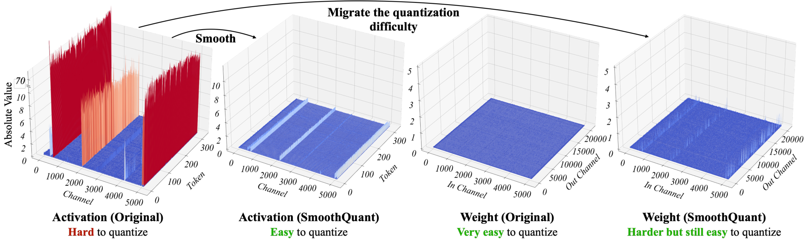
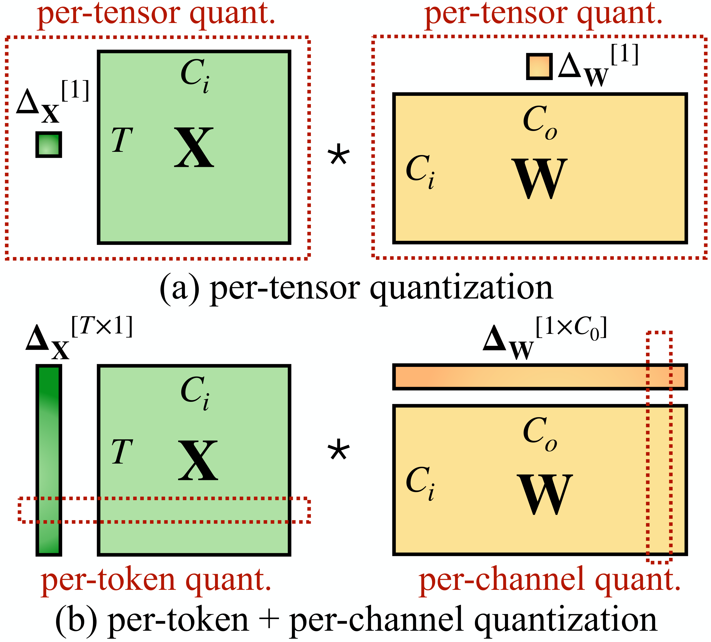
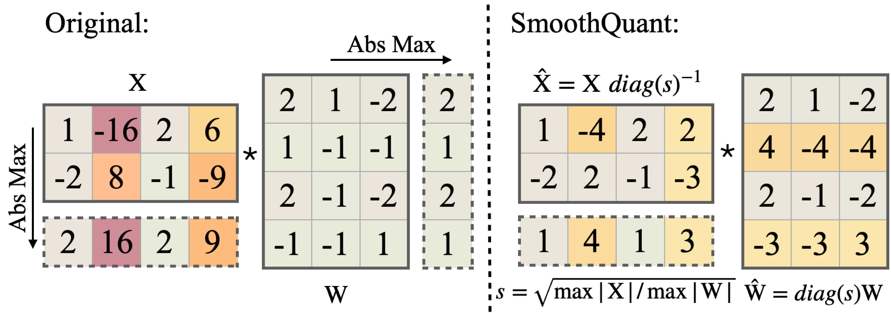
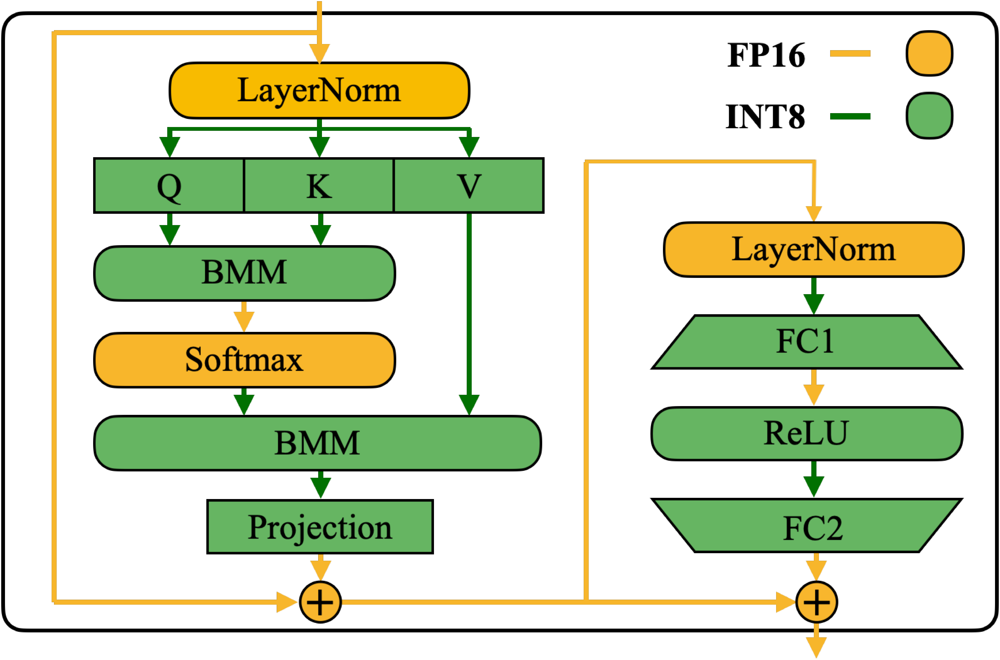
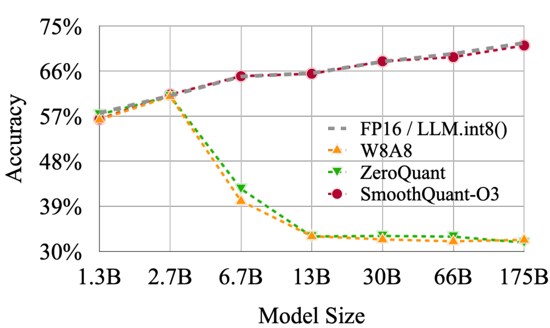
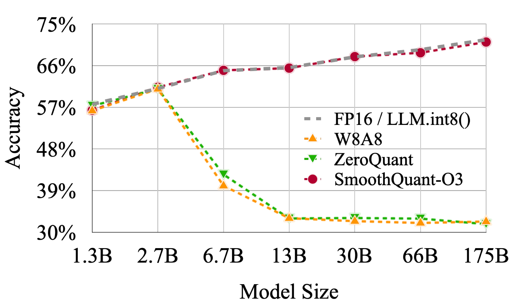

# SmoothQuant: Accurate and Efficient Post-Training Quantization for Large Language Models

### 1. Background & Motivation

大模型规模增长远超 GPU 内存增速（Figure 1），FP16 推理需要大量 GPU，成本高昂。量化可将权重和激活从 FP16 降到 INT8，理论上内存减半、吞吐翻倍。

[[llm.int8-8-bit-matrix-multiplication-for-transformers-at-scale|LLM.int8()]] 首次实现了 175B 模型的 8-bit 推理且精度无损，但它的 mixed-precision decomposition（outlier 用 FP16 计算，其余用 INT8）在 GPU 上实现效率低——每次矩阵乘法都需要分解、分别计算、再拼接，无法充分利用 Tensor Core 的纯 INT8 GEMM 内核。业界需要的是一种 **纯 W8A8** 方案，才能在不依赖混合精度的前提下真正提升吞吐。

核心难题：激活比权重**难量化得多**。Outlier 的幅值比普通值大 ~100×，导致 per-tensor 量化时有效 quantization level 极低（非 outlier channel 仅剩 2-3 个有效量化级别）。Per-channel 量化虽然精度高，但缩放因子只能在外维度（token 维度 T 和输出通道 Co）上生效，与 INT8 GEMM 内核不兼容。

SmoothQuant 的关键洞察：不绕开 outlier，而是通过数学等价变换**把 outlier 抹平**，让所有计算都落在纯 INT8 里。

### 2. High-Level Method

**核心直觉：** 权重分布平坦均匀、易于量化；激活有 outlier、难以量化。如果通过 per-channel smoothing factor s 对激活做缩放、同时对权重做反向缩放，可以在保持数学等价的前提下，将激活的量化难度**迁移**到权重上（Figure 2）。

具体而言，对线性层 $Y = X \cdot W$，引入平滑变换：

$$Y = (X \cdot \text{diag}(s)^{-1}) \cdot (\text{diag}(s) \cdot W) = \hat{X} \cdot \hat{W}$$

**数据的支撑：** 作者分析了 OPT-13B 线性层的激活和权重幅值分布（Figure 4），发现了三个关键模式：

1. **激活比权重更难量化**——权重分布平坦均匀，而激活存在高幅值 outlier（>70）
2. **同一 channel 内方差小**——outlier 固定出现在某些 channel，且 token 间幅值变化不大
3. **Outlier 持续存在于固定 channel**——这为 offline 估计 smoothing factor 提供了基础

**迁移强度 α** 控制在激活和权重之间的难度分配：

$$s_j = \max(|X_j|)^\alpha / \max(|W_j|)^{(1-\alpha)}$$

- $\alpha=0$ → 全部难度留在激活（激活量化误差大）
- $\alpha=1$ → 全部难度迁移到权重（权重量化误差大）
- **$\alpha=0.5$** → OPT/BLOOM 最优平衡点
- $\alpha=0.75$ → GLM-130B（激活 outlier 更严重）
- $\alpha=0.8$ → LLaMA 系列

### 3. Key Implementation Details

**为何需要 SmoothQuant？——量化方案的硬件约束。** 论文首先厘清了不同量化方案的定义及其硬件兼容性（Figure 3）：per-tensor 效率最高但精度差，per-token + per-channel 精度高但需要从外维度（T、Co）缩放以兼容 INT8 GEMM 内核，无法对内维度（Ci）做 per-channel 量化。SmoothQuant 正是在这个约束下设计解决方案。

**Smoothing factor 的计算与融合（Figure 5）：**
- 从预训练数据取 512 条样本离线校准，计算 per-channel 的 max(|X_j|) 和 max(|W_j|)
- 根据 α 公式计算 s_j
- 将 $\text{diag}(s)^{-1}$ **融合到前一层参数**（LayerNorm 或前一个 Linear 的权重）中，推理时**零额外计算开销**

**三档效率-精度权衡（O1/O2/O3）：**

| 级别 | 激活量化 | 权重量化 | 特点 |
|------|---------|---------|------|
| O1 | per-token dynamic | per-channel static | 最高精度 |
| O2 | per-tensor dynamic | per-channel static | 平衡方案 |
| O3 | per-tensor static | per-channel static | 最高效率 |

**Transformer 块的精度映射（Figure 6）：** 量化所有 Linear 层和 Attention 中的 BMM 为 INT8，保留 Softmax、LayerNorm 等轻量操作为 FP16。

### 4. Experiments & Results

**OPT-175B 零样本精度（Table 3）：** SmoothQuant 三档配置均匹配 FP16 精度（~66.8%），而 Naive W8A8、ZeroQuant 和 Outlier Suppression 几乎退化为随机结果（~35%）。LLM.int8() 精度虽好，但混合精度分解导致延迟更高。

| 方法 | 平均精度 | WikiText ↓ |
|------|---------|-----------|
| FP16 | 66.9% | 10.99 |
| Naive W8A8 | 35.5% | 93080 |
| ZeroQuant | 35.8% | 84648 |
| LLM.int8() | 66.7% | 11.10 |
| Outlier Suppression | 36.0% | 96151 |
| **SmoothQuant-O3** | **66.8%** | **11.17** |

**多模型泛化性：**
- **BLOOM-176B**：更容易量化，SmoothQuant O1/O2 无损，O3 降 0.8%
- **GLM-130B**：最难量化，SmoothQuant O1 无损，O3 降 1%
- **LLaMA-7B→65B**：几乎所有模型 W8A8 量化后 perplexity 偏差 < 0.05
- **LLaMA-2、Falcon、Mistral、Mixtral**：均保持无损

**加速效果：**
- PyTorch 实现：最高 **1.51×** 加速，**1.96×** 内存节省
- FasterTransformer 实现：最高 **1.56×** 加速，内存减半
- **530B MT-NLG 单节点（8-GPU）推理**——首次在单机内实现 500B+ 模型推理

### 5. Limitations & Reflection

**作者承认的局限：**
- O3（per-tensor static）在分布偏移大的场景下精度可能下降
- α 需要通过 grid search 选择（虽只需做一次），不同模型族需要不同 α
- 校准集需来自预训练分布，可能导致 domain shift 下的泛化问题

**关于 α 的权衡（Figure 10）：** α 过小则激活仍难量化，过大则权重量化误差大，论文通过实验确认了 "sweet spot"（OPT/BLOOM 为 0.5，GLM 为 0.75，LLaMA 为 0.8）。

**我的判断：**
- 这是对 LLM.int8() 非常漂亮的改进——用简单的数学变换绕过了 hardware 不友好的 mixed-precision 分解
- Smoothing factor 融合到前一层参数是工程上的精巧设计，推理时零额外开销
- 实验覆盖非常全面（OPT/BLOOM/GLM/LLaMA/Falcon/Mistral/Mixtral 共 9 个模型族），泛化性有说服力
- 但 α 需手动调参不够优雅——后续 [[awq-activation-aware-weight-quantization-for-llm-compression-and-acceleration|AWQ]] 的工作就是针对这个痛点改进
- 需要注意的是，W8A8 和 weight-only 量化服务于不同场景：SmoothQuant 适用于 batch serving 和 context stage，而 [[gptq-accurate-post-training-quantization-for-generative-pre-trained-transformers|GPTQ]] 的 weight-only 4-bit 在 memory-bound 的 decoding stage（batch size=1）更有优势

### 6. Personal Takeaways

- **"迁移量化难度"** 这个思路非常 elegant——不增加计算量、不改模型结构、纯数学变换
- 与 [[llm.int8-8-bit-matrix-multiplication-for-transformers-at-scale|LLM.int8()]] 对比: LLM.int8() 发现自己打不过 outlier，于是搞 mixed-precision 绕开；SmoothQuant 选择把 outlier 抹平，让所有计算都落在 INT8 里。两种哲学
- 三档效率级别（O1/O2/O3）的设计很好——用户可以根据硬件和精度需求灵活选择
- 这篇论文和 [[awq-activation-aware-weight-quantization-for-llm-compression-and-acceleration|AWQ]]、[[gptq-accurate-post-training-quantization-for-generative-pre-trained-transformers|GPTQ]] 形成了 LLM 量化的三条清晰发展线，后续工作（如 QuaRot、SpinQuant）在此基础上继续推进

---

**Key Concepts:**
- [[quantization|W8A8]] — 权重和激活均为 8-bit 的量化方案
- [[smoothquant|Quantization difficulty migration]] — 通过数学变换将激活的量化难度转移到权重
- [[smoothquant|Smoothing factor]] — per-channel 缩放因子 s，控制量化难度在激活和权重间的分配
- [[quantization|Per-token vs per-tensor vs per-channel quantization]] — 量化粒度，越细精度越高但硬件效率越低
- [[quantization|Static vs dynamic quantization]] — 静态量化（校准集预计算步长）vs 动态量化（推理时实时计算）

**Extracted Figures:**
- `smoothquant_fig1_model_scaling.png` — 大模型规模 vs GPU 内存增长趋势
- `smoothquant_fig2_migration_intuition.png` — 量化难度迁移的核心直觉
- `smoothquant_fig3_quant_schemes.png` — Per-tensor vs per-token+per-channel 量化定义
- `smoothquant_fig4_magnitude_evidence.png` — 激活与权重幅值分布（平滑前后对比）
- `smoothquant_fig5_smoothing_factor.png` — Smoothing factor 计算与融合流程
- `smoothquant_fig6_precision_mapping.png` — Transformer 块精度映射
- `smoothquant_table3_results.png` — OPT-175B 零样本精度结果
- `smoothquant_fig10_alpha_sweetspot.png` — α 迁移强度 sweet spot
